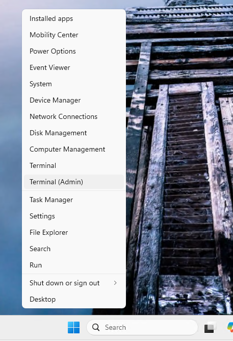
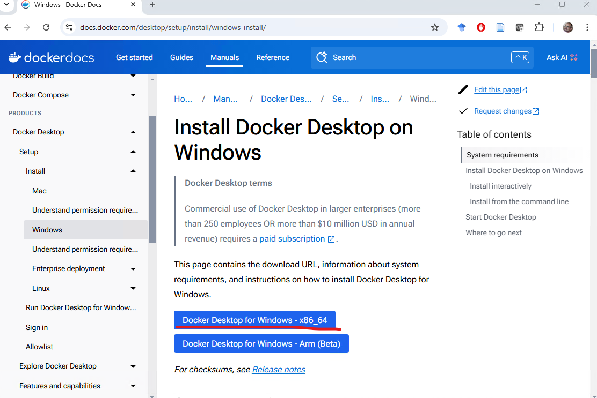
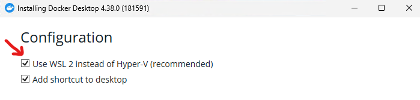
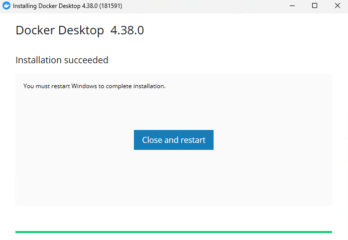

# Preparatory instructions for running Docker containers locally on your computer

The course includes a laboratory component. For the lab sessions, we will use Docker Containers. This guide contains the preparatory steps that you are expected to complete before the first lab. These steps include setting up the Windows Subsystem for Linux (WSL) and Docker Desktop on a personal computer.

## Enabling WSL and Virtual Machine Platform

First, you need to enable WSL and the Virtual Machine Platform feature in Windows.

**Open PowerShell as administrator:** Right-click the **Start** menu and select **Windows Terminal (Administrator)** or **PowerShell (Administrator)**.



Run the following commands to enable WSL and Virtual Machine Platform. After running them, restart your computer.

```bash
wsl --install
Enable-WindowsOptionalFeature -Online -FeatureName Microsoft-Hyper-V -All
```


### Ubuntu configuration

**Open Ubuntu:** After installation, click the **Start** menu and search for **Ubuntu**. Click it to open it.


**Set up a user account and password:** The first time Ubuntu starts, you will be asked to create a user and set a password. This user will be the main user for your Ubuntu installation.


### Upgrades and updates

Once Ubuntu is ready, it is a good idea to run a few commands to make sure your system is up to date.

**Upgrade system packages:** Run the following command to upgrade the system packages:

```bash
sudo apt update && sudo apt upgrade -y
```

**Check the WSL status**

Open PowerShell (as administrator) and run the following command:

```bash
wsl --list --verbose
```


This command shows the installed Linux distributions and indicates which one is the default. If WSL has been installed correctly, you should see the Ubuntu distribution (or another distribution that you installed).

**Check whether Virtual Machine Platform is enabled**

To verify that Virtual Machine Platform is enabled, run the following command:

```bash
Get-WindowsOptionalFeature -Online -FeatureName VirtualMachinePlatform
```

If Virtual Machine Platform is enabled, the feature status should be **Enabled**.

**Check the current WSL version**

To check which WSL version (1 or 2) you are using, run the following command:

```bash
wsl --list --verbose
```

You will see the WSL version for each Linux distribution (for example, 2 for WSL 2 or 1 for WSL 1).

If everything is configured correctly, WSL and Virtual Machine Platform should appear as enabled, and Ubuntu or another Linux distribution should be available for use on your system.

## Installing Docker Desktop

Go to the official Docker page and download the latest version of Docker Desktop for Windows x86_64:

https://docs.docker.com/desktop/setup/install/windows-install/

**Run the installer:** Double-click the installation file you downloaded and follow the installation wizard.



**Installation options:**

During installation, make sure that the **Use the WSL 2 based engine** option is selected.



Docker Desktop will also install the **Docker Desktop WSL 2 Backend**, which is required in order to run Docker with WSL 2.

**Complete the installation:** When the installation finishes, click **Finish** and Docker Desktop will start automatically. The installation may take a little while. You will need to restart your computer.



After the restart, you may be asked to create an account for the service. This is not mandatory, and you may choose **Skip**.


**Configure Docker to use WSL 2:** After installation, you can open **Docker Desktop** from the **Start Menu**.

If this is the first time you open Docker Desktop, it may guide you through enabling WSL 2.

Make sure that **WSL 2** is selected as the backend in Docker Desktop. To check this, go to **Settings** in Docker, then to the **General** tab, and verify that **Use the WSL 2 based engine** is enabled.


**Select the WSL distribution for Docker:** In the **Resources** tab of Docker Desktop, you can see which WSL Linux distributions are available for use with Docker. Make sure that the Ubuntu distribution (or another one you installed) is enabled for Docker.


**Restart Docker:** If you make changes to the settings, restart Docker Desktop so that the changes take effect.

**Confirm the installation**

Open the **Ubuntu terminal** and run the following command to verify that Docker is working correctly:

```bash
docker --version
```


This should display the version of Docker that you installed.

Then try running the command:

```bash
docker run hello-world
```

This command downloads and runs a simple Docker image that prints a success message if Docker is installed and working correctly.


**Updates and settings**

**Update Docker:** Docker Desktop updates automatically. You can check for new versions under **Settings** > **Updates**.

**Resource settings:** In the **Resources** tab of Docker Desktop, you can configure how much CPU, memory (RAM), and disk space are available to the WSL backend.
