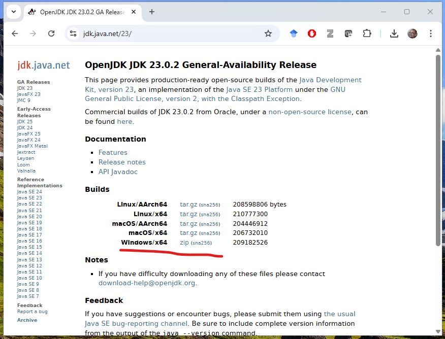
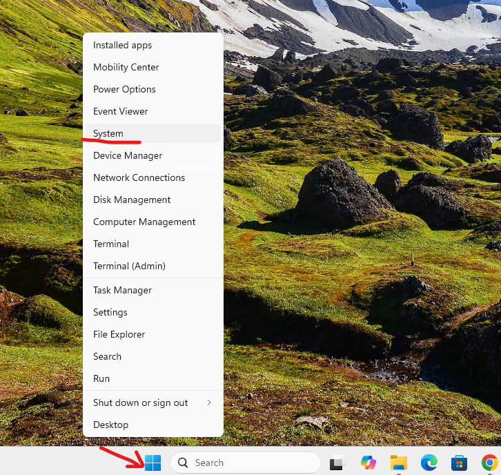
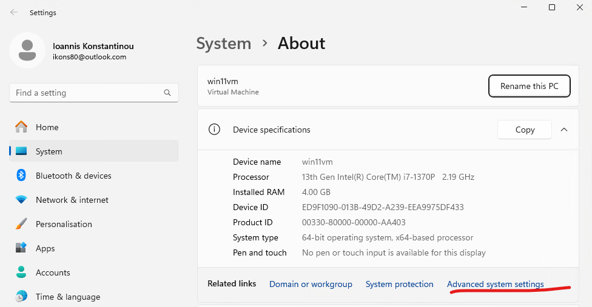
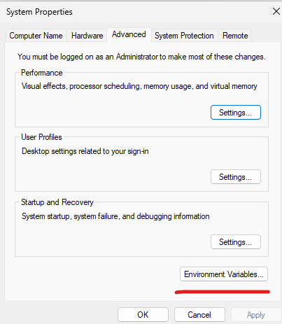
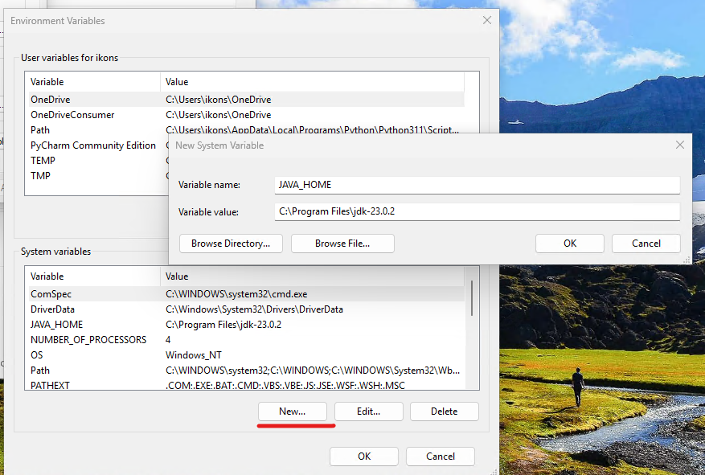
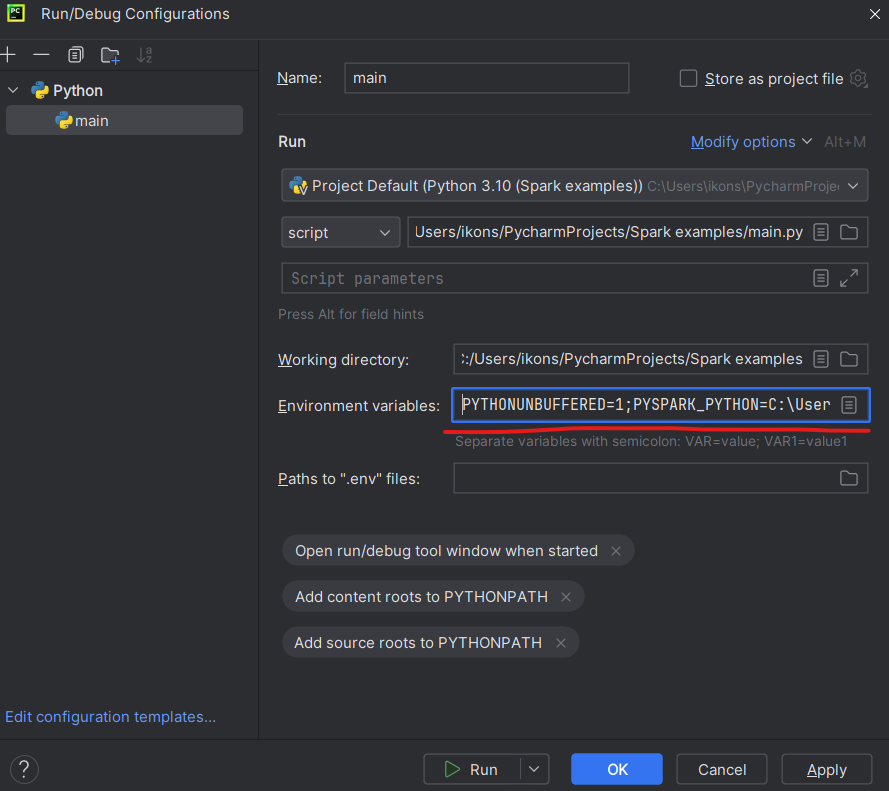
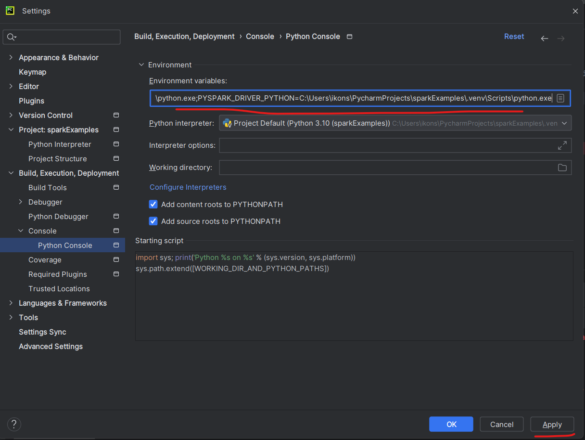
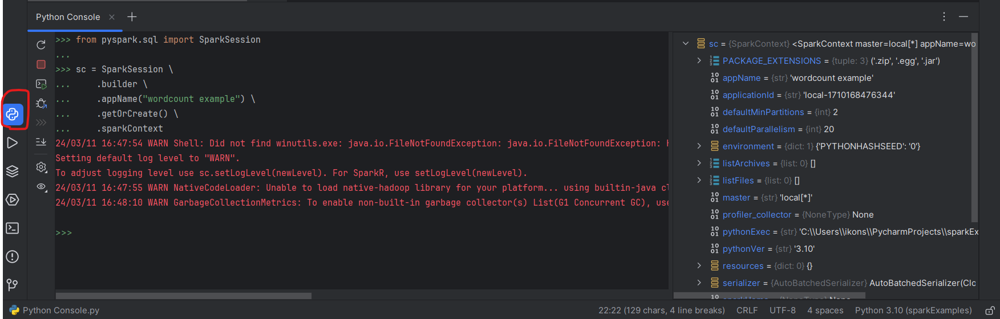
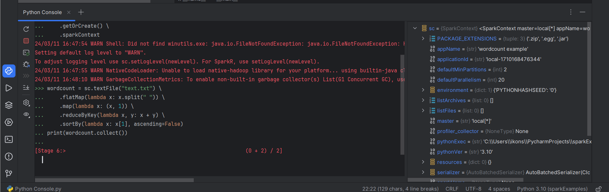

# Apache Spark Development with PyCharm

## Installing `pyspark` in PyCharm with a `venv` environment

You can find the official Apache Spark programming guide here:

https://spark.apache.org/docs/latest/rdd-programming-guide.html

This guide assumes that you already have a recent version of **PyCharm Community Edition** installed on your computer. You can download the Windows version from the following link. Instead of PyCharm, you may also use any Python IDE/editor of your choice.

https://www.jetbrains.com/pycharm/download/download-thanks.html?platform=windows&code=PCC

Download **Python 3.11** (Windows installer, 64-bit) and install it on your computer. Do **not** use the newest Python release (for example 3.13 when this guide was written), because it may not be fully compatible with PySpark.

https://www.python.org/downloads/release/python-3110/

When you launch PyCharm for the first time, choose **New Project**.


The first time you run PyCharm, Windows Security may ask you to add the directory used by PyCharm to the exceptions list. This is useful because Windows Security can significantly slow down operations involving many files and Python package versions.


## Creating a new PyCharm project

When creating a new project, you need to select the Python interpreter. Choose interpreter type **Project venv**. The goal of this option is to manage dependencies automatically and install only what the project needs. If you prefer a different package manager, you may configure it there.

Use `Spark_example` as the project name. It is important that **file names and directory names do not contain spaces**.

Enable the option `create a welcome script`.

Then install the required packages from: **File → Settings → Project → Python Interpreter**.


The packages you need are `pyspark` and `psutil`. After installation, restart PyCharm once. This may not be necessary on every system, but it was required in my setup.

## Installing Java on your computer

From [https://jdk.java.net/23/](https://jdk.java.net/23/) download Java for your operating system (for Windows this is usually a zip archive). Extract its contents to a directory, for example under `C:\Program Files`.



This will create a directory such as `C:\Program Files\jdk-23.0.2`.

You must add this directory to your system environment variables as `JAVA_HOME`.

Right-click the Windows icon and choose **System**.



Then choose **Advanced System Settings**.



Then choose **Environment Variables**.



Under **System variables**, choose **New** and add:
- Variable name: `JAVA_HOME`
- Variable value: the directory where you extracted Java (for example `C:\Program Files\jdk-23.0.2`)

You will need to **restart your computer** for the environment variables to be refreshed.

## Configuring PyCharm to run PySpark code

To run `.py` programs, PyCharm uses **Run Configurations**, which include the parameters required to execute the Python program. For a PySpark file, you must define a few environment variables that Spark workers need in order to launch Python correctly. These variables are set in the `Environment variables` field of the run configuration, shown below.



Use the following variables:

```
PYTHONUNBUFFERED=1;PYSPARK_DRIVER_PYTHON=C:\Users\ikons\PycharmProjects\Spark_example\.venv\Scripts\python.exe;PYSPARK_PYTHON=C:\Users\ikons\PycharmProjects\Spark_example\.venv\Scripts\python.exe;SPARK_SUBMIT_OPTS=-Djava.security.manager=allow
```

Here, the path must point to the Python executable of the virtual environment created for your project. The example above is only indicative; on your system it will be different. You can find it in the interpreter settings under **File → Settings**.

Do the same for the Python console in **File → Settings → Build, Execution, Deployment → Console → Python Console** by setting the same environment variables there.



The first time you run your code, the firewall may ask whether to allow access. Approve it.

## Running a test word count example

Create a new `.py` file, or simply replace the contents of the automatically generated `main.py` file with the following code:

```python
from pyspark import SparkConf
from pyspark.sql import SparkSession
if __name__ == '__main__':
    conf = SparkConf().setAppName("Word Count example") \
        .set("spark.executor.memory", "2g") \
        .set("spark.driver.memory", "2g")

    sc = SparkSession.builder.config(conf=conf).getOrCreate().sparkContext
    #sc.setLogLevel("DEBUG")
    #sc.setLogLevel("INFO")

    wordcount = sc.textFile("text.txt") \
        .flatMap(lambda x: x.split(" ")) \
        .map(lambda x: (x, 1)) \
        .reduceByKey(lambda x,y: x+y) \
        .sortBy(lambda x: x[1], ascending=False)
    print(wordcount.collect())
```

You will also need to place a `text.txt` file in the same directory as the project's `main.py`, containing a few sample words to count. In my setup, that directory was `C:\Users\ikons\PycharmProjects\sparkExamples`.

With the `.set()` lines you can pass parameters to the Spark executors, such as the maximum memory assigned to each one.

The `sc.setLogLevel` lines control how verbose the Spark log messages will be during execution. In the current example they are commented out, so only a few messages are shown. If you run into problems, remove the comments and increase the logging level.

Once everything is ready, you can execute the code in two ways:

- through the **Run Configuration** (`Run` menu or `Shift+F10`)
- through the **Python Console** on the left side of the IDE (highlighted in red in the following figure)



The first time you execute it, your operating system security software (for example Windows Defender) may ask you to approve a security exception. Choose `OK`.

Through the **Python Console** you can execute transformations interactively, without restarting the entire Spark engine after every code change. It is similar in spirit to the Spark shell on the command line.

The Python Console also lets you inspect the variables created by Spark and verify that their contents are correct (shown on the right side of the figure below).



Another useful way to monitor what is happening is the URL where the Spark scheduler UI runs. In the example below, an RDD transformation is executed from the console and can be observed at [http://localhost:4040](http://localhost:4040). When you close the console, the web UI also stops.




