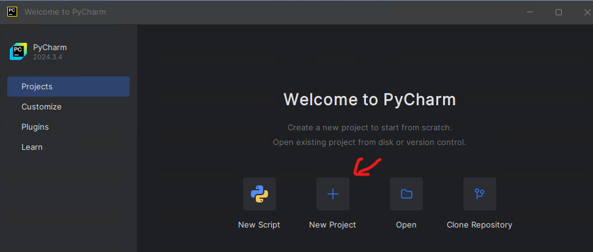
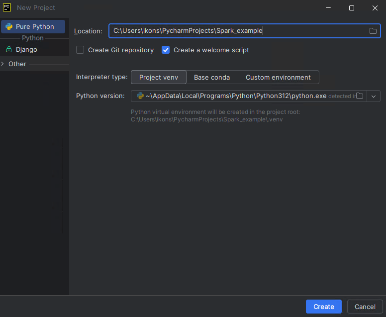
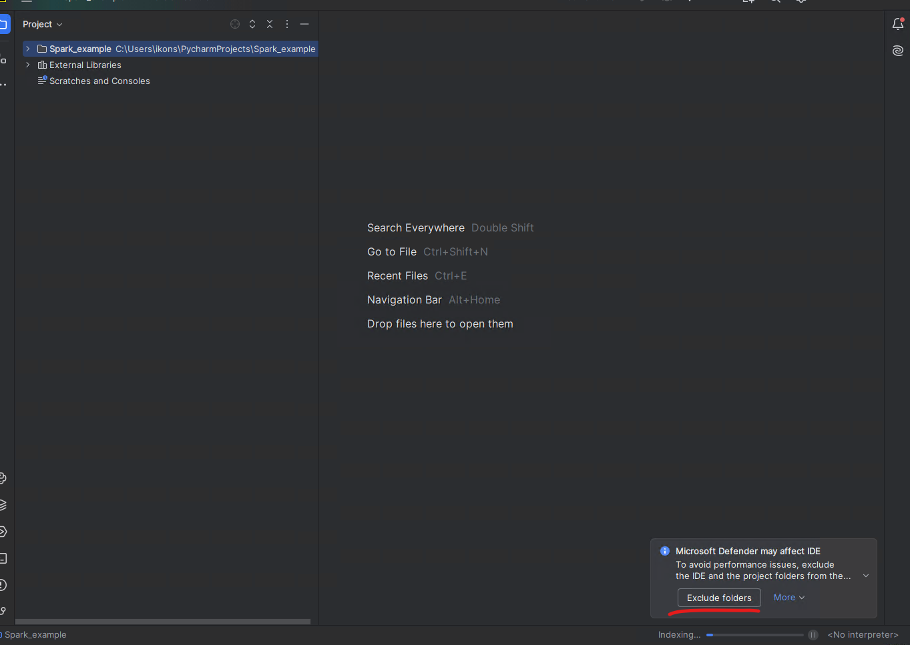

# Apache Spark Development with PyCharm

## Guide

You can find the official Apache Spark programming guide here:

https://spark.apache.org/docs/latest/rdd-programming-guide.html

This guide assumes that you already have **PyCharm Community Edition** and **Python 3.11** installed. For `pyspark`, Python 3.11 is a safe and practical choice.

PyCharm Community Edition:

https://www.jetbrains.com/pycharm/download/

Python 3.11:

https://www.python.org/downloads/

## Creating a new project in PyCharm

Open PyCharm and choose `New Project`.



In the new project:

- choose the `Pure Python` project type
- give it a name such as `Spark_example`
- avoid spaces in file names and directory names
- in `Interpreter type`, choose `Project venv`
- as the base interpreter, choose Python 3.11
- the `Create a welcome script` option is optional



If PyCharm shows a Microsoft Defender message about folder exclusions, you may choose `Exclude folders`. This is not required for the example to run, but it usually helps IDE performance.



## Installing Python packages

After the project is created, install the `pyspark` and `psutil` packages in the project interpreter.

You can do this either:

- from the `Python Packages` tool window
- from `Settings | Python | Interpreter`
- from the built-in PyCharm terminal with `python -m pip install pyspark psutil`

For this guide, you do not need to install Apache Spark separately on your computer. The `pyspark` package inside `.venv` and Java are enough.

## Installing Java on your computer

JDK 17 is required for local PySpark execution.

On Windows, the simplest approach is to open a PowerShell terminal and run:

```powershell
winget install --id Microsoft.OpenJDK.17 --accept-source-agreements --accept-package-agreements
```

During installation, Windows may show a prompt asking to run the installer with administrator privileges. In that case, choose `Yes` to continue.

If `winget` is not available on your machine, install any JDK 17 manually and make sure that:

- `JAVA_HOME` points to the Java installation directory
- the `java` command is available in `PATH`

If Java was installed while PyCharm was already open, close and reopen PyCharm and create a new terminal, so that the new environment variables are loaded. Normally, a full computer restart is not required. Then verify that everything works correctly:

```powershell
java -version
```

## Creating example files

Create two files in the project directory: `main.py` and `text.txt`.

If a welcome script was created automatically, you can simply replace its contents with the following `main.py`.

```python
import os
import sys

from pyspark.sql import SparkSession

os.environ["PYSPARK_PYTHON"] = sys.executable
os.environ["PYSPARK_DRIVER_PYTHON"] = sys.executable


def main() -> None:
    spark = SparkSession.builder.appName("Word Count example").getOrCreate()
    sc = spark.sparkContext

    wordcount = (
        sc.textFile("text.txt")
        .flatMap(lambda line: line.split())
        .map(lambda word: (word, 1))
        .reduceByKey(lambda left, right: left + right)
        .sortBy(lambda item: item[1], ascending=False)
    )

    print(wordcount.collect())
    spark.stop()


if __name__ == "__main__":
    main()
```

The two lines with `sys.executable` explicitly tell Spark to use the same Python interpreter that the project has selected in PyCharm. Because of that, for this first example you do not need to define `PYSPARK_PYTHON` and `PYSPARK_DRIVER_PYTHON` manually in Run Configurations.

Put the following sample content into `text.txt`:

```text
spark spark data
big data spark
python spark
```

## Running and debugging in PyCharm

Open `main.py` and run the program in one of the following ways:

- from the green `Run` icon in the gutter
- by right-clicking the file and choosing `Run 'main'`
- with the shortcut `Shift+F10`

For debugging:

- press the `Debug` icon in the gutter
- or right-click and choose `Debug 'main'`

For this simple example, you do not need to create a manual Run Configuration with environment variables. PyCharm can automatically create a temporary run/debug configuration for the current file, and that is enough.

The first time you run the program, Windows Firewall / Windows Defender may show a prompt for `OpenJDK Platform binary`. If it appears, choose `Allow`, so that Spark can open the local port it needs.

If everything is configured correctly, you should see output such as:

```text
[('spark', 4), ('data', 2), ('big', 1), ('python', 1)]
```

## Experimenting with `pyspark`

If you want to experiment interactively with Spark, you have two practical options:

- `pyspark`, which opens a ready-to-use shell with `sc` and `spark` already available, but on Windows it often does not provide convenient command history with the `Up` / `Down` keys
- the regular Python console that you open with `python`, which usually has more convenient history and editing, but requires you to create the `SparkSession` manually

Note: `pyspark` is for Python, while `spark-shell` is the Scala shell. The command `sparkshell` without a dash is not valid.

### Option 1: `pyspark`

`pyspark` is the quickest option if you want to start immediately with `sc` and `spark` ready to use.

After activating `.venv` and confirming that `java -version` works, run the following in the terminal:

```powershell
$env:PYSPARK_PYTHON = (Resolve-Path .\.venv\Scripts\python.exe).Path
$env:PYSPARK_DRIVER_PYTHON = $env:PYSPARK_PYTHON
pyspark
```

Once the shell opens, you can try commands such as:

```python
sc.parallelize([1, 2, 3]).count()
spark.range(5).show()
```

To exit the shell:

```python
exit()
```

### Option 2: open the regular Python console from the terminal

If you prefer better command history and a more predictable terminal experience, you can first open the regular Python console:

```powershell
python
```

and then create the Spark session manually:

```python
import os
import sys
from pyspark.sql import SparkSession

os.environ["PYSPARK_PYTHON"] = sys.executable
os.environ["PYSPARK_DRIVER_PYTHON"] = sys.executable

spark = SparkSession.builder.appName("playground").getOrCreate()
sc = spark.sparkContext
```

After that, you can experiment with commands such as:

```python
sc.parallelize([1, 2, 3]).count()
spark.range(5).show()
```

When you are done:

```python
spark.stop()
exit()
```

## Checking the Spark UI

While the program is running, you can usually monitor the Spark UI at:

[http://localhost:4040](http://localhost:4040)

Once you stop the program, the corresponding Spark UI web server also stops.

The exact appearance of the Spark UI may differ slightly depending on the Spark version, but the general idea remains the same.


## Useful notes

- If `java -version` does not work immediately after installation, close and reopen PyCharm and create a new terminal.
- If the project is not using the correct `.venv`, check `Settings | Python | Interpreter` again.
- If you see warnings about `winutils.exe` or `NativeCodeLoader`, you can ignore them for this simple local Windows example.
- If `text.txt` is not located in the correct directory, the program will fail because it cannot find it.
- If port `4040` is already in use, Spark may start the UI on another port such as `4041`.
- PyCharm's `Python Console` is useful for more advanced interactive use, but it is not required for this first example.
