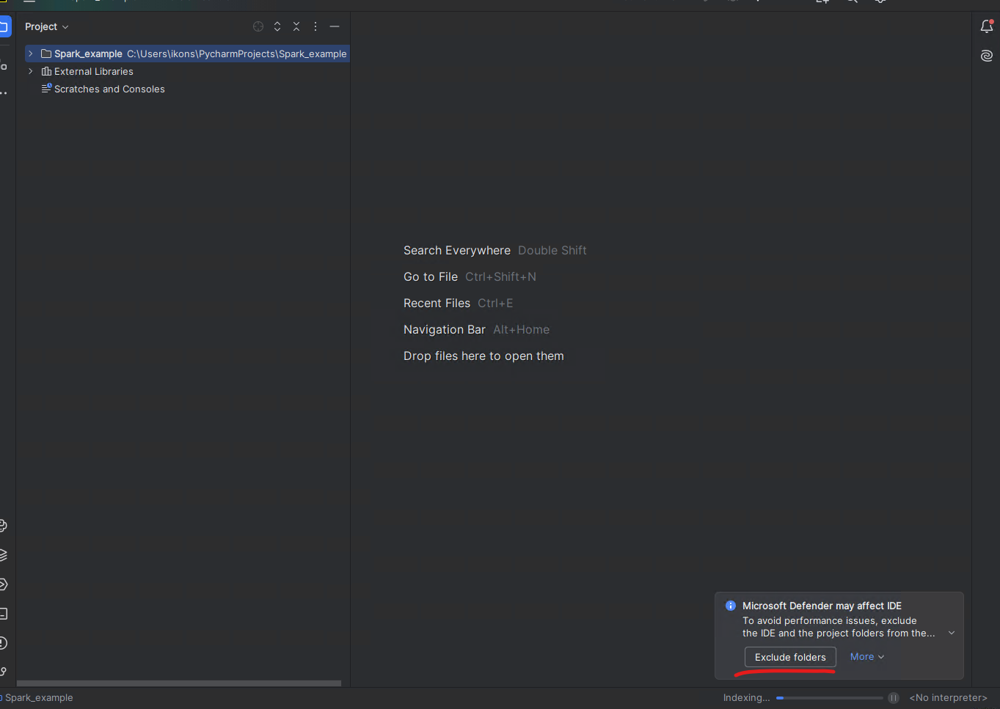
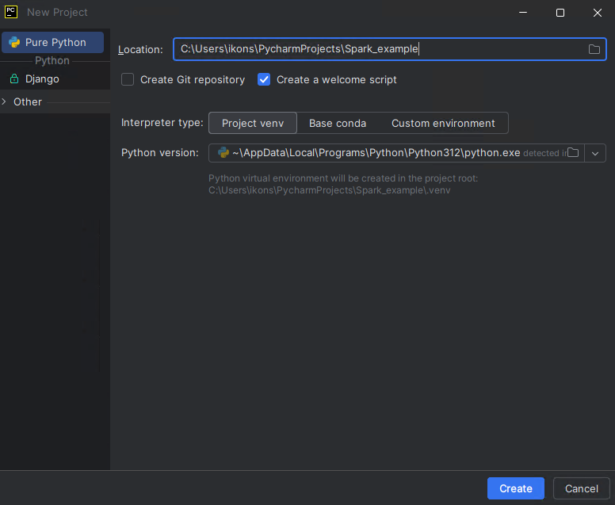
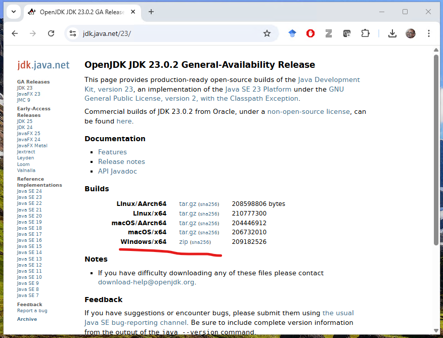
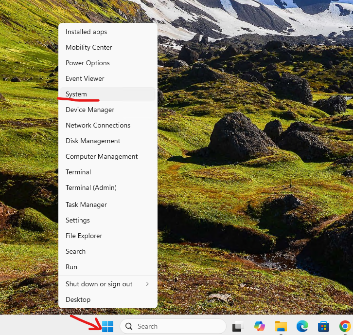
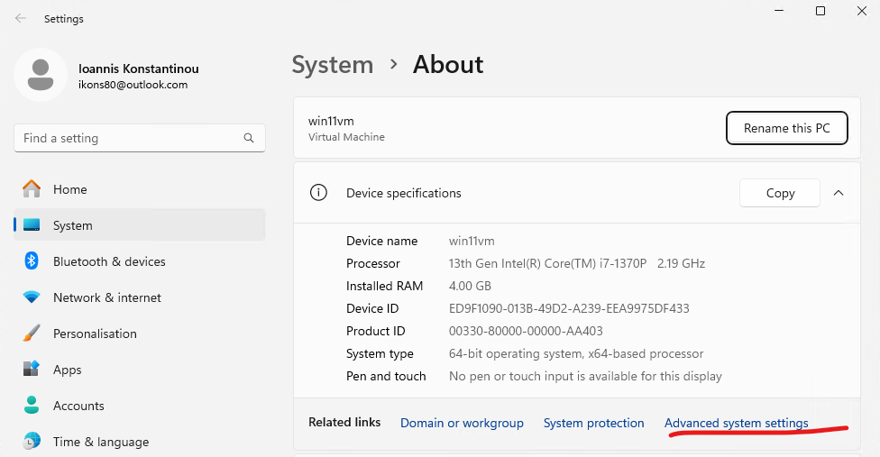
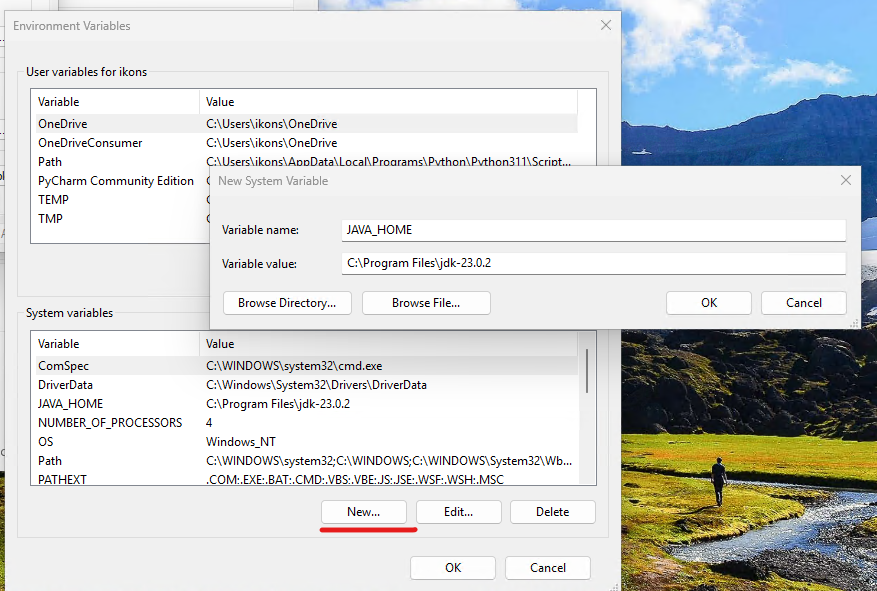

# Υλοποίηση σε Apache Spark μέσω PyCharm


## Οδηγίες εγκατάστασης pyspark σε pycharm με venv package manager

Μπορείτε να δείτε οδηγίες υλοποίησης με Apache Spark εδώ

https://spark.apache.org/docs/latest/rdd-programming-guide.html

Ο παρακάτω οδηγός θεωρεί ότι υπάρχουν εγκατεστημένες στον υπολογιστή σας οι τελευταίες εκδόσεις του εργαλείου **PyCharm Community Edition IDE**. Οι εκδόσεις για windows του εργαλείου βρίσκεται στο παρακάτω link. Αντί για το PyCharm, μπορείτε να χρησιμοποιήσετε το πρόγραμμα ανάπτυξης κώδικα Python της επιλογής σας.


https://www.jetbrains.com/pycharm/download/download-thanks.html?platform=windows&code=PCC


Kατεβάστε την python 3.11(Windows installer (64-bit)) για να την εγκαταστήσετε στον υπολογιστή σας. Μην εγκαταστήσετε την τελευταία έκδοση (3.13 όταν γράφτηκε αυτός ο οδηγός) γιατί δεν είναι πλήρως συμβατή με το pyspark.

https://www.python.org/downloads/release/python-3110/


Κατά την εκτέλεση του PyCharm επιλέξτε την πρώτη φορά New Project


Επίσης, την πρώτη φορά που θα τρέξετε το PyCharm, θα σας ζητήσει να βάλετε τον κατάλογο που χρησιμοποιεί για να γράφει τα αρχεία στις εξαιρέσεις του Windows Security. Ο λόγος είναι ότι το windows security καθυστερεί πάρα πολύ εργασίες που κάνει το εργαλείο με διαφορετικά αρχεία και εκδόσεις πακέτων της python.




## Δημιουργία νέου PyCharm Project

Κατά την δημιουργία νέου project, πρέπει να επιλέξουμε τον python interpreter. Σαν επιλογή βάζουμε interpreter type “Project venv”. Ο στόχος αυτής της επιλογής είναι να χειριζόμαστε αυτόματα τις εξαρτήσεις των βιβλιοθηκών και να εγκαθίστανται αυτόματα αυτά που χρειαζόμαστε. Εάν θέλετε κάποιο διαφορετικό package manager μπορείτε να το δηλώσετε εκεί.

Δηλώστε σαν όνομα για το project το `Spark_example`. Είναι σημαντικό **να μην υπάρχουν κενά στα ονόματα των αρχείων και των καταλόγων**.

Τσεκάρετε την επιλογή `create a welcome script`

Κατόπιν, εγκαθιστούμε τα απαραίτητα πακέτα από την επιλογή: File-> Settings->project->python Interpreter



Τα πακέτα που χρειάζεστε είναι τα `pyspark` και `psutils`. Μετά την εγκατάσταση, και για μία φορά μόνο, κάντε μια επανεκκίνηση του pycharm. Δεν ξέρω αν χρειάζεται σε όλα τα περιβάλλοντα, αλλά στο δικό μου χρειάστηκε.

## Εγκατάσταση Java στον υπολογιστή

Από την διεύθυνση [https://jdk.java.net/23/](https://jdk.java.net/23/) κατεβάστε τη java για το λειτουργικό σας σύστημα (πχ για τα windows είναι το zip αρχείο). Αποσυμπιέστε τα περιεχόμενά του σε έναν κατάλογο, Πχ στον `C:\Program Files`



Θα δημιουργηθεί ένας κατάλογος της μορφής `C:\Program Files\jdk-23.0.2`

Θα χρειαστεί να προσθέσετε τον κατάλογο αυτό στις μεταβλητές περιβάλλοντος του υπολογιστή σας σαν `JAVA_HOME`.

Κάντε δεξί κλικ στο εικονίδιο των windows και επιλέξτε System



Κατόπιν, επιλέξτε Advanced System Settings




Κατόπιν επιλέξτε Environmental Variables


Στα System variables επιλέξτε new και προσθέστε Variable name: `JAVA_HOME` και Variable Value τον κατάλογο που αποσυμπιέσατε την java (στην δική μου περίπτωση `C:\Program Files\jdk-23.0.2`)

Θα χρειαστεί να κάνετε **επανεκκίνηση του υπολογιστή σας** για να ενημερωθούν οι μεταβλητές περιβάλλοντος.

## Ρύθμιση PyCharm για εκτέλεση pySpark κώδικα

Για την εκτέλεση προγραμμάτων `.py` χρησιμοποιούμε τα `run configurations`, τα οποία περιέχουν παραμέτρους για την εκτέλεση του python προγράμματος. Για το configuration του αρχείου που θα τρέξετε πρέπει οπωσδήποτε να θέσετε ορισμένες μεταβλητές περιβάλλοντος που χρειάζονται οι Spark workers που θα σηκώσει το IDE για να τρέξουν python. Οι μεταβλητές τίθενται στην επιλογή `environmental variables` του run configuration που φαίνεται εδώ:



Οι μεταβλητές είναι οι παρακάτω:

```
PYTHONUNBUFFERED=1;PYSPARK_DRIVER_PYTHON=C:\Users\ikons\PycharmProjects\Spark_example\.venv\Scripts\python.exe;PYSPARK_PYTHON=C:\Users\ikons\PycharmProjects\Spark_example\.venv\Scripts\python.exe;SPARK_SUBMIT_OPTS=-Djava.security.manager=allow
```
όπου σαν `path` μπαίνει το path του python εκτελέσιμου του περιβάλλοντος venv που δημιουργήθηκε για το project (ενδεικτικά είναι το παραπάνω, στον δικό σας υπολογιστή είναι διαφορετικό, μπορείτε να το δείτε από τα settings του interpreter), επιλέγοντας file->settings εδώ

Αντίστοιχα, κάνετε το ίδιο και για το python console στην επιλογή File->Settings->preferences->build, execution, Deployment->console->python console (βάζετε τα env variables)


Την πρώτη φορά που εκτελείτε τον κώδικά σας, μπορεί να βγει ερώτηση από το firewall για να επιτρέψετε πρόσβαση - ενεργοποιήστε την.

## Εκτέλεση ενός δοκιμαστικού wordcount

Δημιουργήστε ένα νέο αρχείο `.py`, ή απλώς αντικαταστήστε τα περιεχόμενα του `main.py` που δημιουργείται αυτόματα από το new project του pycharm με τον παρακάτω κώδικα.


```python
from pyspark import SparkConf
from pyspark.sql import SparkSession
if __name__ == '__main__':
    conf = SparkConf().setAppName("Word Count example") \
        .set("spark.executor.memory", "2g") \
        .set("spark.driver.memory", "2g")

    sc = SparkSession.builder.config(conf=conf).getOrCreate().sparkContext
    #sc.setLogLevel("DEBUG")
    #sc.setLogLevel("INFO")

    wordcount = sc.textFile("text.txt") \
        .flatMap(lambda x: x.split(" ")) \
        .map(lambda x: (x, 1)) \
        .reduceByKey(lambda x,y: x+y) \
       .sortBy(lambda x: x[1], ascending=False)
    print(wordcount.collect())
```

Θα χρειαστεί να τοποθετήσετε ένα αρχείο `text.txt` στον κατάλογο που βρίσκεται και το `main.py` του Pycharm Project με ενδεικτικά ορισμένες λέξεις για να τις «μετρήσει». Στην δική μου περίπτωση ο κατάλογος είναι ο `C:\Users\ikons\PycharmProjects\sparkExamples`

Με τις γραμμές `.set()` μπορείτε να περάσετε παραμέτρους στους spark executors, όπως την μέγιστη μνήμη που θα πάρει ο κάθε ένας.

Οι γραμμές `sc.setLogLevel` καθορίζουν το πόσο αναλυτικά θα είναι τα log messages που θα λαμβάνετε κατά την εκτέλεση του προγράμματος. Εγώ τώρα τις έχω σχολιασμένες, και τα log messages είναι λίγα. Αν έχετε πρόβλημα κατά την εκτέλεση αφαιρέστε το σχόλιο για να αυξήσετε το επίπεδο logging.

Εφόσον το έχετε έτοιμο, μπορείτε να το εκτελέσετε με 2 τρόπους:

- Μέσω του `run configuration` (επιλογή στο menu `Run`, ή `Shift+F10`)
- Μέσω του `Python Console`, που βρίσκεται αριστερά στο IDE (σημειωμένο με κόκκινο στο παρακάτω σχήμα) και λέγεται Python Console.


Την πρώτη φορά που θα το εκτελέσετε, θα σας ζητηθεί από το πρόγραμμα ασφαλείας του υπολογιστή σας (πχ windows defender) να αποδεχθείτε την εξαίρεση ασφαλείας – επιλέξτε `ΟΚ`.


Μέσω του `python console` μπορείτε να έχετε μια διαδραστική εκτέλεση των μετασχηματισμών σας, χωρίς να χρειάζεται να σηκώνετε και να εκτελείτε εκ νέου όλη τη μηχανή Spark για κάθε αλλαγή στον κώδικα (κάτι σαν το spark shell στο command line). 

Με το `python console` επίσης μπορείτε να βλέπετε τις μεταβλητές που δημιουργεί το spark, και να ελέγχετε την ορθότητά τους (δεξιά στο σχήμα).


Ένας άλλος τρόπος να ελέγχετε τί γίνεται είναι μέσω του URL  στο οποίο τρέχει το UI του scheduler του Spark. Παρακάτω εκτελώ έναν μετασχηματισμό rdd από την κονσόλα και βλέπω την εκτέλεσή του στο [http://localhost:4040](http://localhost:4040). Μόλις τερματίσω την κονσόλα σταματάει και η εκτέλεση του webserver


