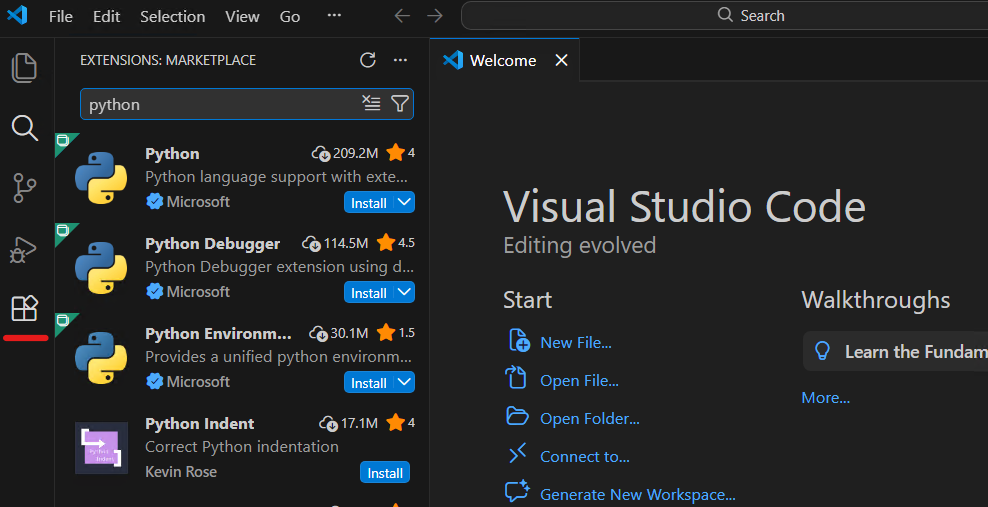
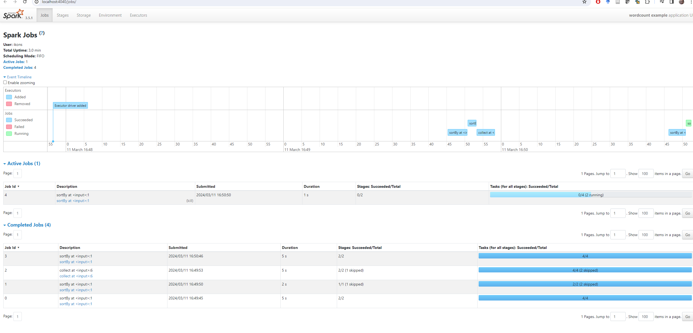

# Υλοποίηση σε Apache Spark μέσω VS Code

## Οδηγίες εγκατάστασης pyspark σε VS Code με venv package manager

Μπορείτε να δείτε οδηγίες υλοποίησης με Apache Spark εδώ:

https://spark.apache.org/docs/latest/rdd-programming-guide.html

Ο παρακάτω οδηγός θεωρεί ότι υπάρχουν εγκατεστημένες στον υπολογιστή σας οι τελευταίες εκδόσεις του εργαλείου **Visual Studio Code**. Αντί για το VS Code, μπορείτε να χρησιμοποιήσετε το πρόγραμμα ανάπτυξης κώδικα Python της επιλογής σας.

https://code.visualstudio.com/

Προτείνεται να εγκαταστήσετε την **Python 3.11** στον υπολογιστή σας. Στο μάθημα χρησιμοποιούμε απλό τοπικό περιβάλλον με `venv`, οπότε η Python 3.11 είναι μια ασφαλής και πρακτική επιλογή.

https://www.python.org/downloads/

Για την Python στο VS Code θα χρειαστείτε τουλάχιστον τα παρακάτω extensions:

- `Python`
- `Pylance`
- προαιρετικά `Jupyter`




## Δημιουργία νέου φακέλου εργασίας

Δημιουργήστε έναν νέο κατάλογο για το project σας, π.χ. `Spark_example` σε μια διαδρομή π.χ. `C:\repositories`. Είναι σημαντικό **να μην υπάρχουν κενά στα ονόματα αρχείων και καταλόγων**.

Ανοίξτε τον φάκελο από το VS Code με `File -> Open Folder`.


Κατά την πρώτη εκτέλεση του VS Code, αν σας ζητηθεί να εμπιστευθείτε τον φάκελο εργασίας σας, επιλέξτε `Yes, I trust the authors`.


## Δημιουργία virtual environment στο VS Code

Για το μάθημα προτείνεται να χρησιμοποιείτε **τοπικό virtual environment με `venv`** μέσα σε κάθε project. Αυτός είναι ο πιο καθαρός και πρακτικός τρόπος, γιατί:

- κάθε εργασία έχει τα δικά της πακέτα,
- αποφεύγονται συγκρούσεις μεταξύ διαφορετικών projects,
- το VS Code συνήθως εντοπίζει αυτόματα το `.venv` του project.

Ανοίξτε τον φάκελο του project σας στο VS Code.


Ανοίξτε ένα terminal μέσα από το VS Code (`Terminal -> New Terminal`) και δημιουργήστε το virtual environment:

```powershell
python -m venv .venv
```

Η παραπάνω εντολή θα δημιουργήσει έναν κατάλογο `.venv` μέσα στο project σας.

## Ενεργοποίηση του virtual environment

Μετά τη δημιουργία του `.venv`, έχετε δύο απλούς τρόπους:

### Τρόπος 1: Κλείνω και ξανανοίγω το terminal

Συνήθως αρκεί να κλείσετε το terminal και να ανοίξετε νέο terminal μέσα στο VS Code.  
Το VS Code συνήθως εντοπίζει αυτόματα το `.venv` και το ενεργοποιεί μόνο του.

### Τρόπος 2: Χειροκίνητη ενεργοποίηση

Αν θέλετε, μπορείτε να το ενεργοποιήσετε και μόνοι σας από το terminal.

Σε Windows `cmd.exe`:

```bat
.venv\Scripts\activate.bat
```

Σε Windows PowerShell:

```powershell
.\.venv\Scripts\Activate.ps1
```

Αν όλα έχουν πάει σωστά, θα δείτε συνήθως το `(.venv)` στην αρχή της γραμμής του terminal.


## Εγκατάσταση πακέτων

Αφού ενεργοποιηθεί το virtual environment, εγκαταστήστε τα απαραίτητα πακέτα με:

```powershell
python -m pip install pyspark psutil
```

Μπορείτε να δείτε τα εγκατεστημένα πακέτα με:

```powershell
python -m pip list
```

Προτιμούμε τη μορφή `python -m pip` αντί για σκέτο `pip`, γιατί έτσι είναι πιο σαφές ότι η εγκατάσταση γίνεται για τον Python interpreter που χρησιμοποιεί το project.


## Αν το PowerShell δεν επιτρέπει το activation

Σε ορισμένους υπολογιστές Windows, το PowerShell μπορεί να μην επιτρέπει την εκτέλεση του `Activate.ps1`.

Σε αυτή την περίπτωση μπορείτε:

- είτε να χρησιμοποιήσετε το `cmd.exe` με:
  ```bat
  .venv\Scripts\activate.bat
  ```
- είτε να εκτελέσετε μία φορά:
  ```powershell
  Set-ExecutionPolicy -ExecutionPolicy RemoteSigned -Scope CurrentUser
  ```

## Αν η δημιουργία του `.venv` κολλήσει

Σε ορισμένους υπολογιστές, η εντολή:

```powershell
python -m venv .venv
```

μπορεί να καθυστερήσει ή να κολλήσει στο βήμα όπου εγκαθίσταται το `pip` μέσα στο virtual environment.

Σε αυτή την περίπτωση, δοκιμάστε την παρακάτω εναλλακτική:

```powershell
python -m venv --without-pip .venv
.\.venv\Scripts\python.exe -m ensurepip --upgrade
```

Με αυτόν τον τρόπο, δημιουργείται πρώτα το virtual environment και στη συνέχεια εγκαθίσταται το `pip` σε δεύτερο βήμα.

## Τι να θυμάστε

Για το συγκεκριμένο μάθημα, η προτεινόμενη ροή είναι η εξής:

1. δημιουργώ το `.venv`
2. επιλέγω `Python: Select Interpreter`
3. εγκαθιστώ πακέτα με `python -m pip`
4. τρέχω ή κάνω debug από το VS Code

Η χειροκίνητη ενεργοποίηση είναι προαιρετική και χρησιμοποιείται κυρίως όταν δουλεύετε άμεσα από terminal.

## Εγκατάσταση Java στον υπολογιστή

Για τοπική εκτέλεση PySpark χρειάζεται JDK 17.
Δεν χρειάζεται να εγκαταστήσετε ξεχωριστά το Apache Spark στον υπολογιστή σας. Για αυτόν τον οδηγό αρκούν το `pyspark` που εγκαταστήσατε μέσα στο `.venv` και η Java.

Στα Windows ο πιο απλός τρόπος είναι να ανοίξετε ένα PowerShell terminal και να εκτελέσετε:

```powershell
winget install --id Microsoft.OpenJDK.17 --accept-source-agreements --accept-package-agreements
```

Η εντολή αυτή εγκαθιστά τη Java και ρυθμίζει τα απαραίτητα environment variables για το σύστημα.

Κατά την εγκατάσταση μπορεί να εμφανιστεί παράθυρο των Windows για εκτέλεση του installer με δικαιώματα διαχειριστή. Σε αυτή την περίπτωση επιλέξτε `Yes` / `Ναι` για να συνεχιστεί η εγκατάσταση.

Αν το `winget` δεν είναι διαθέσιμο στο μηχάνημά σας, εγκαταστήστε χειροκίνητα οποιοδήποτε JDK 17 και βεβαιωθείτε ότι:

- το `JAVA_HOME` δείχνει στον κατάλογο της εγκατάστασης
- η εντολή `java` είναι διαθέσιμη στο `PATH`

Αν η Java εγκαταστάθηκε ενώ το VS Code ήταν ήδη ανοιχτό, κλείστε και ανοίξτε ξανά όλα τα παράθυρα του VS Code και δημιουργήστε νέο terminal, ώστε να φορτωθούν τα νέα environment variables. Κανονικά δεν χρειάζεται επανεκκίνηση του υπολογιστή. Στη συνέχεια, ελέγξτε ότι όλα είναι σωστά:

```powershell
java -version
```

## Δημιουργία αρχείων παραδείγματος

Δημιουργήστε δύο αρχεία στον κατάλογο του project: `main.py` και `text.txt`.

Στο `main.py` βάλτε τον παρακάτω κώδικα:

```python
import os
import sys

from pyspark.sql import SparkSession

os.environ["PYSPARK_PYTHON"] = sys.executable
os.environ["PYSPARK_DRIVER_PYTHON"] = sys.executable


def main() -> None:
    spark = SparkSession.builder.appName("Word Count example").getOrCreate()
    sc = spark.sparkContext

    wordcount = (
        sc.textFile("text.txt")
        .flatMap(lambda line: line.split())
        .map(lambda word: (word, 1))
        .reduceByKey(lambda left, right: left + right)
        .sortBy(lambda item: item[1], ascending=False)
    )

    print(wordcount.collect())
    spark.stop()


if __name__ == "__main__":
    main()
```

Οι δύο γραμμές με το `sys.executable` λένε ρητά στο Spark να χρησιμοποιήσει τον ίδιο Python interpreter που έχει επιλέξει το project στο VS Code. Έτσι, για αυτό το πρώτο παράδειγμα δεν χρειάζεται ξεχωριστό `launch.json`.

Στο `text.txt` βάλτε ενδεικτικά:

```text
spark spark data
big data spark
python spark
```

## Εκτέλεση και debugging στο VS Code

Αφού έχετε ήδη επιλέξει τον interpreter από το `.venv`, ανοίξτε το `main.py` και εκτελέστε το πρόγραμμα με έναν από τους παρακάτω τρόπους:

- από το κουμπί `Run Python File`
- από το ενσωματωμένο terminal, με ενεργό το `.venv`, χρησιμοποιώντας `python main.py`

Για debugging:

- ανοίξτε το `Run and Debug`
- αν το VS Code σας ζητήσει τύπο ρύθμισης, επιλέξτε `Python Debugger: Current File`
- στη συνέχεια πατήστε `F5`

Για το συγκεκριμένο απλό παράδειγμα, αυτό αρκεί. Δεν χρειάζεται να γράψετε χειροκίνητα `launch.json`. Αν το VS Code δημιουργήσει αυτόματα ένα απλό `launch.json` στο πρώτο debug, μπορείτε να κρατήσετε την προεπιλεγμένη ρύθμιση.

Την πρώτη φορά που θα εκτελέσετε το πρόγραμμα, μπορεί να εμφανιστεί ερώτηση από το firewall / Windows Defender για το `OpenJDK Platform binary`. Αν εμφανιστεί, επιλέξτε `Allow`, ώστε το Spark να μπορέσει να ανοίξει την τοπική θύρα που χρειάζεται.


Αν όλα έχουν ρυθμιστεί σωστά, θα δείτε στο terminal αποτέλεσμα όπως:

```text
[('spark', 4), ('data', 2), ('big', 1), ('python', 1)]
```

## Πειραματισμός με `pyspark`

Αν θέλετε να πειραματίζεστε διαδραστικά με Spark, έχετε δύο πρακτικές επιλογές:

- το `pyspark`, που ανοίγει έτοιμη κονσόλα με διαθέσιμα τα `sc` και `spark`, αλλά σε Windows συχνά δεν δίνει βολικό history με τα πλήκτρα `Up` / `Down`
- την κανονική Python κονσόλα που ανοίγετε με `python`, η οποία συνήθως έχει πιο βολικό history και editing, αλλά θέλει χειροκίνητη δημιουργία του `SparkSession`

Σημείωση: το `pyspark` είναι για Python, ενώ το `spark-shell` είναι Scala shell. Η εντολή `sparkshell` χωρίς παύλα δεν είναι έγκυρη.

### Επιλογή 1: `pyspark`

Το `pyspark` είναι ο πιο γρήγορος τρόπος αν θέλετε να ξεκινήσετε αμέσως με έτοιμα τα `sc` και `spark`.

Αφού έχετε ενεργό το `.venv` και η εντολή `java -version` δουλεύει, εκτελέστε στο terminal:

```powershell
$env:PYSPARK_PYTHON = (Resolve-Path .\.venv\Scripts\python.exe).Path
$env:PYSPARK_DRIVER_PYTHON = $env:PYSPARK_PYTHON
pyspark
```

Μόλις ανοίξει το shell, μπορείτε να δοκιμάσετε για παράδειγμα:

```python
sc.parallelize([1, 2, 3]).count()
spark.range(5).show()
```

Για έξοδο από το shell:

```python
exit()
```

### Επιλογή 2: άνοιγμα κανονικής Python κονσόλας από το terminal

Αν θέλετε πιο άνετο history και πιο προβλέψιμη εμπειρία στο terminal, μπορείτε να ανοίξετε πρώτα την κανονική Python κονσόλα:

```powershell
python
```

και στη συνέχεια να δημιουργήσετε χειροκίνητα το Spark session:

```python
import os
import sys
from pyspark.sql import SparkSession

os.environ["PYSPARK_PYTHON"] = sys.executable
os.environ["PYSPARK_DRIVER_PYTHON"] = sys.executable

spark = SparkSession.builder.appName("playground").getOrCreate()
sc = spark.sparkContext
```

Μετά μπορείτε να πειραματιστείτε με εντολές όπως:

```python
sc.parallelize([1, 2, 3]).count()
spark.range(5).show()
```

Όταν τελειώσετε:

```python
spark.stop()
exit()
```
## Έλεγχος του Spark UI

Ένας ακόμη τρόπος να παρακολουθείτε τι γίνεται είναι μέσω του URL στο οποίο τρέχει το Spark UI. Συνήθως, κατά την τοπική εκτέλεση, αυτό εμφανίζεται στο:

[http://localhost:4040](http://localhost:4040)

Μόλις τερματίσετε την εκτέλεση του προγράμματος, σταματά και ο αντίστοιχος web server του Spark UI.

Η ακριβής εμφάνιση του Spark UI μπορεί να διαφέρει λίγο ανάλογα με την έκδοση του Spark, αλλά η βασική ιδέα παραμένει η ίδια.



## Χρήσιμες παρατηρήσεις

- Αν το `java -version` δεν δουλεύει αμέσως μετά την εγκατάσταση, κλείστε και ανοίξτε ξανά το VS Code και δημιουργήστε νέο terminal.
- Αν το VS Code δεν «βλέπει» σωστά το `.venv`, ξανακάντε `Python: Select Interpreter`.
- Αν δείτε warnings για `winutils.exe` ή `NativeCodeLoader`, μπορείτε να τα αγνοήσετε σε αυτό το απλό τοπικό παράδειγμα σε Windows.
- Αν το αρχείο `text.txt` δεν βρίσκεται στον σωστό κατάλογο, το πρόγραμμα θα αποτύχει επειδή δεν θα το βρει.
- Αν η πόρτα `4040` χρησιμοποιείται ήδη, το Spark μπορεί να ξεκινήσει το UI σε άλλη θύρα όπως `4041`.