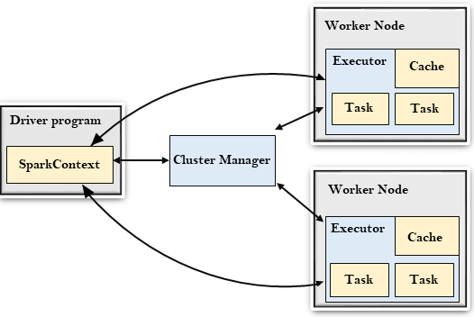
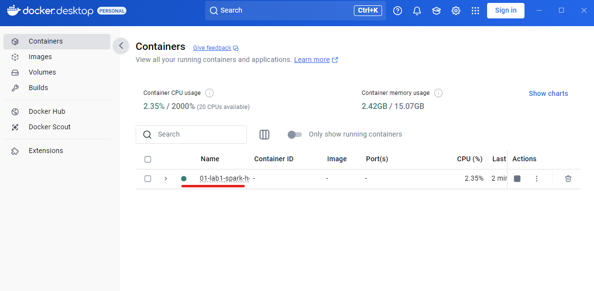
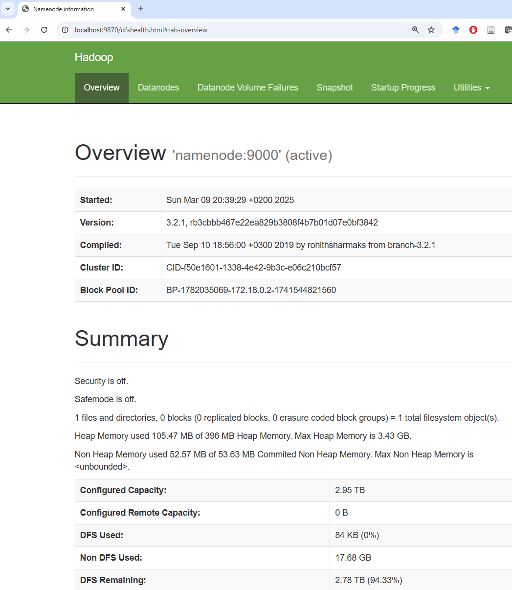
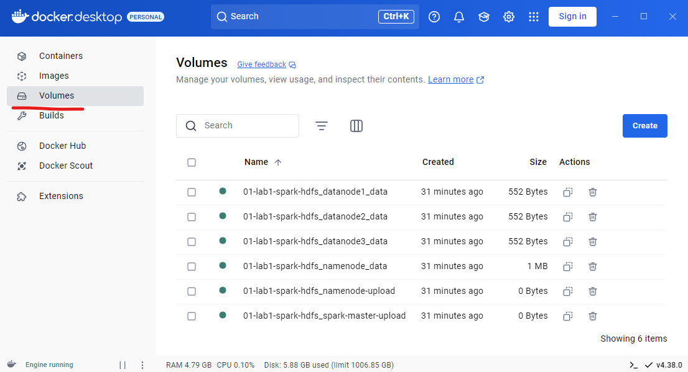
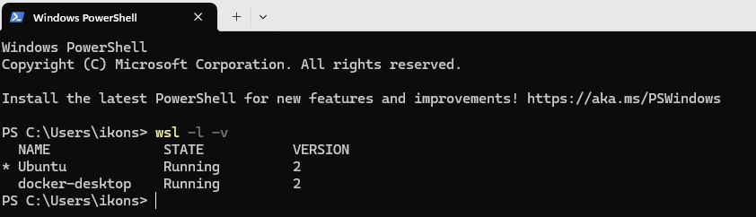
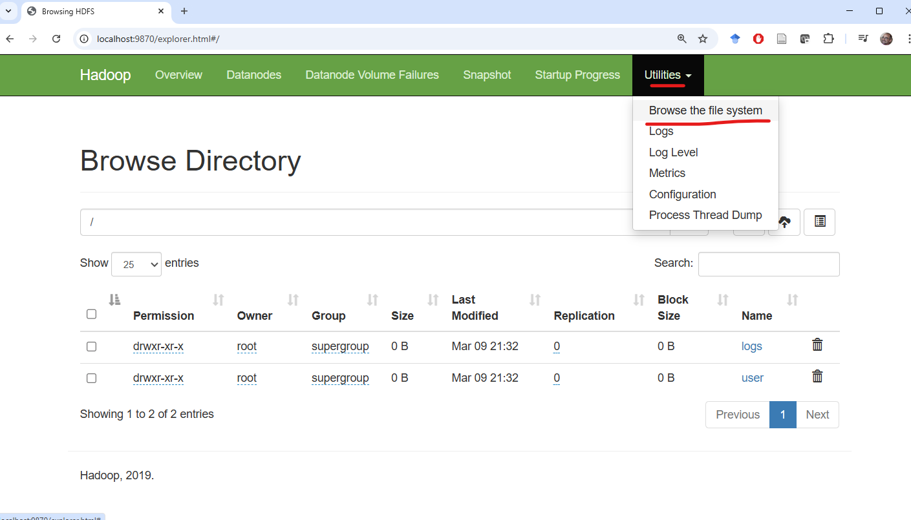
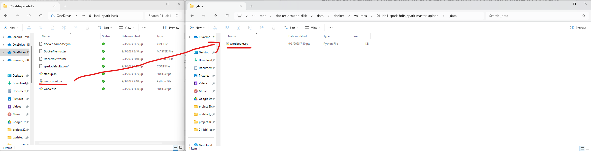
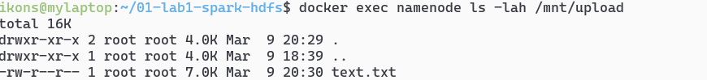
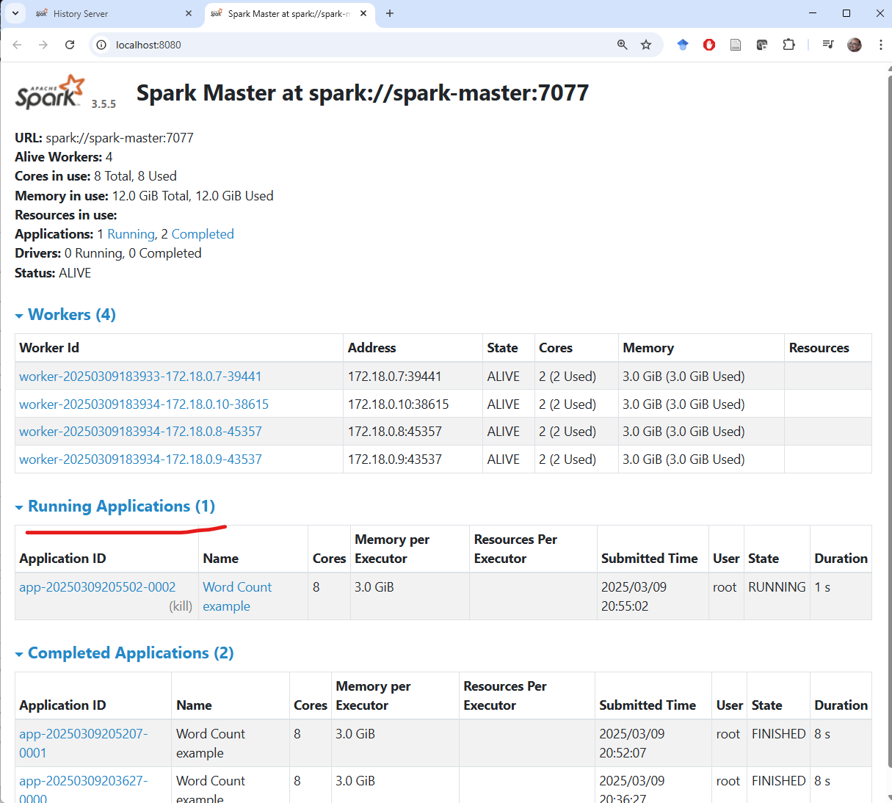
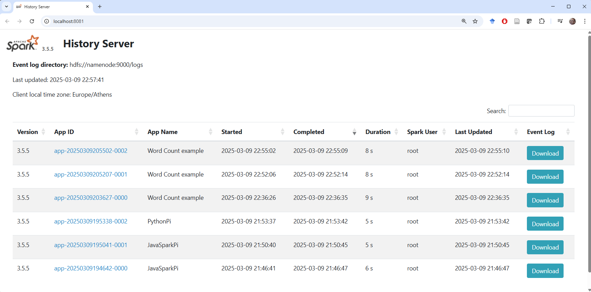

# Installing and configuring Spark and HDFS using Docker containers

## HDFS and Spark architecture

**HDFS** is a distributed file system from which Spark jobs can read and write data.

Cluster node roles:


- **HDFS NameNode:** The NameNode is the most important HDFS node. It knows which DataNode stores each block of every file.
- **HDFS DataNode:** DataNodes store HDFS file blocks on their local file systems and serve those blocks when clients request them.

**Spark** is a unified distributed processing system for data analysis. It includes the Map/Reduce programming model as well as libraries for machine learning, SQL processing, and more.




- **Spark Master:** The Spark Master controls the available resources and launches/manages distributed applications across the cluster.
- **Spark Worker:** A Worker runs on each cluster node and manages the distributed tasks assigned to that node.
- **Spark Driver:** The Driver acts as the controller of a Spark application and maintains its overall execution state.

## Basic Docker concepts

To build the above infrastructure on a personal computer, we use Docker containers. The most important concepts are the following:

- **Docker image:** A static package that contains everything required to run an application, including code, dependencies, and runtime environment. To run a container, Docker first retrieves the corresponding image from an image repository. For example, the following command downloads and runs the official `hello-world` image:

```bash
docker run hello-world
```

- **Dockerfile:** A text file containing the instructions required to build a Docker image. It defines the base image, dependencies, and runtime configuration. The example below builds an image based on Python and runs a local `app.py` file.

Open the Ubuntu terminal and run:

```bash
mkdir compose-example
cd compose-example
```

Create a local `app.py` file:

```bash
nano app.py
```

Add the following content:

```python
print("Hello from Docker!")
```

Save the file (`CTRL+X`, then `Y`, then `Enter`).

Now create a local `Dockerfile`:

```bash
nano Dockerfile
```

Add the following content:

```dockerfile
FROM python:3.9
COPY app.py /app.py
CMD ["python", "/app.py"]
```

Save the file (`CTRL+X`, then `Y`, then `Enter`).

Build and run the image with the following commands:

```bash
docker build -t my-python-app .
```


```bash
docker run my-python-app
```

To run the built image as a container, use the command above. The first time you run it, Docker downloads the required dependencies. On subsequent runs, this is no longer necessary.

- **Docker Compose:** A tool that manages multiple containers through a `docker-compose.yml` file, defining services, networks, and persistent storage.
- Docker containers have an **ephemeral file system**, so data stored only inside the container is lost when the container is removed.
- **Volume:** A storage mechanism that lets containers preserve data even after restart or deletion. Docker uses **persistent volumes** for long-term storage. Volumes can be created, named, and mounted into containers.

## Installing Apache Spark and HDFS locally with Docker containers

Move to the example directory:

```bash
cd ~/bigdata-uth/docker/01-lab1-spark-hdfs/
```

Inside it you will find the following files:

- **docker-compose.yml**: Creates a local infrastructure consisting of:
  - one HDFS cluster with one NameNode (`namenode`) and three DataNodes (`datanode1`, `datanode2`, `datanode3`)
  - one Spark cluster with one Master (`spark-master`) and three Workers (`spark-worker1`, `spark-worker2`, `spark-worker3`)
- **Dockerfile.master**: Dockerfile used to build the `spark-master` image, based on the official Apache Spark image.
- **Dockerfile.worker**: Dockerfile used to build the worker images, also based on the official Apache Spark image.
- **spark-defaults.conf**: Default Spark configuration shared by the master and workers.
- **startup.sh** and **worker.sh**: Shell scripts executed when the `spark-master` and `spark-worker` containers start.

**Starting the infrastructure:** Run the following command to launch the environment. **Important:** you must be inside the `01-lab1-spark-hdfs` directory for it to work correctly.

```bash
docker-compose up --build -d
```

The first execution may take 1–2 minutes, depending on your internet connection and computer speed, because Docker must pull the required images, build the custom images, and start the containers.

If everything works correctly, Docker Desktop will show the stack as running (green dot).



You can also list the containers from the terminal:

```bash
docker ps
```


Click on **01-lab1-spark-hdfs** in Docker Desktop to see the individual containers.


Whenever you see pairs of numbers such as `9870:9870`, it means that the container exposes a **service** (usually an HTTP site, but not necessarily). This service is **accessible from your host operating system**, either by clicking the link directly or by opening it in a browser.

For example, `hdfs-namenode` serves:

http://localhost:9870



And `spark-master` serves the Spark UI at:
- http://localhost:8080
- http://localhost:8081 for the History Server (all jobs executed so far)


In the **Volumes** section you can see all persistent volumes used by the stack. These volumes are declared in `docker-compose.yml` and are created automatically by `docker-compose up`.



You can also list volumes from the terminal:

```bash
docker volume ls
```


In the Docker setup used here, volumes are stored as subdirectories under a local directory of the Docker server.

Because the local Docker server is itself a virtual machine, that directory is part of the Docker VM file system.

To see this, open a Windows terminal (**right-click the Windows icon → Terminal**) and run:

```bash
wsl -l -v
```



This shows that the machine runs two virtual environments: Ubuntu (where you execute the Docker commands) and `docker-desktop`, which runs the Docker daemon itself.

The persistent volumes live inside the file system of the `docker-desktop` VM.

These volumes can be accessed from the Windows host via the following folder:

```
\\wsl.localhost\docker-desktop\mnt\docker-desktop-disk\data\docker\volumes
```

Open Windows Explorer and paste the above path in the address bar. There you will see all directories used as persistent Docker volumes. Each one contains a `_data` subdirectory; whatever you place there becomes visible inside any container that mounts that volume.


**Initializing the HDFS file system:** The first time you create the environment, you must also create the required HDFS directories for uploading files and storing Spark execution logs. Run the following commands from the **Ubuntu shell**:

```bash
docker exec namenode hdfs dfs -mkdir -p /user/root
docker exec namenode hdfs dfs -mkdir -p /logs
docker-compose stop spark-master
docker-compose rm -f spark-master
docker-compose up -d spark-master
```

These commands run `hdfs dfs` through the NameNode container and create two directories:
- `/user/root`, where you will store input files
- `/logs`, where Spark job logs will be stored so you can later inspect what was executed and whether it completed successfully

You also restart the `spark-master` container so that the History Server works correctly.



## Running programs on the cluster

Run the following command to estimate π using a Monte Carlo simulation in Java:

```bash
docker exec spark-master /opt/spark/bin/spark-submit --class org.apache.spark.examples.JavaSparkPi /opt/spark/examples/jars/spark-examples.jar
```

If it executes correctly, you will see output similar to:

```
Pi is roughly 3.14638
```

Run the following for the equivalent Python example:

```bash
docker exec spark-master /opt/spark/bin/spark-submit /opt/spark/examples/src/main/python/pi.py
```

### Running your own Spark program on the cluster

Now that we have an initialized HDFS file system and a working container stack, we can run our own Spark programs. To do so, we need to upload:

- **code files** (for example Python scripts)
- **data files** that will be processed (for example the input text for a word count)

### Uploading code

To execute code through Spark, the file must be visible inside the `spark-master` container. For this purpose, the project defines a local persistent volume named `01-lab1-spark-hdfs_spark-master-upload`. This volume is mounted into the `spark-master` container at `/mnt/upload` (see line 74 of `docker-compose.yml`). To place files from your local Windows file system inside the container file system, open the following folder in Windows Explorer:

```
\\wsl.localhost\docker-desktop\mnt\docker-desktop-disk\data\docker\volumes\01-lab1-spark-hdfs_spark-master-upload\_data
```


The folder is initially empty. Copy `wordcount.py` from `~/bigdata-uth/docker/01-lab1-spark-hdfs/` into that `_data` directory.



Now the `spark-master` container sees the file at `/mnt/upload`:

```bash
docker exec spark-master ls /mnt/upload
```


The following command prints the contents of the remote `wordcount.py` file as seen from inside the container:

```bash
docker exec spark-master cat /mnt/upload/wordcount.py
```

```python
from pyspark import SparkConf
from pyspark.sql import SparkSession
conf = SparkConf().setAppName("Word Count example") \
    .set("spark.master", "spark://spark-master:7077") \
    .set("spark.executor.memory", "3g") \
    .set("spark.driver.memory", "512m")
sc = SparkSession.builder.config(conf=conf).getOrCreate().sparkContext
wordcount = sc.textFile("hdfs://namenode:9000/user/root/text.txt") \
    .flatMap(lambda x: x.split(" ")) \
    .map(lambda x: (x, 1)) \
    .reduceByKey(lambda x,y: x+y) \
    .sortBy(lambda x: x[1], ascending=False)
print(wordcount.collect())
wordcount.saveAsTextFile("hdfs://namenode:9000/user/root/wordcount-output")
```

Any change you make to `wordcount.py` through the Windows file system becomes immediately visible inside the container. You do not need to re-upload it after every edit.

### Uploading data files

The `wordcount.py` script reads a file (or directory) from HDFS and computes word frequencies. At this point, however, the HDFS file system is empty apart from the directories created earlier.

So we must upload an input data file to HDFS.

This happens in **two stages**:
1. Place the file from your local file system into the local file system of the `namenode` container.
2. Run `hdfs dfs -put` inside the `namenode` container to upload the file from `/mnt/upload` into HDFS.

For this purpose we use another persistent volume mounted into the `namenode` container. It is called `01-lab1-spark-hdfs_namenode-upload` and is mounted at `/mnt/upload` (see line 16 of `docker-compose.yml`). Open the following folder in Explorer:

```
\\wsl.localhost\docker-desktop\mnt\docker-desktop-disk\data\docker\volumes\01-lab1-spark-hdfs_namenode-upload\_data
```

Initially the folder is empty. Copy `text.txt` from the `01-lab1-spark-hdfs` directory into that `_data` folder.


Now the `namenode` container sees `text.txt` inside `/mnt/upload`:

```bash
docker exec namenode ls -lah /mnt/upload
```



Upload the file into HDFS with:

```bash
docker exec namenode hdfs dfs -put -f /mnt/upload/text.txt /user/root/text.txt
```

At this point:
- the Python file to execute is available on the local file system of `spark-master`
- `text.txt` is stored in HDFS

You are ready to run the Spark program:

```bash
docker exec spark-master /opt/spark/bin/spark-submit /mnt/upload/wordcount.py
```

### Monitoring execution

You can watch the currently running job at:

http://localhost:8080



### History Server

Apache Spark includes a useful service that stores log files from all submitted jobs across the master and worker nodes. This service is called the **History Server** and is available at:

http://localhost:8081




## Useful Linux commands

| Command | Meaning |
|---|---|
| `ls` | list directory contents |
| `pwd` | print the current directory |
| `cd` | change directory |
| `cp` | copy |
| `mv` | move |
| `cat` | print file contents |
| `echo` | print text to the screen |
| `man <command>` | show the manual page for `<command>` |

## Useful HDFS commands

Create a directory in HDFS:

```bash
docker exec namenode hadoop fs -mkdir -p <path>
```

Delete a directory in HDFS:

```bash
docker exec namenode hdfs dfs -rm -r -f <path>
```

Upload a file with overwrite:

```bash
docker exec namenode hdfs dfs -put -f <local-path> <hdfs-path>
```

## Stopping the infrastructure

The following command stops the infrastructure. Files uploaded to HDFS or saved in the persistent volumes of `namenode` and `spark-master` are **not** deleted and remain available. As with `docker-compose up`, you must run it from the directory that contains `docker-compose.yml`.

```bash
docker-compose down
```
