# Εγκατάσταση και διαμόρφωση του Spark και του HDFS χρησιμοποιώντας περιέκτες (containers Docker


## Αρχιτεκτονική HDFS και Spark

**HDFS**: Κατανεμημένο σύστημα αρχείων, από το οποίο τα Spark jobs μπορούν να διαβάσουν και να γράψουν.


Ρόλοι κόμβων στη συστοιχία:


- **HDFS Namenode:**  Ο Namenode είναι ο πιο σημαντικός κόμβος του HDFS. Ο Namenode γνωρίζει ποιος Datanode έχει ποιο μπλοκ ενός αρχείου.
- **HDFS Datanode:** Οι Datanodes αποθηκεύουν μπλοκ από τα αρχεία του HDFS στο τοπικό τους σύστημα αρχείων. Η δουλειά τους είναι να εξυπηρετούν τα μπλοκ που ζητούν οι πελάτες.

**Spark:** Ένα ενιαίο σύστημα  κατανεμημένης επεξεργασίας για επεξεργασία δεδομένων, που περιλαμβάνει την υλοποίηση του προγραμματιστικού μοντέλου Map/reduce και περιέχει βιβλιοθήκες για μηχανική μάθηση, εκτέλεση SQL κ.λπ.

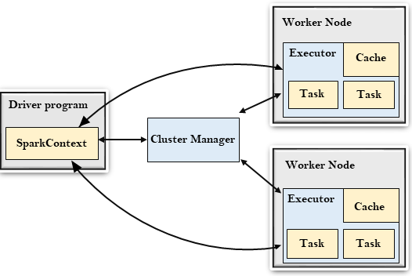


- **Spark Master:** Ο κόμβος Master του Spark ελέγχει τους διαθέσιμους πόρους και, με βάση αυτούς, εκκινεί και διαχειρίζεται τις κατανεμημένες εφαρμογές που εκτελούνται στη συστοιχία.
- **Spark Worker:** Ο Worker είναι μια διεργασία του Spark, η οποία εκτελείται σε κάθε κόμβο της συστοιχίας και διαχειρίζεται τις διεργασίες των κατανεμημένων εφαρμογών που εκτελούνται σε αυτόν τον κόμβο.
- **Spark Driver:** Ο Spark Driver λειτουργεί ως ελεγκτής της εκτέλεσης μιας εφαρμογής Spark. Ο Spark Driver διατηρεί ολόκληρη την κατάσταση της εφαρμογής που εκτελείται στον κλάδο του Spark..


## Βασικές έννοιες Docker

**Βασικές έννοιες:** Για την δημιουργία της παραπάνω υποδομής θα χρησιμοποιήσουμε περιέκτες docker στον προσωπικό μας υπολογιστή. Οι βασικές έννοιες που χρειάζεται να ξέρουμε είναι οι εξής:

- **Docker image:** Είναι ένα στατικό αρχείο που περιέχει όλα τα απαραίτητα για την εκτέλεση μιας εφαρμογής, συμπεριλαμβανομένου του κώδικα, των εξαρτήσεων και του λειτουργικού περιβάλλοντος. Για την δημιουργία περιεκτών χρησιμοποιείται η έννοια της εικόνας (image) και η έννοια του περιέκτη (container). Για να εκτελεστεί ένας περιέκτης χρειάζεται να ανακτηθεί η εικόνα του από ένα αποθετήριο εικόνων (image repository). Για παράδειγμα, με την παρακάτω εντολή κατεβάζουμε την εικόνα και εκτελούμε ένα περιέκτη που βασίζεται στην επίσημη εικόνα `hello-world`:

```bash
docker run hello-world
```

- **Dockerfile:** Είναι ένα αρχείο κειμένου που περιέχει οδηγίες για τη δημιουργία ενός Docker image. Μέσω αυτού καθορίζουμε τη βάση του image, τις εξαρτήσεις και τις ρυθμίσεις εκτέλεσης. Παράδειγμα δημιουργίας ενός Dockerfile που χρησιμοποιεί το Python image και εκτελεί ένα τοπικό αρχείο app.py

Ανοίγουμε το τερματικό Ubuntu και τρέχουμε

```bash
mkdir compose-example
cd compose-example
```

Δημιουργώ το τοπικό αρχείο app.py

```bash
nano app.py
```

Γράφω στον editor

```python
print("Hello from Docker!")
```

Αποθηκεύστε το (`CTRL` + `X`, μετά `Y` και `Enter`).

Τώρα δημιουργώ το τοπικό αρχείο Dockerfile
```bash
nano Dockerfile
```

Γράφω στον editor

```dockerfile
FROM python:3.9
COPY app.py /app.py
CMD ["python", "/app.py"]
```

Αποθηκεύστε το (`CTRL` + `X`, μετά `Y` και `Enter`).

Το χτίζουμε και το τρέχουμε με τις παρακάτω εντολές

```bash
docker build -t my-python-app .
```


```bash
docker run my-python-app
```


Για να εκτελέσω την χτισμένη εικόνα σαν περιέκτη τρέχω την παρακάτω εντολή

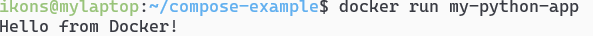


Την πρώτη φορά που το τρέχουμε «κατεβάζει» τις απαραίτητες εξαρτήσεις. Τις επόμενες φορές δεν χρειάζεται


- **Docker Compose:** Είναι ένα εργαλείο που επιτρέπει τη διαχείριση πολλών containers μέσω ενός αρχείου docker-compose.yml, ορίζοντας υπηρεσίες, δίκτυα και αποθηκευτικούς χώρους.
- Οι περιέκτες docker (docker containers) έχουν **εφήμερο (ephemeral)** σύστημα αρχείων, το οποίο με τον τερματισμό των στιγμιοτύπων τους χάνεται. 
- **Volume:** Είναι ένας μηχανισμός αποθήκευσης δεδομένων που επιτρέπει στους containers να διατηρούν δεδομένα ακόμη και μετά την επανεκκίνηση ή διαγραφή τους. Για την μόνιμη αποθήκευση αρχείων το docker χρησιμοποιεί την έννοια των "persistent volumes" (τόμοι). Οι τόμοι μπορούν να δημιουργηθούν, να αποκτήσουν δικό τους όνομα και να προσαρτηθούν σε containers που δημιουργούνται.


## Οδηγός εγκατάστασης Apache Spark και HDFS στον τοπικό υπολογιστή με χρήση docker containers.


Περιηγηθείτε στον κατάλογο του παραδείγματος

```bash
cd ~/bigdata-uth/docker/01-lab1-spark-hdfs/
```


Στον κατάλογο θα δείτε τα παρακάτω αρχεία:

- **docker-compose.yml**: Αρχείο που δημιουργεί μια υποδομή τοπικά στον υπολογιστή σας που αποτελείται από:
   -1 HDFS cluster με έναν namenode (όνομα: namenode) και 3 datanodes (όνομα: datanode1, datanode2 και datanode3).
   -1 Spark cluster με έναν master (όνομα: spark-master) και 3 workers (όνομα: spark-worker1, spark-worker2 και spark-worker3).

- **Dockerfile.master**: Αρχείο ρυθμίσεων dockerfile με το οποίο δημιουργούμε μια εικόνα για τον περιέκτη spark-master βασισμένη στην επίσημη εικόνα του Apache spark.
- **Dockerfile.worker:** Αρχείο ρυθμίσεων dockerfile με το οποίο δημιουργούμε μια εικόνα για τους περιέκτες spark-worker1-3 βασισμένη στην επίσημη εικόνα του Apache spark.
- **spark-defaults.conf**: Αρχείο με default επιλογές για τους περιέκτες spark-master και workers.
- **startup.sh και worker.sh**: Αρχεία φλοιού Linux τα οποία εκτελούνται κατά την εκκίνηση των περιεκτών spark-master και spark-workers.

**Εκκίνηση υποδομής:** Εκτελέστε την παρακάτω εντολή για να σηκώσετε την υποδομή. **Προσοχή**: πρέπει να βρίσκεστε μέσα στον κατάλογο 01-lab1-spark-hdfs για να λειτουργήσει σωστά:

```bash
docker-compose up --build -d
```

Την πρώτη φορά που θα εκτελέσετε την εντολή θα χρειαστεί περίπου 1-2 λεπτά, ανάλογα με την ταχύτητα του internet και του υπολογιστή σας για την ανάκτηση των απαραίτητων εικόνων, την δημιουργία των νέων εικόνων και  την εκκίνηση των περιεκτών.

Εάν όλα πάνε καλά, θα δείτε στο πρόγραμμα docker-desktop την υποδομή να εκτελείται κανονικά (πράσινη κουκκίδα).


Αντίστοιχα, μπορείτε να εκτελέσετε από το τερματικό την παρακάτω εντολή για δείτε τους περιέκτες

```bash
docker ps
```
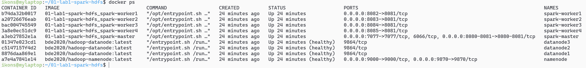

Κάντε κλικ στο 01-lab1-spark-hdfs και θα δείτε τους επιμέρους περιέκτες που εκτελούνται:


Για κάθε περιέκτη που βλέπετε ζεύγη αριθμών (πχ για τον namenode βλέπετε το  `9870:9870`) σημαίνει ότι εκτελούν μια **υπηρεσία** (συνήθως ένα http site, αλλά όχι απαραίτητα). Η υπηρεσία αυτή είναι**προσβάσιμη από το λειτουργικό σύστημα του υπολογιστή σας** είτε κάνοντας απευθείας κλικ στο link είτε ανοίγοντάς την από τον explorer

Για παράδειγμα, ο `hdfs-namenode` "τρέχει" το site http://localhost:9870 


Και ο `spark-master` τρέχει το site που δείχνει τους workers και τις εργασίες του στην http://localhost:8080 και τον history server στην http://localhost:8081 (όλες τις εργασίες που έχετε τρέξει μέχρι τώρα)

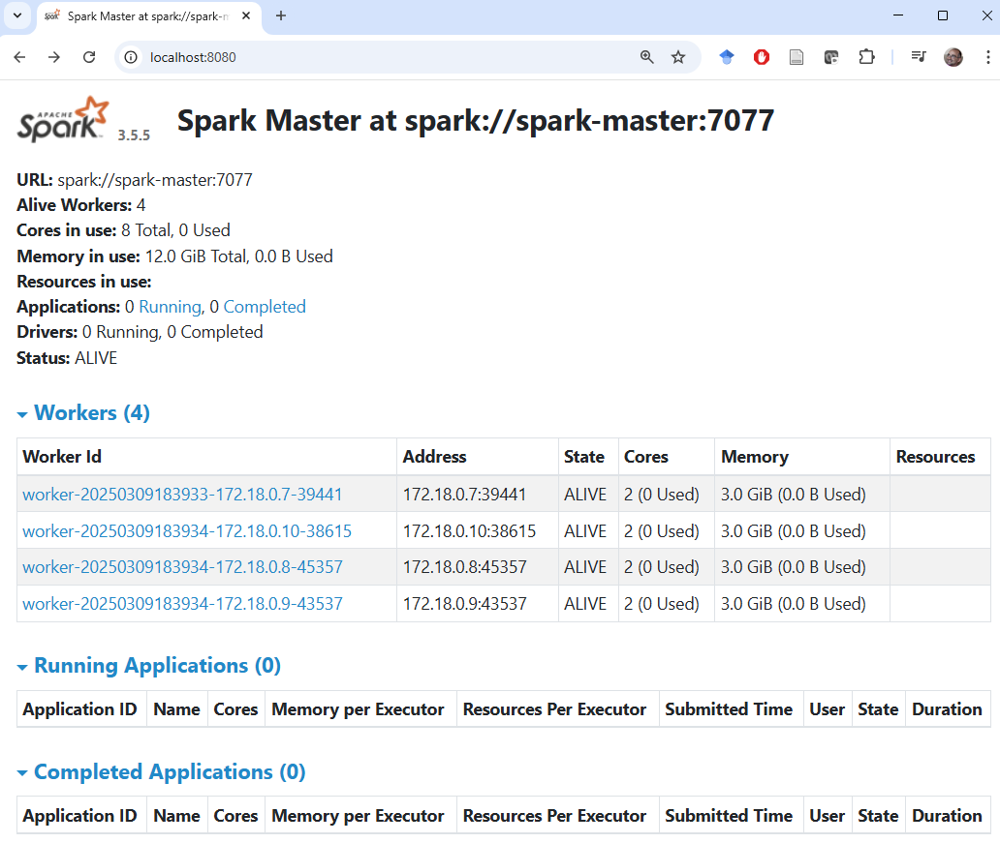

Στην ενότητα **Volumes** βλέπετε όλους τους μόνιμους τόμους (persistent volumes) που χρησιμοποιεί η υποδομή σας. Οι μόνιμοι τόμοι έχουν δηλωθεί στο `docker-compose.yml` και δημιουργήθηκαν με την `docker-compose up` εντολή. 


Αντίστοιχα, μπορείτε να εκτελέσετε από το τερματικό την παρακάτω εντολή για δείτε τους τόμους

```bash
docker volume ls
```

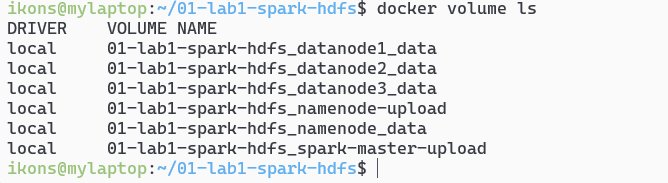

Στην έκδοση docker που χρησιμοποιούμε οι τόμοι είναι υποκατάλογοι σε έναν τοπικό κατάλογο του docker server. 

Επειδή ο τοπικός docker server είναι και αυτός μια εικονική μηχανή (virtual machine), ο τοπικός κατάλογος είναι ένας κατάλογος στο σύστημα αρχείων της εικονικής μηχανής του docker.

Για να καταλάβετε τι εννοώ, ανοίξτε ένα κέλυφος των windows (δεξί κλικ στο σύμβολο των windows) και επιλέξτε Terminal 


Εκτελέστε την παρακάτω εντολή

```bash
wsl -l -v
```

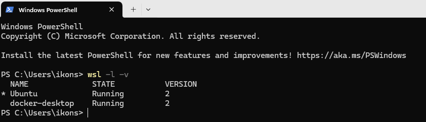

Αυτό που βλέπουμε είναι ότι ο υπολογιστής μας εκτελεί 2 εικονικές μηχανές: Η μία είναι η Ubuntu (από την οποία εκτελούμε τις εντολές docker) και η άλλη είναι η docker-desktop. Η docker-desktop είναι αυτή που εκτελεί τον docker daemon ο οποίος σηκώνει τους περιέκτες.

Οι μόνιμοι τόμοι (persistent volumes) είναι κατάλογοι στο σύστημα αρχείων της εικονικής μηχανής docker-desktop.

Οι μόνιμοι τόμοι της εικονικής μηχανής docker-desktop μπορούν να γίνουν προσβάσιμοι μέσω του συστήματος αρχείων του windows host μηχανήματος μέσω ενός συγκεκριμένου φακέλου με την ονομασία

```
\\wsl.localhost\docker-desktop\mnt\docker-desktop-disk\data\docker\volumes
```

 Ανοίγουμε έναν windows explorer και κάνουμε paste το παραπάνω στην διεύθυνση. Εκεί βλέπουμε όλους τους φακέλους που χρησιμοποιούνται ως μόνιμοι τόμοι στους περιέκτες docker, και μπορούμε να τους διαχειριστούμε μέσω του συστήματος αρχείων του λειτουργικού συστήματος windows. Ο κάθε κατάλογος έχει έναν υποκατάλογο _data στον οποίο ότι τοποθετούμε είναι ορατό στους περιέκτες που έχουν προσαρτήσει (mount) τον τόμο (volume) αυτό.


**Αρχικοποίηση του συστήματος αρχείων HDFS:** Την πρώτη φορά που θα δημιουργήσετε την υποδομή, θα πρέπει να δημιουργήσετε και τους απαραίτητους καταλόγους στο hdfs για να ανεβάζετε αρχεία και για να κρατάτε πληροφορίες εκτέλεσης εργασιών. Εκτελέστε τις παρακάτω εντολές από το **κέλυφος Ubuntu**:

```bash
docker exec namenode hdfs dfs -mkdir -p /user/root
docker exec namenode hdfs dfs -mkdir -p /logs
docker-compose stop spark-master
docker-compose rm -f spark-master
docker-compose up -d spark-master
```


Με τις παρακάτω εντολές εκτελείτε μέσω του περιέκτη namenode την εντολή hdfs dfs με την οποία δημιουργείτε 2 φακέλους: 

- τον `/user/root`, όπου θα βάζετε τα αρχεία προς επεξεργασία
- τον `/logs` στον οποίο θα αποθηκεύονται αρχεία καταγραφής των εργασιών σας για να βλέπετε τι έχει τρέξει και εάν έχει τρέξει σωστά. Μετά την σωστή εκτέλεση, αν ανοίξετε την ιστοσελίδα του hdfs στην διεύθυνση http://localhost:9870 θα δείτε τους καταλόγους που δημιουργήσατε
- Επίσης, επανεκκινείτε τον περιέκτη `spark-master`, για να λειτουργήσει σωστά ο history-server (περισσότερες πληροφορίες παρακάτω).


## Εκτέλεση προγραμμάτων στη συστοιχία

Εκτελέστε το παρακάτω για τον υπολογισμό του π με την χρήση monte carlo simulation σε Java.

```bash
docker exec spark-master /opt/spark/bin/spark-submit --class org.apache.spark.examples.JavaSparkPi /opt/spark/examples/jars/spark-examples.jar
```

Όπου εάν εκτελεστεί σωστά, θα δείτε στην οθόνη να τυπώνεται (μεταξύ άλλων μηνυμάτων) το εξής:

```
Pi is roughly 3.14638
```

Εκτελέστε το παρακάτω για τον ίδιο υπολογισμό σε python

```bash
docker exec spark-master /opt/spark/bin/spark-submit /opt/spark/examples/src/main/python/pi.py
```

**Εκτέλεση δικού σας προγράμματος στην συστοιχία:** Τώρα που έχουμε ένα αρχικοποιημένο σύστημα αρχείων hdfs και τους περιέκτες να λειτουργούν σωστά, μπορούμε να εκτελέσουμε τα πρώτα μας προγράμματα spark. Για τον σκοπό αυτό, πρέπει να ανεβάσουμε τα εξής στην συστοιχία:

- Αρχεία με **κώδικα** (πχ σε python).
- Αρχεία με **δεδομένα** στα οποία θα γίνει επεξεργασία (πχ τα κείμενα στα οποία θα τρέξει ένα wordcount).

**Ανέβασμα κώδικα**: Για να εκτελέσουμε κώδικα μέσω του spark θα πρέπει να τον “ανεβάσουμε” στον περιέκτη που εκτελείται ο spark-master. Για τον σκοπό αυτό έχουμε δημιουργήσει έναν τοπικό μόνιμο τόμο (persistent volume) με το όνομα `01-lab1-spark-hdfs_spark-master-upload`. Ο τόμος αυτός προσαρτάται (mount) κατά την εκκίνηση του περιέκτη `spark-master` στον τοπικό κατάλογο του περιέκτη με το όνομα `/mnt/upload` (δείτε την γραμμή 74 στο αρχείο `docker-compose.yml`). Για να τοποθετήσουμε αρχεία από το τοπικό μας σύστημα αρχείων (των windows) στο σύστημα αρχείων του περιέκτη, ανοίγουμε μέσω explorer τον παρακάτω φάκελο. 

```
\\wsl.localhost\docker-desktop\mnt\docker-desktop-disk\data\docker\volumes\01-lab1-spark-hdfs_spark-master-upload\_data
```


Ο φάκελος αρχικά είναι άδειος. Κάνουμε αντιγραφή/επικόλληση του αρχείου `wordcount.py` από τον κατάλογο `~/bigdata-uth/docker/01-lab1-spark-hdfs/` στον κατάλογο `\\wsl.localhost\docker-desktop\mnt\docker-desktop-disk\data\docker\volumes\01-lab1-spark-hdfs_spark-master-upload\_data`


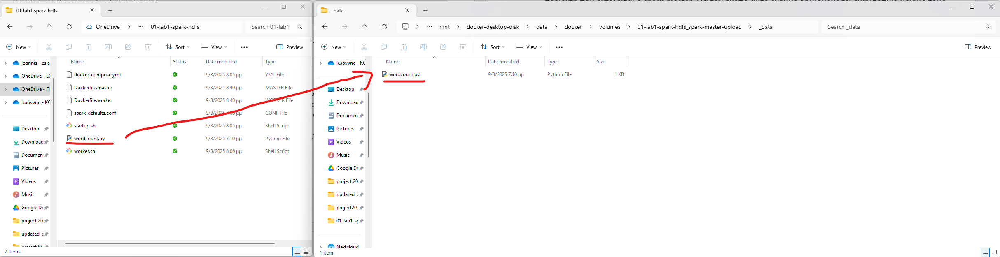

Πλέον, ο περιέκτης spark-master έχει στο τοπικό σύστημα αρχείων του το αρχείο word-count.py στον κατάλογο `/mnt/upload` όπως μπορείτε να δείτε εκτελώντας την παρακάτω εντολή:

```bash
docker exec spark-master ls /mnt/upload 
```

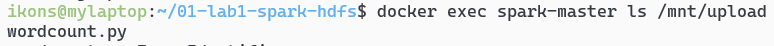

Η παρακάτω εντολή τυπώνει τα περιεχόμενα του απομακρυσμένου αρχείου wordcount.py (που βρίσκεται στο σύστημα αρχείων του περιέκτη spark-master):

```bash
docker exec spark-master cat /mnt/upload/wordcount.py 
```
Και θα δείτε το `wordcount.py` αρχείο να τυπώνεται:


```python
from pyspark import SparkConf
from pyspark.sql import SparkSession
conf = SparkConf().setAppName("Word Count example") \
    .set("spark.master", "spark://spark-master:7077") \
    .set("spark.executor.memory", "3g") \
    .set("spark.driver.memory", "512m")
sc = SparkSession.builder.config(conf=conf).getOrCreate().sparkContext
wordcount = sc.textFile("hdfs://namenode:9000/user/root/text.txt") \
    .flatMap(lambda x: x.split(" ")) \
    .map(lambda x: (x, 1)) \
    .reduceByKey(lambda x,y: x+y) \
    .sortBy(lambda x: x[1], ascending=False)
print(wordcount.collect())
wordcount.saveAsTextFile("hdfs://namenode:9000/user/root/wordcount-output")
```

Επιπλέον, κάθε αλλαγή στο αρχείο `wordcount.py` που κάνετε από το σύστημα αρχείων των windows θα είναι άμεσα ορατή και στο σύστημα αρχείων του περιέκτη (δεν χρειάζεται να το ανεβάζετε με κάθε αλλαγή του κώδικα).

**Ανέβασμα αρχείων δεδομένων**: Το `wordcount.py` αρχείο διαβάζει έναν κατάλογο (ή ένα αρχείο μόνο) από το hdfs και υπολογίζει τον αριθμό εμφανίσεων των λέξεων. Αυτή την στιγμή όμως, το σύστημα αρχείων hdfs είναι κενό (εκτός από τους 2 καταλόγους που δημιουργήσαμε σε προηγούμενο βήμα).

Θα χρειαστεί να ανεβάσουμε ένα αρχείο με δεδομένα στο hdfs για να τρέξουμε το wordcount με είσοδο το αρχείο αυτό.

Το ανέβασμα θα γίνει σε **δυο στάδια**. Αρχικά θα τοποθετήσουμε ένα αρχείο από το τοπικό σύστημα αρχείων μας στο σύστημα αρχείων του περιέκτη namenode.

Κατόπιν θα εκτελέσουμε την εντολή `hdfs dfs -put` από τον περιέκτη namenode με την οποία θα κάνουμε upload το αρχείο από το τοπικό σύστημα αρχείων του περιέκτη (κατάλογος `/mnt/upload`) στο σύστημα αρχείων του hdfs. 

Για τον σκοπό αυτό θα χρησιμοποιήσουμε έναν άλλο μόνιμο τόμο (persistent volume) τον οποίο έχουμε προσαρτήσει στον περιέκτη namenode.  Ο τόμος αυτός ονομάζεται `01-lab1-spark-hdfs_namenode-upload`. Ο τόμος αυτός προσαρτάται (mount) κατά την εκκίνηση του περιέκτη namenode  στον τοπικό κατάλογο του περιέκτη με το όνομα `/mnt/upload` (δείτε την γραμμή 16 στο αρχείο `docker-compose.yml`). Για να τοποθετήσουμε αρχεία από το τοπικό μας σύστημα αρχείων (των windows) στο σύστημα αρχείων του περιέκτη, ανοίγουμε μέσω explorer τον παρακάτω φάκελο. 

```
\\wsl.localhost\docker-desktop\mnt\docker-desktop-disk\data\docker\volumes\01-lab1-spark-hdfs_namenode-upload\_data
```

Ο φάκελος αρχικά είναι άδειος. Κάνουμε αντιγραφή/επικόλληση του αρχείου `text.txt` από τον κατάλογο `01-lab1-spark-hdfs` στον κατάλογο `\\wsl.localhost\docker-desktop\mnt\docker-desktop-disk\data\docker\volumes\01-lab1-spark-hdfs_namenode-upload\_data`.

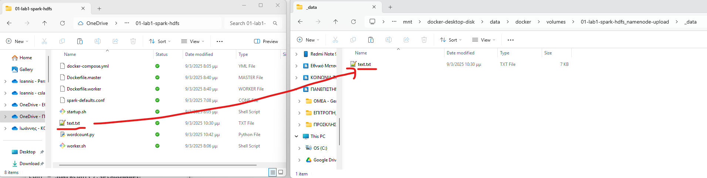


Πλέον, ο περιέκτης namenode έχει στο τοπικό σύστημα αρχείων του το αρχείο `text.txt` στον κατάλογο `/mnt/upload` όπως μπορείτε να δείτε εκτελώντας την παρακάτω εντολή:

```bash
docker exec namenode ls -lah /mnt/upload 
```


Πλέον, με την παρακάτω εντολή ανεβάζουμε στο hdfs το αρχείο text.txt που βρίσκεται στο τοπικό σύστημα αρχείων του namenode στον κατάλογο `/mnt/upload` (με τον διακόπτη `-f` κάνουμε overwrite εάν υπάρχει ήδη):

```bash
docker exec namenode hdfs dfs -put -f /mnt/upload/text.txt /user/root/text.txt
```

Τώρα έχουμε τοποθετήσει το αρχείο python προς εκτέλεση στο τοπικό σύστημα αρχείων του `spark-master` και το αρχείο `text.txt` στο hdfs. Είμαστε έτοιμοι να εκτελέσουμε το spark πρόγραμμα με την παρακάτω εντολή:

```bash
docker exec spark-master /opt/spark/bin/spark-submit /mnt/upload/wordcount.py 
```

Παρακολούθηση της εκτέλεσης της τρέχουσας εργασίας: Μπορείτε να δείτε την εργασία που έχετε στείλει για εκτέλεση στην σελίδα http://localhost:8080 

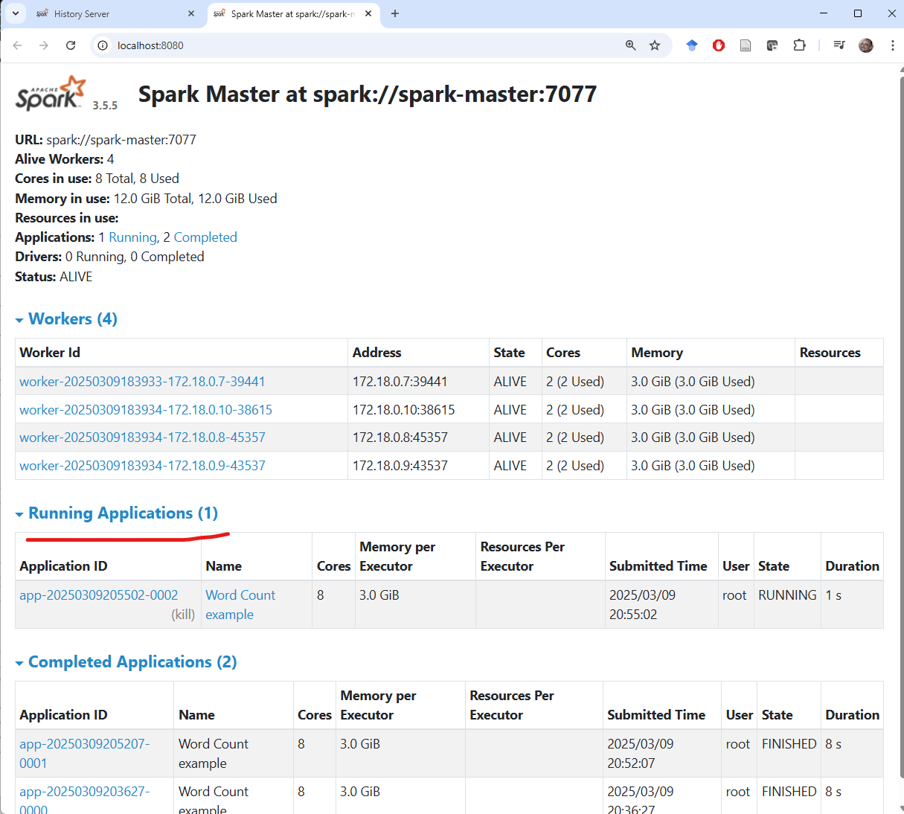

**History Server**: Το Apache Spark έχει μια χρήσιμη υπηρεσία που αποθηκεύει όλα τα αρχεία καταγραφής (logfiles) από όλους τους διακομιστές (master και workers) από όλες τις εργασίες που έχουν υποβληθεί. Η υπηρεσία αυτή είναι γνωστή ως History Server, και είναι διαθέσιμη μέσω της σελίδας http://localhost:8081 

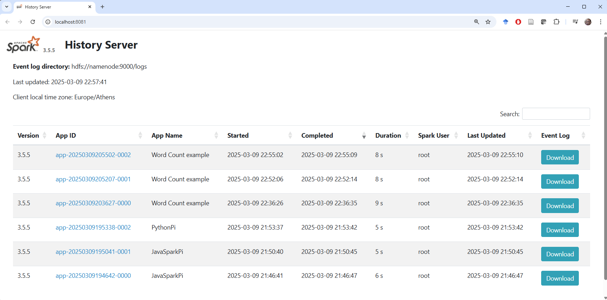


**Χρήσιμες εντολές ****linux**

|ls|περιεχόμενα καταλόγου|
|pwd|εκτύπωση τρέχοντος καταλόγου|
|cd|αλλαγή τρέχοντος καταλόγου|
|cp|αντιγραφή|
|mv|μετακίνηση|
|cat|εκτύπωση περιεχομένων αρχείου|
|echo|εκτύπωση χαρακτήρων στην οθόνn|
|man <command>|οδηγίες χρήσης εντολής με όνομα <command>|

**Χρήσιμες εντολές ****hdfs**

Δημιουργία φακέλου στο hdfs
```bash
docker exec namenode hadoop fs -mkdir -p <path>
```

Σβήσιμο φακέλου στο hdfs
```bash
docker exec namenode hdfs dfs -rm -r -f <path>			

```

Ανέβασμα αρχείου με overwrite

```bash
docker exec namenode hdfs dfs -put -f <local-path> <hdfs-path>
```

**Τερματισμός Υποδομής**: Με την παρακάτω εντολή τερματίζετε (σταματάτε την λειτουργία) της υποδομής. Αρχεία που έχουν ανέβει στο hdfs ή έχουν αποθηκευτεί στους μόνιμους τόμους των namenode και spark-master δεν διαγράφονται, και παραμένουν. Όπως και για την `docker-compose up`, θα χρειαστεί να βρίσκεστε στον κατάλογο που είναι το `docker-compose.yml` αρχείο.

```bash
docker-compose down
```