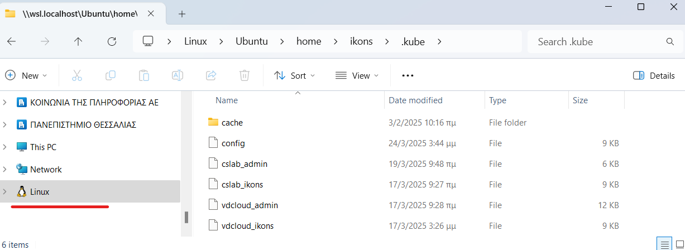
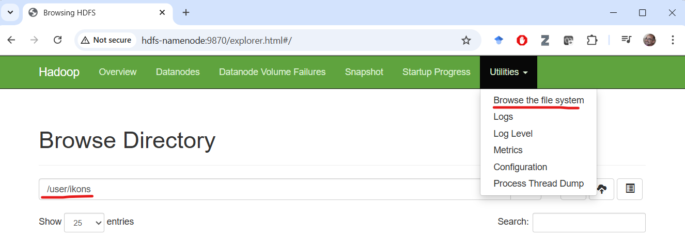

# Guide for connecting to the vdcloud lab Kubernetes environment and running Apache Spark

## Introduction

This guide provides detailed instructions for connecting to the VDCLOUD lab infrastructure through VPN, installing the required tools, preparing a local workstation, and running Apache Spark jobs on Kubernetes (k8s).

You will also receive an email containing two configuration files and the username assigned to you in the infrastructure. In the guide below, whenever you see **testuser**, replace it with the username you received by email.

## Installing the OpenVPN client

To connect to the infrastructure, install the OpenVPN client from the following link:

https://openvpn.net/community-downloads/

After installing the client, import the `.ovpn` file that was sent to you by email and connect.

## Checking infrastructure connectivity from WSL Ubuntu

After connecting to the VPN, access from Windows usually works without issues. On some WSL Linux installations, however, DNS settings may not be updated automatically. Open your WSL Linux environment and run:

```bash
ping source-code-master.cluster.local
```

If it is **not** configured correctly, the command will hang and return no output because hostname resolution is not working. In that case, do the following.

Open `/etc/resolv.conf` with:

```bash
sudo nano /etc/resolv.conf
```

Replace:

```
nameserver 10.255.255.254
```

with:

```
nameserver 10.42.0.1
```

Also make sure the following line exists:

```
search default.svc.cluster.local
```

Save the file and exit (`Ctrl+X`, then `Y`).

Run the `ping` command again:

```bash
ping source-code-master.cluster.local
```

You should now get output similar to the following (stop it with `Ctrl+C`, otherwise it keeps running):

```
PING source-code-master.cluster.local (10.42.0.1) 56(84) bytes of data.
64 bytes from source-code-master.cluster.local (10.42.0.1): icmp_seq=1 ttl=63 time=9.34 ms
64 bytes from source-code-master.cluster.local (10.42.0.1): icmp_seq=2 ttl=63 time=9.33 ms
64 bytes from source-code-master.cluster.local (10.42.0.1): icmp_seq=3 ttl=63 time=52.2 ms
64 bytes from source-code-master.cluster.local (10.42.0.1): icmp_seq=4 ttl=63 time=10.9 ms
64 bytes from source-code-master.cluster.local (10.42.0.1): icmp_seq=5 ttl=63 time=10.9 ms
^C
--- source-code-master ping statistics ---
5 packets transmitted, 5 received, 0% packet loss, time 4180ms
rtt min/avg/max/mdev = 9.325/18.530/52.237/16.867 ms
```

Unfortunately, you may need to repeat this DNS adjustment **every time you reconnect to the VPN**.

## Installing kubectl

`kubectl` is the command-line tool used to manage Kubernetes clusters. Install it on a Linux machine or VM with the following commands:

```bash
# Install basic packages required for HTTPS repositories
sudo apt-get install -y apt-transport-https ca-certificates curl gnupg

# Download and store the public key for the Kubernetes repository
curl -fsSL https://pkgs.k8s.io/core:/stable:/v1.32/deb/Release.key | sudo gpg --dearmor -o /etc/apt/keyrings/kubernetes-apt-keyring.gpg

# Set the correct permissions on the key
sudo chmod 644 /etc/apt/keyrings/kubernetes-apt-keyring.gpg

# Add the Kubernetes repository to apt sources
echo 'deb [signed-by=/etc/apt/keyrings/kubernetes-apt-keyring.gpg] https://pkgs.k8s.io/core:/stable:/v1.32/deb/ /' | sudo tee /etc/apt/sources.list.d/kubernetes.list

# Set the correct permissions on the sources file
sudo chmod 644 /etc/apt/sources.list.d/kubernetes.list

# Update apt package lists
sudo apt-get update

# Install kubectl
sudo apt-get install -y kubectl

# Create ~/.kube where the config file will be stored
mkdir ~/.kube
```

Copy the `config` file you received by email to `~/.kube/config`, so that `kubectl` can connect to the k8s infrastructure.

To do this, you need to copy the `config` file from the location in the Windows host file system where you originally downloaded it into the `~/.kube` directory inside WSL Linux.

Assume that you downloaded the file into the Windows user's `Downloads` folder. In my case, for example, the path is `/mnt/c/Users/ikons/Downloads/config`.

Run the following commands in WSL Linux. Replace **ikons** with your own Windows username.

```bash
# Move to the user's home directory
cd

# Create the .kube directory if it does not exist
mkdir .kube

# Copy the config file from the Windows file system to WSL
# ⚠️ Replace ikons with your own Windows username
cp /mnt/c/Users/ikons/Downloads/config ~/.kube/config
```

Another way to do this is through Windows Explorer by opening the Linux folder directly.



## Installing k9s

`k9s` is a terminal tool for monitoring and managing Kubernetes clusters. Install it as follows:

```bash
# Download the k9s .deb package from GitHub
wget https://github.com/derailed/k9s/releases/download/v0.40.10/k9s_linux_amd64.deb

# Install the package with dpkg
sudo dpkg -i k9s_linux_amd64.deb

# Set nano as the default editor for k9s (and generally for kubectl)
echo "export KUBE_EDITOR=nano" >> ~/.bashrc
```

`k9s` uses the same `~/.kube/config` file.

## Installing Hadoop and Spark clients

Install Hadoop and Spark locally on your Linux machine / WSL environment so that you can connect to the remote infrastructure and interact with HDFS and Spark.

```bash
# Move to the home directory
cd ~

# Install Java Development Kit 8 (required by Hadoop/Spark)
sudo apt-get install -y openjdk-8-jdk

# Download Spark 3.5.5 with Hadoop 3 support
wget https://downloads.apache.org/spark/spark-3.5.5/spark-3.5.5-bin-hadoop3.tgz

# Extract Spark
tar -xzf spark-3.5.5-bin-hadoop3.tgz

# Download Hadoop 3.4.1
wget https://dlcdn.apache.org/hadoop/common/hadoop-3.4.1/hadoop-3.4.1.tar.gz

# Extract Hadoop
tar -xzf hadoop-3.4.1.tar.gz
```

Add the following environment variables to your shell configuration file. Replace `testuser` with your own username. In my case, for example, it becomes `export HADOOP_USER_NAME=ikons`.

```bash
export JAVA_HOME=/usr/lib/jvm/java-8-openjdk-amd64
export SPARK_HOME=$HOME/spark-3.5.5-bin-hadoop3
export PATH=$HOME/spark-3.5.5-bin-hadoop3/bin:$HOME/hadoop-3.4.1/bin:$PATH
# ⚠️ Replace testuser with your own username
export HADOOP_USER_NAME=testuser
```

Save the file (`Ctrl+X`, then `Y`, then `Enter`).

Finally, run the following command to load the new settings into the environment:

```bash
. ~/.bashrc
```

## Configuring the HDFS client

Create `core-site.xml`:

```bash
nano hadoop-3.4.1/etc/hadoop/core-site.xml
```

```xml
<configuration>
  <property>
    <name>fs.default.name</name>
    <value>hdfs://hdfs-namenode:9000</value>
  </property>
</configuration>
```

If everything is configured correctly, open the following page on your computer:

http://hdfs-namenode:9870/

Then select **Utilities -> Browse the file system** and enter the path `/user/username`. There you will be able to see the outputs of your jobs.



## Running a test WordCount program

Create the file `wordcount_localdir.py` and place the following content in it:

```python
from pyspark import SparkContext  # Import SparkContext to create the Spark application

# Create a SparkContext with the application name "WordCount"
sc = SparkContext(appName="WordCount")

# Define the input file in HDFS
# ⚠️ Replace testuser with your own username
input_dir = "hdfs://hdfs-namenode:9000/user/testuser/text.txt"

# Get the unique Spark application ID
job_id = sc.applicationId

# Create the output path based on the job_id to avoid conflicts
# ⚠️ Replace testuser with your own username
output_dir = f"hdfs://hdfs-namenode:9000/user/testuser/wordcount_output_{job_id}"

# Read the text file from HDFS
text_files = sc.textFile(input_dir)

# Perform the word count:
# 1. flatMap: split each line into words
# 2. map: create (word, 1) pairs
# 3. reduceByKey: add the occurrences of each word
word_count = text_files.flatMap(lambda line: line.split(" ")) \
                       .map(lambda word: (word, 1)) \
                       .reduceByKey(lambda a, b: a + b)

# Save the results to HDFS
word_count.saveAsTextFile(output_dir)

# Stop the SparkContext
sc.stop()
```

**Note:** Replace `testuser` with the username you received (for example, `ikons`).

Copy the required files into HDFS:

```bash
# Create a sample input text file
echo "this is a text file, with text document, to be used as input for the wordcount example" > ~/text.txt

# Copy the Python file into your home directory
cp wordcount_localdir.py ~/wordcount_localdir.py

# Upload the text file to HDFS (the user/<username> directory must already exist)
hdfs dfs -put -f ~/text.txt

# Upload the Python script to HDFS
hdfs dfs -put -f ~/wordcount_localdir.py
```

The `-put -f` option overwrites the file in HDFS if it already exists.

## Running Spark on Kubernetes

The `wordcount_localdir.py` file must be stored in HDFS so that it is accessible to Spark executors during execution. The HDFS location of the file is the final argument of `spark-submit`.

Run the following command:

```bash
spark-submit \
    --master k8s://https://10.42.0.1:6443 \
    --deploy-mode cluster \
    --name wordcount \
    --conf spark.hadoop.fs.permissions.umask-mode=000 \
    --conf spark.kubernetes.authenticate.driver.serviceAccountName=spark \
    --conf spark.kubernetes.namespace=testuser-priv \
    --conf spark.executor.instances=5 \
    --conf spark.kubernetes.container.image=apache/spark \
    --conf spark.kubernetes.submission.waitAppCompletion=false \
    --conf spark.eventLog.enabled=true \
    --conf spark.eventLog.dir=hdfs://hdfs-namenode:9000/user/testuser/logs \
    --conf spark.history.fs.logDirectory=hdfs://hdfs-namenode:9000/user/testuser/logs \
    hdfs://hdfs-namenode:9000/user/testuser/wordcount_localdir.py
```

Replace **testuser** with the username you received by email. For example, in my case it is **ikons**.

This command submits a Spark job to a Kubernetes cluster. The main parameters are:

- `--master k8s://https://10.42.0.1:6443`: defines the Kubernetes master endpoint. The `k8s://` prefix indicates that the job will run on Kubernetes.
- `--deploy-mode cluster`: defines the application deployment mode. `cluster` means that the job will run inside the Kubernetes cluster rather than on the user's local computer.
- `--name wordcount`: sets the name of the Spark application that will run on Kubernetes.
- `--conf spark.hadoop.fs.permissions.umask-mode=000`: defines Hadoop file-system permissions.
- `--conf spark.kubernetes.authenticate.driver.serviceAccountName=spark`: sets the Kubernetes service account used by the driver.
- `--conf spark.kubernetes.namespace=testuser-priv`: defines the Kubernetes namespace where the job will run.
- `--conf spark.executor.instances=5`: defines the number of executors that will be created for the job.
- `--conf spark.kubernetes.container.image=apache/spark`: defines the container image used for the execution.
- `--conf spark.kubernetes.submission.waitAppCompletion=false`: specifies whether `spark-submit` should wait for the application to finish. When set to `false`, the Spark job starts and the submission process exits immediately.
- `--conf spark.eventLog.enabled=true`: enables event logging for the Spark job.
- `--conf spark.eventLog.dir=hdfs://hdfs-namenode:9000/user/testuser/logs`: defines where event-log files will be stored in HDFS.
- `--conf spark.history.fs.logDirectory=hdfs://hdfs-namenode:9000/user/testuser/logs`: defines where the Spark History Server will read the history logs from.
- `hdfs://hdfs-namenode:9000/user/testuser/wordcount_localdir.py`: defines the path of the Python file that contains the application code.

All configurable parameters are available on the page below:

https://spark.apache.org/docs/latest/configuration.html

Other important parameters that may help during execution are:

- `--conf spark.log.level=DEBUG`: produces more messages during execution for debugging.
- `--conf spark.executor.memory=2g`: allocates more RAM per executor when your jobs need more memory. This is useful when executors terminate due to OOM (Out of Memory) errors.

These parameters allow a Spark application to run correctly on a Kubernetes cluster, while also providing settings for HDFS, logging, executors, and other Kubernetes-related options.

## Storing default Spark parameters

To avoid typing all of these parameters every time you run a Spark job, you can place them in a configuration file that Spark will read whenever you execute `spark-submit`. Do not forget to replace the username (in this example, **testuser**) with your own.

```bash
# ⚠️ Replace testuser with your own username
USERNAME=testuser
```

Then, in the same terminal, run:

```bash
cat > ~/spark-3.5.5-bin-hadoop3/conf/spark-defaults.conf <<EOF
spark.master k8s://https://10.42.0.1:6443
spark.submit.deployMode cluster
spark.hadoop.fs.permissions.umask-mode 000
spark.kubernetes.authenticate.driver.serviceAccountName spark
spark.kubernetes.namespace $USERNAME-priv
spark.executor.instances 5
spark.executor.memory 1500m
spark.driver.memory 512m
spark.kubernetes.container.image=apache/spark
spark.kubernetes.submission.waitAppCompletion false
spark.eventLog.enabled true
spark.eventLog.dir hdfs://hdfs-namenode:9000/user/$USERNAME/logs
spark.history.fs.logDirectory hdfs://hdfs-namenode:9000/user/$USERNAME/logs
EOF
```

Now you can run the previous command simply by executing the following command after replacing `testuser` with your own username:

```bash
spark-submit hdfs://hdfs-namenode:9000/user/testuser/wordcount_localdir.py
```

## Monitoring execution with k9s

Start `k9s`:

```bash
k9s
```

Examples:

Show pods:

```bash
:pods
```

Show logs for a pod:

```bash
l
```

Inspect the status/details of a pod:

```bash
d
```

## Useful HDFS commands

List the contents of `<path>`:

```bash
hadoop fs -ls <path>
```

Create a directory including parent directories:

```bash
hadoop fs -mkdir -p <path>
```

Upload a file from `<localpath>` to `<hdfspath>`:

```bash
hadoop fs -put <localpath> <hdfspath>
```

Delete a remote HDFS directory recursively:

```bash
hadoop fs -rm -r <hdfspath>
```

## Useful Linux commands

```bash
ls
pwd
cd
cp
mv
cat
echo
man
```

Using the `nano` editor:

```text
Ctrl+X: Exit
y/n: save or not
Enter: Save using the same file name/path
```

## Running Spark locally, either interactively or via a Python file

As discussed in theory, Spark can also run locally on your own computer, either interactively through a shell or by executing a Python file with `spark-submit`.

### Interactive execution through the shell

Open a Spark shell with:

```bash
pyspark --deploy-mode client --master local[*]
```

You can read and write files directly from the lab HDFS. Spark executors will run on your own computer, using its memory and CPU resources. Depending on your hardware, you may need to tune `spark.executor.instances` and `spark.executor.memory` in `~/spark-3.5.5-bin-hadoop3/conf/spark-defaults.conf` so that the requested resources do not exceed what your machine can provide.

You can monitor the running jobs at:

http://localhost:4040/

To exit the shell, press `Ctrl+D`.

### Running a local Python file for testing

You can also test a local `.py` file before uploading it to the k8s cluster:

```bash
spark-submit --deploy-mode client --master local[*] wordcount_localdir.py
```

A Python file executed in this way can still read from and write to the remote HDFS cluster of the lab. The execution resources, however, are taken from your local machine. As before, make sure the configured CPU and memory requirements do not exceed the resources available on your computer. In this case, you do **not** need to upload the `.py` file to HDFS before running it.
