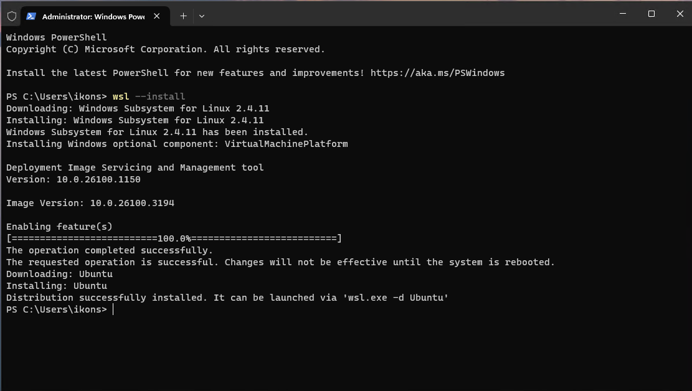
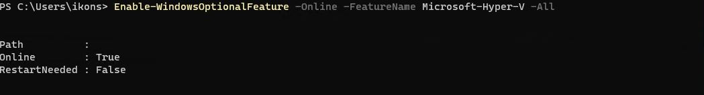
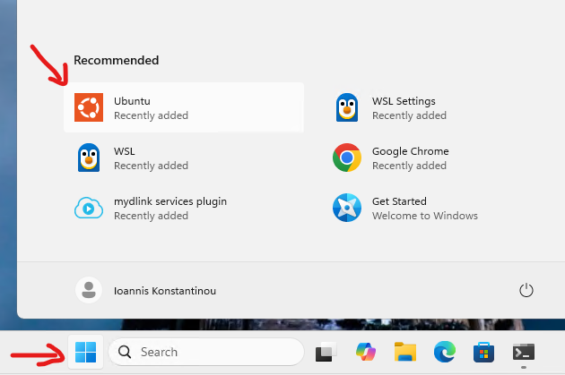
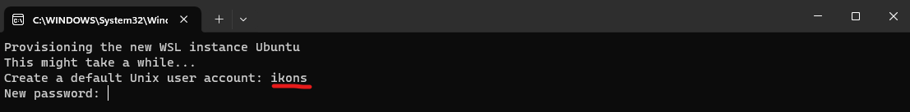
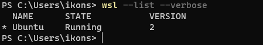
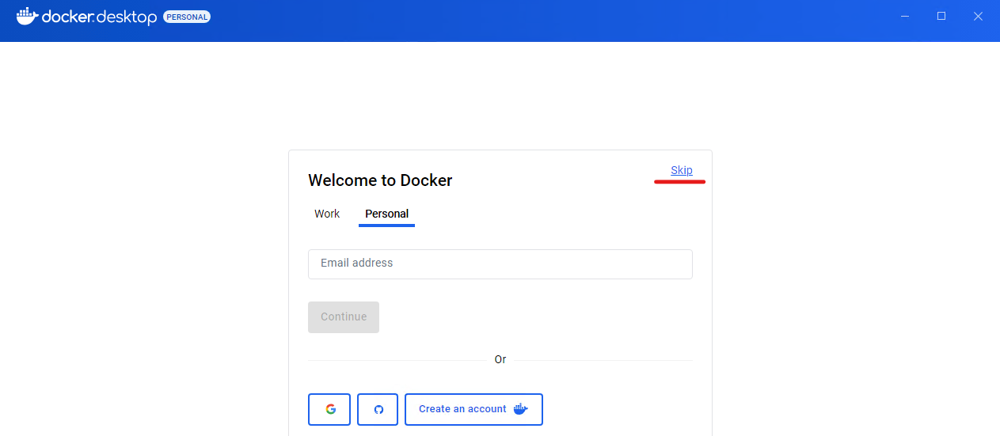
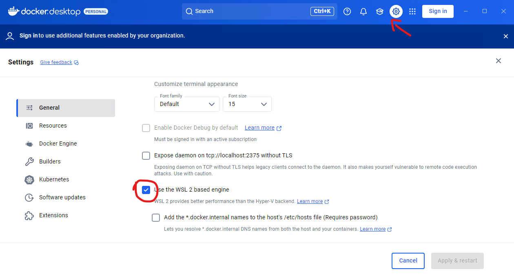
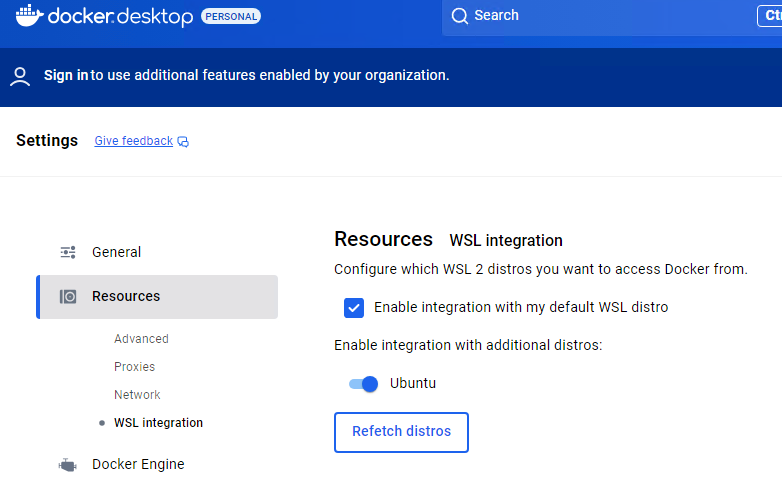
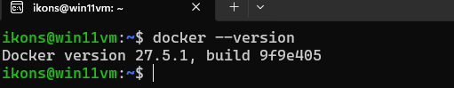
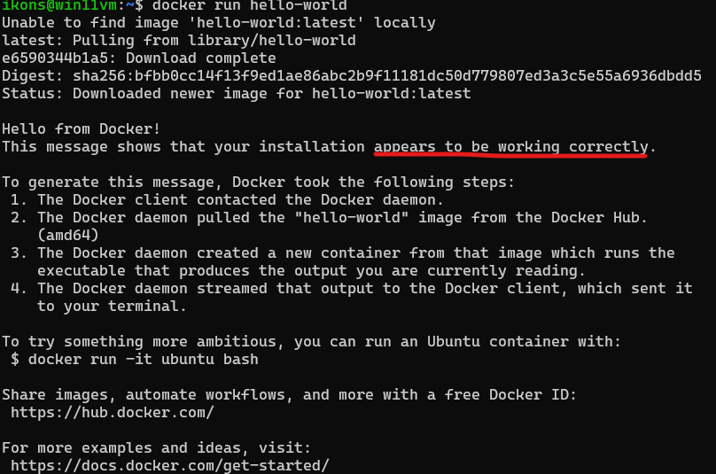

# Προετοιμασία σταθμού εργασίας (WSL + Docker Desktop)


Το μάθημα περιλαμβάνει εργαστηριακό μέρος, στο οποίο θα χρησιμοποιήσουμε Docker containers. Ο παρών οδηγός περιγράφει τα προπαρασκευαστικά βήματα που πρέπει να έχουν ολοκληρωθεί πριν από το πρώτο εργαστήριο. Συγκεκριμένα, καλύπτει τη ρύθμιση του Windows Subsystem for Linux (WSL), του Ubuntu και του Docker Desktop σε προσωπικό υπολογιστή.


## Ενεργοποίηση WSL και Virtual Machine Platform

Αρχικά, πρέπει να ενεργοποιήσετε το WSL και τη δυνατότητα `Virtual Machine Platform` στα Windows.

**Ανοίξτε ένα PowerShell ως διαχειριστής:** Κάντε δεξί κλικ στο μενού "Έναρξη" και επιλέξτε **Windows Terminal (Administrator) ή PowerShell (Administrator)**.


Εκτελέστε τις παρακάτω εντολές για να ενεργοποιήσετε το WSL και το `Virtual Machine Platform`. Μετά την εκτέλεση των εντολών κάντε επανεκκίνηση.

```bash
wsl --install --no-distribution
dism.exe /online /enable-feature /featurename:Microsoft-Windows-Subsystem-Linux /all /norestart
dism.exe /online /enable-feature /featurename:VirtualMachinePlatform /all /norestart
```




Μετά την επανεκκίνηση, εγκαταστήστε το Ubuntu:

```bash
wsl --install -d Ubuntu
```

### Προαιρετική σημείωση για όσους δοκιμάζουν τον οδηγό μέσα σε Hyper-V VM

Η βασική διαδρομή του μαθήματος υποθέτει ότι ο φοιτητής εκτελεί τον οδηγό σε προσωπικό υπολογιστή και όχι μέσα σε εικονική μηχανή Windows.

Αν όμως δοκιμάζετε τον οδηγό μέσα σε εικονική μηχανή Windows που τρέχει σε `Hyper-V`, το `WSL2` δεν αρκεί να ενεργοποιηθεί μόνο μέσα στο guest λειτουργικό σύστημα. Πρέπει να είναι ενεργοποιημένο και το **nested virtualization** στο Hyper-V host.

Αν δείτε μήνυμα όπως:

- `WSL2 is not supported with your current machine configuration`
- `HCS_E_HYPERV_NOT_INSTALLED`

τότε συνήθως το πρόβλημα δεν είναι μέσα στο guest, αλλά στο ότι ο host δεν έχει εκθέσει virtualization extensions στο VM.

Σε αυτή την περίπτωση:

1. κλείστε το VM
2. στο **host** PowerShell ως διαχειριστής εκτελέστε:

```powershell
Stop-VM "<Your-VM-Name>"
Set-VMProcessor -VMName "<Your-VM-Name>" -ExposeVirtualizationExtensions $true
Start-VM "<Your-VM-Name>"
```

3. μέσα στο guest Windows εκτελέστε ξανά:

```powershell
wsl --install --no-distribution
wsl --install -d Ubuntu
```

Αν το πρόβλημα επιμένει, ελέγξτε επίσης:

- ότι το virtualization είναι ενεργοποιημένο στο BIOS/UEFI του φυσικού host
- ότι μετά την ενεργοποίηση έγινε πλήρης επανεκκίνηση του VM
- ότι το `VirtualMachinePlatform` εμφανίζεται ως `Enabled`

Για το συγκεκριμένο δικό μου δοκιμαστικό VM, το αντίστοιχο όνομα ήταν `Windows 11 Bigdata uth 2026`, αλλά αυτό δεν αφορά τη γενική φοιτητική ροή.


## Ρύθμιση του Ubuntu

**Άνοιγμα του ****Ubuntu****:** Μετά την εγκατάσταση, κάντε κλικ στο μενού "Έναρξη" και αναζητήστε Ubuntu. Κάντε κλικ για να το ανοίξετε.



**Ρύθμιση χρήστη και κωδικού πρόσβασης:** Κατά την πρώτη εκκίνηση του Ubuntu, θα σας ζητηθεί να δημιουργήσετε έναν χρήστη και να ορίσετε έναν κωδικό πρόσβασης. Αυτός ο χρήστης θα είναι ο κύριος χρήστης για την εγκατάσταση του Ubuntu.




## Αναβάθμιση και ενημερώσεις

Αφού το Ubuntu είναι έτοιμο, καλό είναι να εκτελέσετε μερικές εντολές για να βεβαιωθείτε ότι το σύστημά σας είναι ενημερωμένο:

**Αναβάθμιση των πακέτων**: Εκτελέστε την παρακάτω εντολή για να αναβαθμίσετε τα πακέτα του συστήματος:

```bash
sudo apt update && sudo apt upgrade -y
```

**Ελέγξτε την κατάσταση του WSL**

Ανοίξτε PowerShell (ως διαχειριστής) και εκτελέστε την εξής εντολή:

```bash
wsl --list --verbose
```


Αυτή η εντολή θα σας δείξει τις εγκατεστημένες διανομές του Linux και ποια είναι η προεπιλεγμένη. Αν το WSL έχει εγκατασταθεί σωστά, θα πρέπει να εμφανίζεται η διανομή Ubuntu (ή άλλη διανομή που έχετε εγκαταστήσει).

**Ελέγξτε αν το `Virtual Machine Platform` είναι ενεργοποιημένο**

Για να ελέγξετε αν το `Virtual Machine Platform` έχει ενεργοποιηθεί, εκτελέστε την παρακάτω εντολή:

```bash
Get-WindowsOptionalFeature -Online -FeatureName VirtualMachinePlatform
```

Αν το `Virtual Machine Platform` είναι ενεργοποιημένο, η κατάσταση του feature θα πρέπει να είναι **Enabled**.

**Ελέγξτε την τρέχουσα έκδοση του WSL**

Για να ελέγξετε ποια έκδοση του WSL (1 ή 2) χρησιμοποιείτε, εκτελέστε την παρακάτω εντολή:

```bash
wsl --list --verbose
```

Θα δείτε την έκδοση του WSL για κάθε διανομή Linux (π.χ., 2 για WSL 2 ή 1 για WSL 1).

Αν όλα είναι σωστά ρυθμισμένα, το WSL και το `Virtual Machine Platform` θα πρέπει να εμφανίζονται ως ενεργοποιημένα και το Ubuntu ή άλλη διανομή θα είναι διαθέσιμη για χρήση στο σύστημά σας.

## Εγκατάσταση Docker Desktop

Μεταβείτε στην επίσημη σελίδα του Docker και κατεβάστε την πιο πρόσφατη έκδοση του Docker Desktop για Windows x86_64:

https://docs.docker.com/desktop/setup/install/windows-install/

**Εκτελέστε το αρχείο εγκατάστασης**: Κάντε διπλό κλικ στο αρχείο εγκατάστασης που κατεβάσατε και ακολουθήστε τα βήματα του οδηγού εγκατάστασης.


**Επιλογές εγκατάστασης**:

Κατά τη διάρκεια της εγκατάστασης, βεβαιωθείτε ότι έχετε επιλέξει τη δυνατότητα **Use the WSL 2 based engine**.


Επίσης, το Docker Desktop θα εγκαταστήσει και το **Docker Desktop WSL 2 Backend**, που είναι απαραίτητο για να τρέξεις το Docker με το WSL 2.

**Ολοκλήρωση εγκατάστασης**: Όταν η εγκατάσταση ολοκληρωθεί, κάνε κλικ στο **Finish** και το Docker Desktop θα ξεκινήσει αυτόματα. Η εγκατάσταση θα διαρκέσει λίγη ώρα. Θα χρειαστεί να επανεκκινήσετε τον υπολογιστή σας.


Μετά την επανεκκίνηση θα σας ζητηθεί να δημιουργήσετε λογαριασμό στην υπηρεσία. Δεν είναι υποχρεωτικό, και μπορείτε να επιλέξετε skip



**Ρύθμιση του Docker για χρήση με WSL 2**: Μετά την εγκατάσταση, μπορείτε να ανοίξετε το **Docker Desktop** μέσω του **Μενού Έναρξη**.

Αν είναι η πρώτη φορά που ανοίγεις το Docker Desktop, θα σε καθοδηγήσει να ενεργοποιήσεις το WSL 2.

Σιγουρέψου ότι το **WSL 2** είναι επιλεγμένο ως backend στο Docker Desktop. Για να το ελέγξεις, πήγαινε στο **Settings** (Ρυθμίσεις) του Docker και, στη συνέχεια, στην καρτέλα **General**, έλεγξε ότι η επιλογή **Use the WSL 2 based engine** είναι ενεργοποιημένη.



**Επιλογή διανομής WSL για Docker**: Στην καρτέλα **Resources** του Docker Desktop, μπορείς να δεις ποιες διανομές Linux του WSL είναι διαθέσιμες για χρήση με το Docker. Βεβαιώσου ότι έχεις επιλέξει την διανομή Ubuntu (ή άλλη που έχεις εγκαταστήσει) για χρήση με το Docker.



**Επανεκκίνηση του Docker**: Αν κάνεις αλλαγές στις ρυθμίσεις, πρέπει να επανεκκινήσεις το Docker Desktop για να εφαρμόσουν οι αλλαγές.

**Επιβεβαίωση Εγκατάστασης**

Άνοιξε το **ubuntu**** ****terminal** και εκτέλεσε την εντολή για να επιβεβαιώσεις ότι το Docker δουλεύει σωστά:

```bash
docker --version
```


Αυτό θα πρέπει να εμφανίσει την έκδοση του Docker που έχεις εγκαταστήσει.

Δοκίμασε να εκτελέσεις την εντολή:

```bash
docker run hello-world
```

Αυτή η εντολή θα κατεβάσει και θα εκτελέσει μια απλή εικόνα Docker που εκτυπώνει ένα μήνυμα επιτυχίας αν το Docker είναι σωστά εγκατεστημένο και λειτουργεί.



**Ενημερώσεις και Ρυθμίσεις**

**Αναβάθμιση Docker**: Το Docker Desktop ενημερώνεται αυτόματα. Μπορείς να ελέγξεις αν υπάρχουν νέες εκδόσεις στις **Settings** > **Updates**.

**Ρυθμίσεις πόρων**: Στην καρτέλα **Resources** του Docker Desktop, μπορείς να ρυθμίσεις τη χρήση πόρων όπως CPU, μνήμη (RAM) και δίσκο για το WSL backend.

## Εργαλεία που θα χρειαστούν στους επόμενους οδηγούς

Μετά το `01`, το μάθημα χωρίζεται σε δύο είδη διαδρομών:

- `02` και `03`: μπορούν να γίνουν είτε από `Windows / PowerShell` είτε από `WSL / Ubuntu`
- `04` και `05`: γίνονται μόνο από `WSL / Ubuntu`
- `06`: τεκμηριώνεται επίσης με `WSL / Ubuntu`, ώστε να μείνει ενιαίο το shell περιβάλλον

### Για τη διαδρομή Windows / PowerShell

Πριν περάσετε στους τοπικούς οδηγούς `02` και `03`, βεβαιωθείτε ότι στα Windows υπάρχουν ήδη:

- `Python 3.11`
- `Git for Windows`
- `OpenJDK 17`

Η πιο πρακτική και δοκιμασμένη διαδρομή στο μάθημα είναι να χρησιμοποιήσετε `winget`.

Από PowerShell:

```powershell
winget install --id Python.Python.3.11 -e
winget install --id Git.Git -e
winget install --id Microsoft.OpenJDK.17 --accept-source-agreements --accept-package-agreements
```

Μετά την εγκατάσταση, κλείστε και ανοίξτε νέο PowerShell και ελέγξτε:

```powershell
python --version
git --version
java -version
```

Οι παραπάνω αναγνωριστικές τιμές `winget` έχουν ελεγχθεί στο δικό μου σύστημα:

- `Python.Python.3.11`
- `Git.Git`
- `Microsoft.OpenJDK.17`

Εναλλακτικά υπάρχει και το:

- `Microsoft.OpenJDK.11`
- `EclipseAdoptium.Temurin.11.JDK`

### OpenVPN client στα Windows και αρχεία πρόσβασης του εργαστηρίου

Αφού συμπληρώσετε τη φόρμα του εργαστηρίου, θα λάβετε email με δύο βασικά συνημμένα:

- `vdcloud-k8s.ovpn`
- `config`

Στο provisioning tool του μαθήματος, αυτά παράγονται και αποστέλλονται ακριβώς με αυτά τα ονόματα για το `vdcloud`.

Αν δεν έχετε ήδη OpenVPN client στα Windows, εγκαταστήστε τον client που χρησιμοποιεί το εργαστήριο. Για τη ροή που περιγράφει και το mail, ο client περιμένει συνήθως τα `.ovpn` αρχεία στον φάκελο:

```text
C:\Users\<windows-username>\OpenVPN\config
```

Πρακτικά:

1. αποθηκεύστε και τα δύο συνημμένα πρώτα στον φάκελο `Downloads` των Windows
2. αντιγράψτε το `vdcloud-k8s.ovpn` στον φάκελο `C:\Users\<windows-username>\OpenVPN\config`
3. ανοίξτε τον OpenVPN client και συνδεθείτε με το profile `vdcloud-k8s.ovpn`

Κάθε φορά που το εργαστήριο σας στείλει νέο `vdcloud-k8s.ovpn`, αντικαθιστάτε το παλιό αρχείο και επανασυνδέεστε.

### Για τη διαδρομή WSL / Ubuntu

Πριν περάσετε στους οδηγούς που χρησιμοποιούν WSL, βεβαιωθείτε ότι στο Ubuntu υπάρχουν τουλάχιστον τα βασικά εργαλεία:

```bash
sudo apt update
sudo apt install -y git curl tar openjdk-11-jdk
git --version
java -version
```

Τα `kubectl`, `Spark` και `Hadoop client` θα χρησιμοποιηθούν από το `04` και μετά. Αν ακολουθείτε την πλήρη εργαστηριακή διαδρομή, βεβαιωθείτε ότι έχουν εγκατασταθεί και ρυθμιστεί πριν προχωρήσετε στον οδηγό απομακρυσμένης εκτέλεσης.

Για τη βασική εργαστηριακή γραμμή εκδόσεων του μαθήματος, προτείνεται:

- `Spark 3.5.8`
- `Hadoop client 3.4.1`
- `Java 11`

Ενδεικτική εγκατάσταση μέσα στο WSL:

```bash
cd ~

SPARK_VERSION=3.5.8
HADOOP_VERSION=3.4.1

curl -LO "https://archive.apache.org/dist/spark/spark-${SPARK_VERSION}/spark-${SPARK_VERSION}-bin-hadoop3.tgz"
tar -xzf "spark-${SPARK_VERSION}-bin-hadoop3.tgz"

curl -LO "https://archive.apache.org/dist/hadoop/common/hadoop-${HADOOP_VERSION}/hadoop-${HADOOP_VERSION}.tar.gz"
tar -xzf "hadoop-${HADOOP_VERSION}.tar.gz"
```

Για το `kubectl`, η πιο απλή per-user εγκατάσταση στο WSL είναι η επίσημη binary διαδρομή:

```bash
cd ~
curl -LO "https://dl.k8s.io/release/$(curl -L -s https://dl.k8s.io/release/stable.txt)/bin/linux/amd64/kubectl"
chmod +x kubectl
mkdir -p ~/.local/bin
mv ./kubectl ~/.local/bin/kubectl
kubectl version --client
```

## Ρύθμιση VPN και kubeconfig για το `vdcloud`

Από το email του εργαστηρίου θα έχετε ήδη κατεβάσει στα Windows:

- το `vdcloud-k8s.ovpn`
- το συνημμένο `config`

Αφού συνδεθείτε πρώτα στο VPN από τα Windows, περάστε στο WSL και ρυθμίστε το kubeconfig από το συνημμένο αρχείο:

```bash
mkdir -p ~/.kube
cp /mnt/c/Users/<windows-username>/Downloads/config ~/.kube/config
chmod 600 ~/.kube/config
```

Έπειτα ελέγξτε:

```bash
kubectl config current-context
kubectl config get-contexts
kubectl config view --minify --flatten | sed -n '1,40p'
kubectl get ns
```

Στη ρύθμιση που δημιουργεί το provisioning tool του εργαστηρίου:

- ο server του cluster είναι `https://source-code-master.cluster.local:6443`
- δημιουργούνται τα contexts `development` και `<username>-priv`
- το default current context τίθεται στο `<username>-priv`

Αν δεν δουλεύει το `kubectl`, ελέγξτε πρώτα:

- ότι το VPN είναι συνδεδεμένο στα Windows
- ότι το `config` αντιγράφηκε σωστά στο `~/.kube/config`
- ότι η εντολή `kubectl version --client` δουλεύει κανονικά στο WSL

## Επόμενο βήμα: λήψη του repository

Αφού ολοκληρώσεις το `01`, το επόμενο πρακτικό βήμα είναι να έχεις το repository τοπικά. Για τους τοπικούς οδηγούς `02` και `03`, μπορείς να επιλέξεις είτε διαδρομή Windows είτε διαδρομή WSL. Για τους απομακρυσμένους οδηγούς `04` και `05`, θα χρειαστείς οπωσδήποτε κλωνοποιημένο αποθετήριο μέσα στο WSL.

### Επιλογή Α: clone σε φάκελο των Windows

Από PowerShell:

```powershell
Set-Location $HOME
git clone https://github.com/ikons/bigdata-uth.git
Set-Location bigdata-uth
```

Αυτή η επιλογή αρκεί για τους τοπικούς οδηγούς `02` και `03`.

### Επιλογή Β: clone μέσα στο WSL

Από Ubuntu terminal:

```bash
cd ~
git clone https://github.com/ikons/bigdata-uth.git
cd bigdata-uth
```

Αυτή η επιλογή είναι απαραίτητη για τους οδηγούς `04` και `05`, και είναι η προτεινόμενη διαδρομή και για το `06`.

### Τι να κρατήσετε

- Για `02` και `03`, μπορείτε να δουλέψετε είτε από PowerShell είτε από WSL.
- Για `04` και `05`, δουλεύετε μόνο από WSL.
- Αν ξεκινήσετε τοπικά από Windows, μπορείτε αργότερα να κάνετε δεύτερο clone στο WSL μόνο για την απομακρυσμένη διαδρομή.

