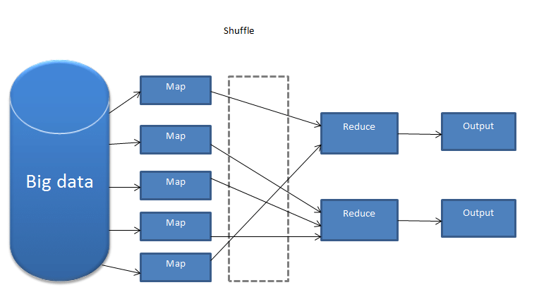
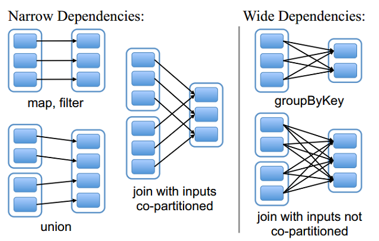
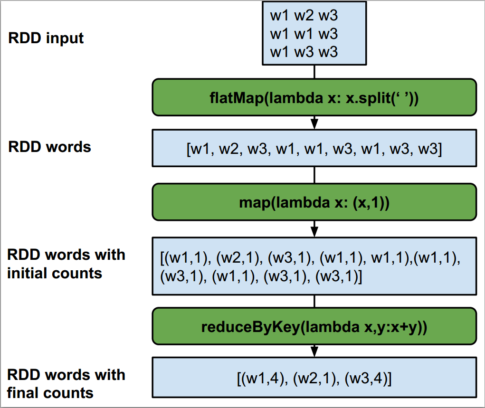
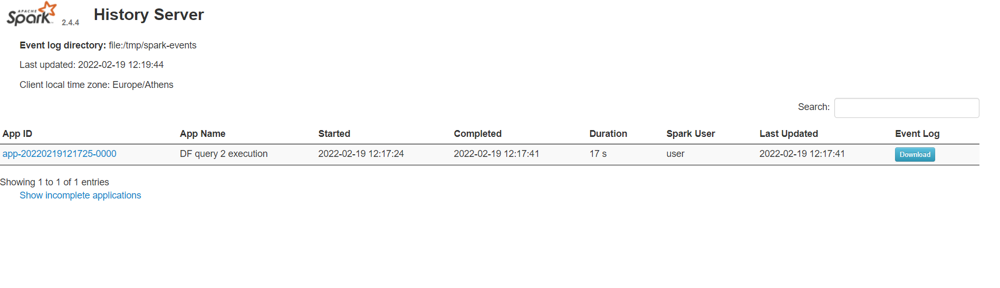
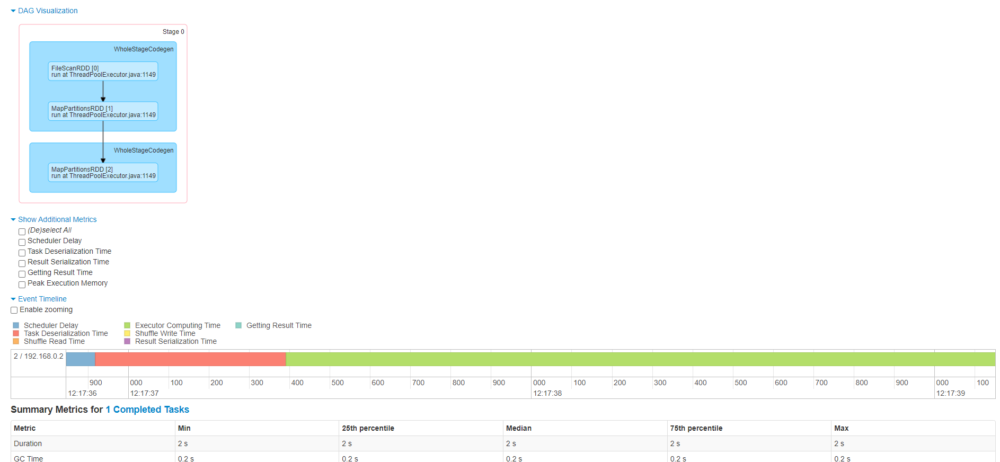

# Executing relational-style Spark queries with RDDs and DataFrames

## Data preparation

To download the files used in this lab, first clone the repository. Make sure `git` is installed.

```bash
cd ~
git clone https://github.com/ikons/bigdata-uth.git
```

### Uploading the example files to HDFS

Next, upload the entire `examples` folder to HDFS under `/user/<username>/examples`:

```bash
cd bigdata-uth
hadoop fs -put examples examples
```

Verify that the files were uploaded successfully:

```bash
hadoop fs -ls examples
```

### Uploading the code files to HDFS

Before uploading the `code` folder, replace the hard-coded username `ikons` in the source files with your own username (for example `student1`):

```bash
find code -type f -exec sed -i 's/ikons/<your_username>/g' {} +
```

📌 Example:

```bash
find code -type f -exec sed -i 's/ikons/student1/g' {} +
```

Then upload the code folder:

```bash
hadoop fs -put code code
```

💡 You can verify that the replacement worked with:

```bash
grep -rn "student1" code/
```

And confirm that all code files are present in HDFS:

```bash
hadoop fs -ls code
```

## Map/Reduce





A **Map/Reduce job** consists of a **map stage** and a **reduce stage**. During the map stage, the worker nodes that receive map tasks process a partition of the input data assigned by the master node. The master tends to schedule work on workers that already store the corresponding data blocks locally, in order to minimize network traffic across the cluster. This principle is known as **data locality**.

After the map stage finishes, the mappers send their intermediate results to the reducers. The master determines which reducer will receive which records, ensuring that records with the same key are sent to the same reducer. The reducer then combines the intermediate values to produce the final output. Additional steps such as sorting may also appear between the map and reduce stages.

> INITIAL DATA -> MASTER -> ASSIGNS MAP JOBS TO WORKERS
>
> WORKERS EXECUTE MAP JOBS AND PRODUCE (key, value) PAIRS
>
> MAP 1: [(1, DATA), (1, DATA), (1, DATA)]
>
> MAP 2: [(1, DATA), (1, DATA), (1, DATA)]
>
> MAP 3: [(2, DATA), (2, DATA)]
>
> --------------------------------------------------------------------
>
> REDUCERS COMBINE DATA FROM MAPPERS TO PRODUCE THE FINAL OUTPUT
>
> MAP1, MAP2 -> REDUCER1
>
> MAP3 -> REDUCER2
>
> REDUCER1, REDUCER2 -> FINAL_REDUCER -> FINAL OUTPUT

One of the classic Map/Reduce examples is **word count**. Given one or more text documents, we want to count how many times each word appears.

Run `wordcount.py` with:

```bash
# ⚠️ Replace ikons with your own username
spark-submit hdfs://hdfs-namenode:9000/user/ikons/code/wordcount.py
```

After submitting it, open `k9s` and watch the job running on Kubernetes.

`wordcount.py`:

```python
from pyspark.sql import SparkSession
username = "ikons"
sc = SparkSession \
    .builder \
    .appName("wordcount example") \
    .getOrCreate() \
    .sparkContext

# MINIMIZE LOG OUTPUT
sc.setLogLevel("ERROR")

# Retrieve the job ID and define the output path
job_id = sc.applicationId
output_dir = f"hdfs://hdfs-namenode:9000/user/{username}/wordcount_output_{job_id}"

# Load the text file from HDFS and compute word frequencies
wordcount = (
    sc.textFile(f"hdfs://hdfs-namenode:9000/user/{username}/examples/text.txt") \
    .flatMap(lambda x: x.split(" "))                 # Split each line into words
    .map(lambda x: (x, 1))                           # Map each word to (word, 1)
    .reduceByKey(lambda x, y: x + y)                 # Sum occurrences for each word
    .sortBy(lambda x: x[1], ascending=False)         # Sort by frequency in descending order
)

# Print the results (for verification)
for item in wordcount.coalesce(1).collect():
    print(item)

# Coalesce to reduce the number of output files and save to HDFS
wordcount.saveAsTextFile(output_dir)

# Example output:
# [('text', 3), ('this', 2), ('is', 2), ('like', 2), ('a', 2),
#  ('file', 2), ('words', 2), (',', 2), ('an', 1), ('of', 1),
#  ('with', 1), ('random', 1), ('example', 1)]
```

**WARNING:** Using `collect()` on large RDDs can cause errors, because all data is brought back to the driver. For quick inspection, prefer functions such as `take(n)` whenever possible.

### Code explanation

First, we create a **SparkSession** and obtain the associated **SparkContext**. `SparkSession` is the general entry point for Spark libraries, while `SparkContext` is the classic entry point for **RDD-based** programming.

The program then reads `text.txt` from HDFS and uses a lambda function inside `flatMap`:

```python
lambda x: x.split(" ")
```

For each input line `x`, this returns a list of words by splitting on whitespace.

The key difference between `flatMap` and `map` is that:
- `map` returns **one list per input record**
- `flatMap` **flattens** the output into a single sequence

Next, `map` creates a `(key, value)` pair for each word:
- **Key** = the word
- **Value** = `1`, representing one occurrence

Then `reduceByKey` combines all pairs with the same key. For example:

`("text", 1), ("text", 1)`

becomes:

`("text", 2)`

Finally, `sortBy` sorts the pairs by the number of occurrences in descending order.

Example output:

```python
[('text', 3), ('this', 2), ('is', 2), ('like', 2), ('a', 2),
 ('file', 2), ('words', 2), (',', 2), ('an', 1), ('of', 1),
 ('with', 1), ('random', 1), ('example', 1)]
```

The overall process (without showing `sortBy`) is summarized below:



## Data format

The file **employees.csv** contains:
- the **employee ID**
- the **employee name**
- the **salary**
- the **department ID** where the employee works

Structure:

| ID | NAME | SALARY | DEPARTMENT_ID |
|----|------|--------|---------------|

Example: `1,George R,2000,1`

The file **departments.csv** contains:
- the **department ID**
- the **department name**

Structure:

| ID | NAME |
|----|------|

Example: `1,Dep A`

**QUERY 1:** Find the 5 employees with the lowest salary

**QUERY 2:** Find the 3 highest-paid employees in department `Dep A`

**QUERY 3:** Find the yearly income of all employees

**QUERY 4:** Join employees with departments using only RDDs

## RDD (Resilient Distributed Datasets)

**RDDs** are the **fundamental data structure in Spark**. They are immutable, distributed collections of objects. Each dataset is split into logical partitions that can be processed on different cluster nodes. RDDs can contain any Python/Java/Scala object, including custom user-defined classes.

### Query 1 with RDDs

Run `RddQ1.py` with:

```bash
# ⚠️ Replace ikons with your own username
spark-submit hdfs://hdfs-namenode:9000/user/ikons/code/RddQ1.py
```

`RddQ1.py`:

```python
from pyspark.sql import SparkSession

username = "ikons"
sc = SparkSession \
    .builder \
    .appName("RDD query 1 execution") \
    .getOrCreate() \
    .sparkContext

# MINIMIZE LOG OUTPUT
sc.setLogLevel("ERROR")

# Retrieve the job ID and define the output path
job_id = sc.applicationId
output_dir = f"hdfs://hdfs-namenode:9000/user/{username}/RddQ1_{job_id}"

# Load and preprocess data
# CSV columns: "id", "name", "salary", "dep_id"
employees = sc.textFile(f"hdfs://hdfs-namenode:9000/user/{username}/examples/employees.csv") \
    .map(lambda x: x.split(","))  # Split each line into a list

# Map each employee to the form (salary, [id, name, dep_id]) and sort by salary (ascending)
# Column mapping:
#   x[0] = id
#   x[1] = name
#   x[2] = salary
#   x[3] = dep_id
sorted_employees = employees.map(lambda x: [int(x[2]), [x[0], x[1], x[3]]]) \
    .sortByKey()

# Print the data (for verification)
for item in sorted_employees.coalesce(1).collect():
    print(item)  # Example output: [60000, ['123', 'Alice', '5']]

# Coalesce to reduce the number of output files and save to HDFS
sorted_employees.coalesce(1).saveAsTextFile(output_dir)
```

This is a simple example. First we read `employees.csv` from HDFS and then use `map` to create **one list per employee record** (that is, one list per input line).

Here we use `map` instead of `flatMap` because we care about **each individual record** and we want to keep it intact for the next step.

The output of `map(lambda x: x.split(","))` looks like:

`[["id", "name", "salary", "dep_id"], [...], [...], ...]`

If we had used `flatMap` instead, the result would have been:

`["id", "name", "salary", "dep_id", "id", "name", "salary", "dep_id", ...]`

That would flatten everything into one long sequence, making sorting or grouping by a particular field impractical.

In the second `map`, each employee is transformed into a `(key, value)` pair where:
- **key = salary**
- **value = [id, name, dep_id]**

Then `sortByKey()` sorts the employees by salary in **ascending** order.

Example output:

```python
[(550, ['6', 'Jerry L', '3']),
 (1000, ['7', 'Marios K', '1']),
 (1000, ['2', 'John K', '2']),
 (1050, ['5', 'Helen K', '2']),
 (1500, ['10', 'Yiannis T', '1'])]
```

### Query 2 with RDDs

Run `RddQ2.py` with:

```bash
# ⚠️ Replace ikons with your own username
spark-submit hdfs://hdfs-namenode:9000/user/ikons/code/RddQ2.py
```

`RddQ2.py`:

```python
from pyspark.sql import SparkSession

username = "ikons"
sc = SparkSession \
    .builder \
    .appName("RDD query 2 execution") \
    .getOrCreate() \
    .sparkContext

# MINIMIZE LOG OUTPUT
sc.setLogLevel("ERROR")

# Retrieve the job ID and define the output path
job_id = sc.applicationId
output_dir = f"hdfs://hdfs-namenode:9000/user/{username}/RddQ2_{job_id}"

# =======================
# SCHEMA INFORMATION:
# employees:   "emp_id", "emp_name", "salary", "dep_id"
# departments: "id", "dpt_name"
#
# Column mapping for employees:
#   x[0] = emp_id
#   x[1] = emp_name
#   x[2] = salary
#   x[3] = dep_id
#
# Column mapping for departments:
#   x[0] = id
#   x[1] = dpt_name
# =======================

# Load and parse employee data
employees = sc.textFile(f"hdfs://hdfs-namenode:9000/user/{username}/examples/employees.csv") \
    .map(lambda x: x.split(","))  # → [emp_id, emp_name, salary, dep_id]

# Load and parse department data
departments = sc.textFile(f"hdfs://hdfs-namenode:9000/user/{username}/examples/departments.csv") \
    .map(lambda x: x.split(","))  # → [id, dpt_name]

# Keep only departments with dpt_name == "Dep A"
depA = departments.filter(lambda x: x[1] == "Dep A")

# Format employees as (dep_id, [emp_id, emp_name, salary])
# Use x[3] = dep_id as the key
employees_formatted = employees.map(lambda x: [x[3], [x[0], x[1], x[2]]])

# Format departments as (id, [dpt_name])
# Use x[0] = id as the key
depA_formatted = depA.map(lambda x: [x[0], [x[1]]])

# Join employees with department "Dep A" using dep_id
# Result: (dep_id, ([emp_id, emp_name, salary], [dpt_name]))
joined_data = employees_formatted.join(depA_formatted)

# Extract only employee fields (without department fields)
# Result: [emp_id, emp_name, salary]
get_employees = joined_data.map(lambda x: x[1][0])

# Sort employees by salary in descending order
# Input: [emp_id, emp_name, salary] — x[2] = salary
# Output: (salary, [emp_id, emp_name])
sorted_employees = get_employees.map(lambda x: [int(x[2]), [x[0], x[1]]]) \
    .sortByKey(ascending=False)

# Create an RDD with a separator line for the final output
delimiter = ["=========="]
delimiter_rdd = sc.parallelize(delimiter)  # Single-line RDD

# Concatenate all RDDs with separators in between
final_rdd = employees_formatted.union(delimiter_rdd) \
    .union(departments) \
    .union(delimiter_rdd) \
    .union(joined_data) \
    .union(delimiter_rdd) \
    .union(sorted_employees)

# Print the final output (for testing/debugging)
for item in final_rdd.coalesce(1).collect():
    print(item)

# Save the final output to HDFS
final_rdd.coalesce(1).saveAsTextFile(output_dir)
```

We start by reading both CSV files from HDFS.

Then we keep only the record corresponding to **Dep A** from the departments dataset.

Next, we create `(key, value)` pairs for both datasets so that we can join them:
- for employees: **key = dep_id**
- for departments: **key = id**

We then perform an RDD `join`. The resulting `joined_data` RDD contains only the employees who belong to **Dep A**:

```python
[
 ('1', (['7', 'Marios K', '1000'], ['Dep A'])),
 ('1', (['10', 'Yiannis T', '1500'], ['Dep A'])),
 ('1', (['1', 'George R', '2000'], ['Dep A'])),
 ('1', (['3', 'Mary T', '2100'], ['Dep A'])),
 ('1', (['4', 'George T', '2100'], ['Dep A']))
]
```

After that we remove the department metadata and keep only the employee fields:

```python
[
 ['1', 'George R', '2000'],
 ['3', 'Mary T', '2100'],
 ['4', 'George T', '2100'],
 ['7', 'Marios K', '1000'],
 ['10', 'Yiannis T', '1500']
]
```

Finally, we create new `(key, value)` pairs where:
- key = salary
- value = the remaining employee fields

and we sort by key in **descending** order.

```python
(2100, ['3', 'Mary T'])
(2100, ['4', 'George T'])
(2000, ['1', 'George R'])
(1500, ['10', 'Yiannis T'])
(1000, ['7', 'Marios K'])
```

### Query 3 with RDDs

Run `RddQ3.py` with:

```bash
# ⚠️ Replace ikons with your own username
spark-submit hdfs://hdfs-namenode:9000/user/ikons/code/RddQ3.py
```

`RddQ3.py`:

```python
from pyspark.sql import SparkSession

username = "ikons"
sc = SparkSession \
    .builder \
    .appName("RDD query 3 execution") \
    .getOrCreate() \
    .sparkContext

# MINIMIZE LOG OUTPUT
sc.setLogLevel("ERROR")

# Retrieve the job ID and define the output path
job_id = sc.applicationId
output_dir = f"hdfs://hdfs-namenode:9000/user/{username}/RddQ3_{job_id}"

# =======================
# SCHEMA INFORMATION:
# employees:   "emp_id", "emp_name", "salary", "dep_id"
# departments: "id", "dpt_name"
#
# Column mapping for employees:
#   x[0] = emp_id
#   x[1] = emp_name
#   x[2] = salary
#   x[3] = dep_id
#
# Column mapping for departments:
#   x[0] = id
#   x[1] = dpt_name
# =======================

# Load and parse employee data
employees = sc.textFile(f"hdfs://hdfs-namenode:9000/user/{username}/examples/employees.csv") \
    .map(lambda x: x.split(","))  # → [emp_id, emp_name, salary, dep_id]

# Directly compute yearly income using a lambda function
employees_yearly_income = employees.map(lambda x: [x[1], 14 * int(x[2])])  # → [emp_name, 14*salary]

# Print the final output (for testing/debugging)
for item in employees_yearly_income.coalesce(1).collect():
    print(item)

# Save the final output to HDFS
employees_yearly_income.coalesce(1).saveAsTextFile(output_dir)
```

In this example we directly compute yearly income using a lambda expression that multiplies the salary by 14.

### Hands-on RddQ4 example: joining two datasets using only RDD operations

**Dataset A**

```python
(1, George K, 1)
(2, John T, 2)
(3, Mary M, 1)
(4, Jerry S, 3)
```

**Dataset B**

```python
(1, Dep A)
(2, Dep B)
(3, Dep C)
```

Dataset A contains:
- employee ID
- employee name
- department ID

Dataset B contains:
- department ID
- department name

We want to join the two datasets **using department ID**.

We define the join key as `department_id` and create key-value pairs.

**Dataset A** becomes:

```text
(1, (1, George K, 1))
(2, (2, John T, 2))
(1, (3, Mary M, 1))
(3, (4, Jerry S, 3))
```

**Dataset B** becomes:

```text
(1, (1, Dep A))
(2, (2, Dep B))
(3, (3, Dep C))
```

We then add a **tag** to distinguish the origin of each record:
- `1` for Dataset A
- `2` for Dataset B

```text
(1, (1, (1, George K, 1)))   # from A
(2, (1, (2, John T, 2)))
(1, (1, (3, Mary M, 1)))
(3, (1, (4, Jerry S, 3)))

(1, (2, (1, Dep A)))         # from B
(2, (2, (2, Dep B)))
(3, (2, (3, Dep C)))
```

Then we combine both RDDs with `union`:

```python
unioned_data = left.union(right)
```

After that, [`groupByKey()`](https://spark.apache.org/docs/latest/api/python/reference/api/pyspark.RDD.groupByKey.html) ensures that all records with the same department key end up together on the same reducer.

We define `arrange()` to split values by origin and then emit all employee/department combinations.

Apply:

```python
flatMapValues(lambda x: arrange(x))
```

which yields:

```python
[
 (3, (4, Jerry S, 3), (3, Dep C)),
 (1, (1, George K, 1), (1, Dep A)),
 (1, (3, Mary M, 1), (1, Dep A)),
 (2, (2, John T, 2), (2, Dep B))
]
```

The full Python code is:

```python
from pyspark.sql import SparkSession

# Create SparkContext
sc = SparkSession \
    .builder \
    .appName("Join Datasets with RDD") \
    .getOrCreate() \
    .sparkContext

# MINIMIZE LOG OUTPUT
sc.setLogLevel("ERROR")

# --------------------------
# Initial data
# --------------------------

# Dataset A: (employee_id, employee_name, department_id)
data_a = [
    (1, "George K", 1),
    (2, "John T", 2),
    (3, "Mary M", 1),
    (4, "Jerry S", 3)
]

# Dataset B: (department_id, department_name)
data_b = [
    (1, "Dep A"),
    (2, "Dep B"),
    (3, "Dep C")
]

# --------------------------
# Create RDDs
# --------------------------

rdd_a = sc.parallelize(data_a)
rdd_b = sc.parallelize(data_b)

# --------------------------
# Prepare for join
# --------------------------

# Create key-value pairs using department_id as the key
# and add a dataset tag (1 for A, 2 for B)

# From Dataset A:
# (department_id, (1, (employee_id, employee_name, department_id)))
left = rdd_a.map(lambda x: (x[2], (1, x)))

# From Dataset B:
# (department_id, (2, (department_id, department_name)))
right = rdd_b.map(lambda x: (x[0], (2, x)))

# --------------------------
# Union the two RDDs
# --------------------------

# Use union so that all records end up in the same RDD
unioned_data = left.union(right)

# --------------------------
# Group by department_id
# --------------------------

# Records with the same department_id are grouped together
grouped = unioned_data.groupByKey()

# --------------------------
# Function for merging the data
# --------------------------

def arrange(records):
    left_origin = []   # Records from Dataset A (employees)
    right_origin = []  # Records from Dataset B (departments)

    for (source_id, value) in records:
        if source_id == 1:
            left_origin.append(value)
        elif source_id == 2:
            right_origin.append(value)

    # Return every employee/department-name combination
    return [(employee, dept) for employee in left_origin for dept in right_origin]

# --------------------------
# Final join result
# --------------------------

# Use flatMapValues to unroll the results
joined = grouped.flatMapValues(lambda x: arrange(x))

# Returns: (department_id, ((employee_id, name, dept_id), (dept_id, dept_name)))
for record in joined.collect():
    print(record)
```

## DataFrames

A **DataFrame** is a distributed collection of data organized into **named columns**. Conceptually it is similar to a relational table or to a data frame in R/Python, but with Spark's distributed execution and optimizations under the hood.

DataFrames can be created from a variety of sources, such as:
- structured files (CSV, JSON, etc.)
- Hive tables
- external databases
- existing RDDs

The DataFrame API is different from the RDD API. Its documentation is available in the [official DataFrame API reference](https://spark.apache.org/docs/latest/api/python/reference/pyspark.sql/dataframe.html).

### Query 1 with DataFrames

Run `DFQ1.py` with:

```bash
# ⚠️ Replace ikons with your own username
spark-submit hdfs://hdfs-namenode:9000/user/ikons/code/DFQ1.py
```

`DFQ1.py`:

```python
from pyspark.sql import SparkSession
from pyspark.sql.types import StructField, StructType, IntegerType, FloatType, StringType
from pyspark.sql.functions import col

username = "ikons"
spark = SparkSession \
    .builder \
    .appName("DF query 1 execution") \
    .getOrCreate()
sc = spark.sparkContext

# MINIMIZE LOG OUTPUT
sc.setLogLevel("ERROR")

job_id = spark.sparkContext.applicationId
output_dir = f"hdfs://hdfs-namenode:9000/user/{username}/DFQ1_{job_id}"

# Define the schema for the employees DataFrame
employees_schema = StructType([
    StructField("id", IntegerType()),
    StructField("name", StringType()),
    StructField("salary", FloatType()),
    StructField("dep_id", IntegerType()),
])

# Load the employees DataFrame
employees_df = spark.read.format('csv') \
    .options(header='false') \
    .schema(employees_schema) \
    .load(f"hdfs://hdfs-namenode:9000/user/{username}/examples/employees.csv")

# Sort employees by salary
sorted_employees_df = employees_df.sort(col("salary"))

# Display the sorted employees (for testing)
sorted_employees_df.show(5)

# Coalesce partitions into one and save to HDFS
sorted_employees_df.coalesce(1).write.format("csv").option("header", "false").save(output_dir)
```

Because we are **not using RDDs**, we only need a **SparkSession**. Since `employees.csv` does not include column names, we define the schema manually and then read the file from HDFS. After that we use the built-in DataFrame `sort()` function together with `col("salary")` and display the first rows with `show(5)`.

Example output:

```text
+---+---------+--------+-------+
| id|    name | salary |dep_id|
+---+---------+--------+-------+
| 6 | Jerry L |  550.0 |   3   |
| 2 | John K  | 1000.0 |   2   |
| 7 |Marios K | 1000.0 |   1   |
| 5 | Helen K | 1050.0 |   2   |
|10 |Yiannis T| 1500.0 |   1   |
+---+---------+--------+-------+
```

### Query 2 with DataFrames and SQL

Run `DFQ2.py` with:

```bash
# ⚠️ Replace ikons with your own username
spark-submit hdfs://hdfs-namenode:9000/user/ikons/code/DFQ2.py
```

`DFQ2.py`:

```python
from pyspark.sql import SparkSession
from pyspark.sql.types import StructField, StructType, IntegerType, FloatType, StringType

username = "ikons"
spark = SparkSession \
    .builder \
    .appName("DF query 2 execution") \
    .getOrCreate()
sc = spark.sparkContext

# MINIMIZE LOG OUTPUT
sc.setLogLevel("ERROR")

job_id = spark.sparkContext.applicationId
output_dir = f"hdfs://hdfs-namenode:9000/user/{username}/DFQ2_{job_id}"

# Define the schema for the employees DataFrame
employees_schema = StructType([
    StructField("id", IntegerType()),
    StructField("name", StringType()),
    StructField("salary", FloatType()),
    StructField("dep_id", IntegerType()),
])

# Load the employees DataFrame
employees_df = spark.read.format('csv') \
    .options(header='false') \
    .schema(employees_schema) \
    .load(f"hdfs://hdfs-namenode:9000/user/{username}/examples/employees.csv")

# Define the schema for the departments DataFrame
departments_schema = StructType([
    StructField("id", IntegerType()),
    StructField("name", StringType()),
])

# Load the departments DataFrame
departments_df = spark.read.format('csv') \
    .options(header='false') \
    .schema(departments_schema) \
    .load(f"hdfs://hdfs-namenode:9000/user/{username}/examples/departments.csv")

# Register the DataFrames as temporary views
employees_df.createOrReplaceTempView("employees")
departments_df.createOrReplaceTempView("departments")

# Query to find the id of 'Dep A'
id_query = "SELECT departments.id, departments.name FROM departments WHERE departments.name == 'Dep A'"
depA_id = spark.sql(id_query)
depA_id.createOrReplaceTempView("depA")

# Inner join query to extract employees from 'Dep A'
inner_join_query = """
    SELECT employees.name, employees.salary
    FROM employees
    INNER JOIN depA ON employees.dep_id == depA.id
    ORDER BY employees.salary DESC
"""
joined_data = spark.sql(inner_join_query)

# Display the join result (for verification)
joined_data.show()

# Coalesce to a single partition and save the final DataFrame to HDFS
joined_data.coalesce(1).write.format("csv").option("header", "false").save(output_dir)
```

We define the schemas for both files, read them from HDFS, and then use `registerTempTable` or `createOrReplaceTempView`, which allows us to use the **DataFrames as SQL tables**. This lets us reference the employees DataFrame as `employees` and the departments DataFrame as `departments` inside SQL queries.

Next, we execute a SQL query to find the **ID of department "Dep A"**. We do that by defining the query as a string and executing it with:

```python
spark.sql(id_query)
```

This creates a new DataFrame with one record containing the values **1** and **Dep A**. Then we register the `depA` DataFrame as another temporary SQL table and run the join query. Finally, we inspect the rows with `show()`.

Example output:

```text
+---------+------+
|     name|salary|
+---------+------+
|   Mary T|2100.0|
| George T|2100.0|
| George R|2000.0|
|Yiannis T|1500.0|
| Marios K|1000.0|
+---------+------+
```

### Alternative Query 2 without an intermediate table

Run `DFQ2_noI.py` with:

```bash
# ⚠️ Replace ikons with your own username
spark-submit hdfs://hdfs-namenode:9000/user/ikons/code/DFQ2_noI.py
```

`DFQ2_noI.py`:

```python
from pyspark.sql import SparkSession
from pyspark.sql.types import StructField, StructType, IntegerType, FloatType, StringType

username = "ikons"
spark = SparkSession \
    .builder \
    .appName("DF query 2 execution, no Intermediate Table") \
    .getOrCreate()
sc = spark.sparkContext

# MINIMIZE LOG OUTPUT
sc.setLogLevel("ERROR")

job_id = spark.sparkContext.applicationId
output_dir = f"hdfs://hdfs-namenode:9000/user/{username}/DFQ2_nol_{job_id}"

# Define the schema for the employees DataFrame
employees_schema = StructType([
    StructField("id", IntegerType()),
    StructField("name", StringType()),
    StructField("salary", FloatType()),
    StructField("dep_id", IntegerType()),
])

# Load the employees DataFrame
employees_df = spark.read.format('csv') \
    .options(header='false') \
    .schema(employees_schema) \
    .load(f"hdfs://hdfs-namenode:9000/user/{username}/examples/employees.csv")

# Define the schema for the departments DataFrame
departments_schema = StructType([
    StructField("id", IntegerType()),
    StructField("name", StringType()),
])

# Load the departments DataFrame
departments_df = spark.read.format('csv') \
    .options(header='false') \
    .schema(departments_schema) \
    .load(f"hdfs://hdfs-namenode:9000/user/{username}/examples/departments.csv")

# Register the DataFrames as temporary views
employees_df.createOrReplaceTempView("employees")
departments_df.createOrReplaceTempView("departments")

# Inner join query to extract employees from 'Dep A'
inner_join_query = """
    SELECT employees.name, employees.salary
    FROM employees
    INNER JOIN departments ON employees.dep_id == departments.id
    WHERE departments.name == 'Dep A'
    ORDER BY employees.salary DESC
"""

# Execute the query
joined_data = spark.sql(inner_join_query)

# Display the join result (for verification)
joined_data.show()

# Coalesce partitions into one and save to HDFS
joined_data.coalesce(1).write.format("csv").option("header", "false").save(output_dir)
```

### DataFrame join and aggregation example (`DF2b.py`)

We can also perform joins using only built-in DataFrame operations. For example, to compute the **sum of salaries per department**, run:

```bash
# ⚠️ Replace ikons with your own username
spark-submit hdfs://hdfs-namenode:9000/user/ikons/code/DF2b.py
```

`DF2b.py`:

```python
from pyspark.sql import SparkSession
from pyspark.sql.types import StructField, StructType, IntegerType, FloatType, StringType

username = "ikons"
spark = SparkSession \
    .builder \
    .appName("DF query 2b execution") \
    .getOrCreate()
sc = spark.sparkContext
# MINIMIZE LOG OUTPUT
sc.setLogLevel("ERROR")

job_id = spark.sparkContext.applicationId
output_dir = f"hdfs://hdfs-namenode:9000/user/{username}/DF2b_{job_id}"

# Define the schema for the employees DataFrame
employees_schema = StructType([
    StructField("emp_id", IntegerType()),
    StructField("emp_name", StringType()),
    StructField("salary", FloatType()),
    StructField("dep_id", IntegerType()),
])

# Load the employees DataFrame
employees_df = spark.read.format('csv') \
    .options(header='false') \
    .schema(employees_schema) \
    .load(f"hdfs://hdfs-namenode:9000/user/{username}/examples/employees.csv")

# Define the schema for the departments DataFrame
departments_schema = StructType([
    StructField("id", IntegerType()),
    StructField("dpt_name", StringType()),
])

# Load the departments DataFrame
departments_df = spark.read.format('csv') \
    .options(header='false') \
    .schema(departments_schema) \
    .load(f"hdfs://hdfs-namenode:9000/user/{username}/examples/departments.csv")

# Execute an inner join between the employee and department DataFrames
joinedDf = employees_df.join(departments_df, employees_df.dep_id == departments_df.id, "inner")

# Display the joined data (for verification)
joinedDf.show()

# Group by department id and compute the salary sum
groupedDf = joinedDf.groupBy("dep_id").sum("salary")

# Display the grouped data (for verification)
groupedDf.show()

# Coalesce both DataFrames into a single partition and save them to HDFS

# Save the joined DataFrame to HDFS
joinedDf.coalesce(1).write.format("csv").option("header", "false").save(f"{output_dir}_joined")

# Save the grouped DataFrame to HDFS
groupedDf.coalesce(1).write.format("csv").option("header", "false").save(f"{output_dir}_grouped")
```

First, we read the two datasets from **HDFS**. Then we use the built-in DataFrame [`join`](https://spark.apache.org/docs/latest/api/python/reference/pyspark.sql/api/pyspark.sql.DataFrame.join.html) function, specifying the join key `employees_df.dep_id == departments_df.id` and the join type `inner`.

Next, we perform a [`groupBy`](https://spark.apache.org/docs/latest/api/python/reference/pyspark.sql/api/pyspark.sql.DataFrame.groupBy.html) operation on `dep_id` and use [`sum()`](https://spark.apache.org/docs/latest/api/python/reference/pyspark.sql/api/pyspark.sql.GroupedData.sum.html) to compute the **sum of salaries** for each department.

```text
+------+----------+------+------+---+--------+
|emp_id|  emp_name|salary|dep_id| id|dpt_name|
+------+----------+------+------+---+--------+
|     1|  George R|2000.0|     1|  1|   Dep A|
|     2|    John K|1000.0|     2|  2|   Dep B|
|     3|    Mary T|2100.0|     1|  1|   Dep A|
|     4|  George T|2100.0|     1|  1|   Dep A|
|     5|   Helen K|1050.0|     2|  2|   Dep B|
|     6|   Jerry L| 550.0|     3|  3|   Dep C|
|     7|  Marios K|1000.0|     1|  1|   Dep A|
|     8|  George K|2500.0|     2|  2|   Dep B|
|     9|Vasilios D|3500.0|     3|  3|   Dep C|
|    10| Yiannis T|1500.0|     1|  1|   Dep A|
|    11| Antonis T|2500.0|     2|  2|   Dep B|
+------+----------+------+------+---+--------+

+------+-----------+
|dep_id|sum(salary)|
+------+-----------+
|     1|     8700.0|
|     3|     4050.0|
|     2|     7050.0|
+------+-----------+
```

### Query 3 with DataFrames and a UDF

Run `DFQ3.py` with:

```bash
# ⚠️ Replace ikons with your own username
spark-submit hdfs://hdfs-namenode:9000/user/ikons/code/DFQ3.py
```

This example demonstrates the use of [User Defined Functions (UDFs)](https://spark.apache.org/docs/latest/sql-ref-functions.html#udfs-user-defined-functions).

`DFQ3.py`:

```python
from pyspark.sql import SparkSession
from pyspark.sql.types import StructField, StructType, IntegerType, FloatType, StringType
from pyspark.sql.functions import col, udf

username = "ikons"
spark = SparkSession \
    .builder \
    .appName("DF query 3 execution") \
    .getOrCreate()
sc = spark.sparkContext
# MINIMIZE LOG OUTPUT
sc.setLogLevel("ERROR")

job_id = spark.sparkContext.applicationId
output_dir = f"hdfs://hdfs-namenode:9000/user/{username}/DF3_{job_id}"

# Define the schema for the employees DataFrame
employees_schema = StructType([
    StructField("emp_id", IntegerType()),
    StructField("emp_name", StringType()),
    StructField("salary", FloatType()),
    StructField("dep_id", IntegerType()),
])

# Load the employees DataFrame
employees_df = spark.read.format('csv') \
    .options(header='false') \
    .schema(employees_schema) \
    .load(f"hdfs://hdfs-namenode:9000/user/{username}/examples/employees.csv")

# Define a function that computes yearly income
def calculate_yearly_income(salary):
    return 14 * salary

# Register the UDF
calculate_yearly_income_udf = udf(calculate_yearly_income, FloatType())

# Compute the result by creating a new column
employees_yearly_income_df = employees_df \
    .withColumn("yearly_income", calculate_yearly_income_udf(col("salary"))) \
    .select("emp_name", "yearly_income")

# Display the result
employees_yearly_income_df.show()

# Save the DataFrame to HDFS
employees_yearly_income_df.coalesce(1).write.format("csv").option("header", "false").save(f"{output_dir}")
```

In this implementation we define a function that multiplies the salary by 14 and returns the yearly income. Then we register the corresponding UDF and apply it to the `salary` column in the `employees_df` DataFrame.

**Think about the following:** could the same result be achieved without a UDF? How would performance differ between the two approaches?

Example output:

```text
+----------+-------------+
|  emp_name|yearly_income|
+----------+-------------+
|  George R|      28000.0|
|    John K|      14000.0|
|    Mary T|      29400.0|
|  George T|      29400.0|
|   Helen K|      14700.0|
|   Jerry L|       7700.0|
|  Marios K|      14000.0|
|  George K|      35000.0|
|Vasilios D|      49000.0|
| Yiannis T|      21000.0|
| Antonis T|      35000.0|
+----------+-------------+
```

## Installing Spark History Server to inspect previous executions

To inspect Spark jobs after they finish, install the **Spark History Server**. Your jobs are already configured to store their event logs in the `logs` subdirectory of your HDFS home directory. Using Docker, we will start a local container that reads those logs and exposes the execution history through a web interface.

1. Make sure Docker Desktop is running. Then go to:

```bash
cd ~/bigdata-uth/docker/02-lab2-spark-history-server
```

and run:

```bash
docker build -t spark-history-server .
```

This builds a custom Docker image.

2. Start the container and set your username (**replace `ikons` with your own username**):

```bash
# ⚠️ Replace ikons with your own username

docker run -d \
  --name spark-history-server \
  -e USERNAME=ikons \
  -p 18080:18080 \
  spark-history-server
```

3. Check the logs:

```bash
docker logs -f spark-history-server
```

You should see something like:

```text
Starting Spark History Server for user ikons, reading logs from hdfs://hdfs-namenode:9000/user/ikons/logs
```

Press `Ctrl+C` to stop following the logs.

4. Open the UI:

http://localhost:18080/

There you will see the jobs you have executed so far.



If you click on an **application id**, you will see a page like the following. Then, if you click on a **job**, you can inspect more details such as the **DAG graph**, the **event timeline**, and more.



5. Stop and restart the container when needed.

Stop the container (it remains available for later use):

```bash
docker stop spark-history-server
```

Start it again:

```bash
docker start spark-history-server
```

If you want to remove the image and recreate it from scratch, run:

```bash
docker rmi spark-history-server
```
