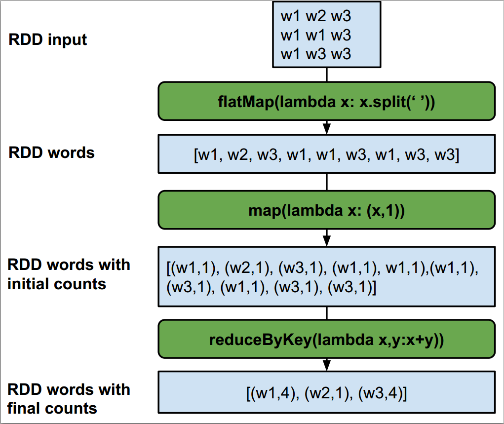

# Εκτέλεση σχεσιακών ερωτημάτων στο Spark με χρήση RDD και DataFrames

## Προετοιμασία Δεδομένων

Για να κατεβάσουμε τα αρχεία που θα χρησιμοποιήσουμε, αρχικά πρέπει να κατεβάσουμε τα **παραδείγματα** και τον **κώδικα**. Βεβαιωθείτε ότι έχετε εγκαταστήσει το `git`.


```bash
cd ~
```


```bash
git clone https://github.com/ikons/bigdata-uth.git
```

Ανέβασμα των αρχείων των παραδειγμάτων στο HDFS

Στη συνέχεια, ανεβάζουμε ολόκληρο τον φάκελο `examples` στον κατάλογο του HDFS: `/user/<όνομα_χρήστη>/examples`

```bash
cd bigdata-uth
```

```bash
hadoop fs -put examples examples
```

Τώρα μπορούμε να βεβαιωθούμε ότι τα αρχεία ανέβηκαν σωστά, εκτελώντας:

```bash
hadoop fs -ls examples
```

Ανέβασμα των αρχείων κώδικα στο HDFS

Ανεβάζουμε όλα τα αρχεία από τον φάκελο code στο HDFS:

```bash
hadoop fs -put code code
```

```bash
hadoop fs -ls code
```
## Map/Reduce


Ένα **Map/Reduce job** περιλαμβάνει ένα **στάδιο map** και ένα **στάδιο reduce**. Στο στάδιο του map, οι **κόμβοι εργάτες (worker nodes)** στους οποίους έχουν ανατεθεί τα map jobs εκτελούν εργασία πάνω σε ένα **τμήμα των δεδομένων** που τους έχει ανατεθεί από τον **κύριο κόμβο (master VM)**. Ο master προτιμά να αναθέτει ορισμένες εργασίες σε συγκεκριμένους εργάτες που **έχουν ήδη το αντίστοιχο κομμάτι των δεδομένων τοπικά**, ώστε να **ελαχιστοποιηθεί η χρήση του δικτύου** της συστοιχίας (αρχή **τοπικότητας δεδομένων - data locality**). Μετά την εκτέλεση του σταδίου map, οι mappers στέλνουν τα αποτελέσματα στους reducers. Ο master καθορίζει **σε ποιον reducer** πρέπει να στείλει τα αποτελέσματά του κάθε mapper – και στέλνει **τα δεδομένα με το ίδιο key στον ίδιο reducer**. Ο ρόλος του reducer είναι να **συνδυάσει τα δεδομένα** από διάφορους mappers για να δημιουργήσει την τελική έξοδο. (Ενδιάμεσα βήματα μεταξύ των map και reduce jobs μπορεί να είναι απαραίτητα, π.χ. ταξινόμηση)

> ΑΡΧΙΚΑ ΔΕΔΟΜΕΝΑ -> MASTER -> ΑΝΑΘΕΤΕΙ MAP JOBS ΣΕ ΕΡΓΑΤΕΣ
>
> ΕΡΓΑΤΕΣ ΕΚΤΕΛΟΥΝ ΤΑ MAP JOBS ΚΑΙ ΠΑΡΑΓΟΥΝ ΖΕΥΓΗ (key, value)
>
> MAP 1:  [(1, DATA), (1 , DATA ), (1, DATA)] 
>
> MAP 2:  [(1, DATA), (1, DATA), (1, DATA)] 
>
> MAP 3:  [(2, DATA), (2, DATA)] 
>
> --------------------------------------------------------------------
>
> REDUCERS ΣΥΝΔΥΑΖΟΥΝ ΤΑ ΔΕΔΟΜΕΝΑ ΑΠΟ ΤΟΥΣ MAPPERS ΓΙΑ ΝΑ ΠΑΡΑΞΟΥΝ ΤΗΝ ΤΕΛΙΚΗ ΕΞΟΔΟ
>
> MAP1, MAP2 -> REDUCER1  
>
> MAP3 -> REDUCER2  
>
> REDUCER1, REDUCER2 -> FINAL_REDUCER -> ΤΕΛΙΚΟ OUTPUT

Ένα από τα πιο κλασικά παραδείγματα Map/Reduce είναι το πρόβλημα καταμέτρησης λέξεων (word count). Σε αυτό το παράδειγμα, έχουμε ένα ή περισσότερα έγγραφα και θέλουμε να βρούμε πόσες φορές εμφανίζεται κάθε λέξη μέσα στο έγγραφο

Για να εκτελέσεις το πρόγραμμα **wordcount.py**, χρησιμοποίησε την εξής εντολή:

```bash
# ⚠️ Αντικατέστησε το "ikons" με το δικό σου 👇 username
spark-submit hdfs://hdfs-namenode:9000/user/ikons/code/wordcount.py
```

Μετά την εκτέλεση, **τρέξε** k9s και παρακολούθησε το job που εκτελείται στο **k8s (Kubernetes)**.

Wordcount.py:

```python
from pyspark.sql import SparkSession
# ⚠️ Αντικατέστησε 👇 το "ikons" με το δικό σου username
username = "ikons"
sc = SparkSession \
    .builder \
    .appName("wordcount example") \
    .getOrCreate() \
    .sparkContext

# ΕΛΑΧΙΣΤΟΠΟΙΗΣΗ ΕΞΟΔΩΝ ΚΑΤΑΓΡΑΦΗΣ (LOGGING)
sc.setLogLevel("ERROR")

# Λήψη του job ID και καθορισμός διαδρομής εξόδου
job_id = sc.applicationId
output_dir = f"hdfs://hdfs-namenode:9000/user/{username}/wordcount_output_{job_id}"

# Φόρτωση αρχείου κειμένου από το HDFS και υπολογισμός συχνοτήτων λέξεων
wordcount = (
    sc.textFile(f"hdfs://hdfs-namenode:9000/user/{username}/examples/text.txt") \
    .flatMap(lambda x: x.split(" "))       # Διάσπαση κάθε γραμμής σε λέξεις
    .map(lambda x: (x, 1))       # Χαρτογράφηση (map) κάθε λέξης σε (λέξη, 1)
    .reduceByKey(lambda x, y: x + y)     # Άθροιση εμφανίσεων για κάθε λέξη
    .sortBy(lambda x: x[1], ascending=False) # Ταξινόμηση κατά φθίνουσα συχνότητα
)

# Εμφάνιση των αποτελεσμάτων (για έλεγχο)
for item in wordcount.coalesce(1).collect():
    print(item)

# Συγχώνευση για μείωση των αρχείων εξόδου και αποθήκευση στο HDFS
wordcount.saveAsTextFile(output_dir)

# Παράδειγμα αποτελεσμάτων:
# [('text', 3), ('this', 2), ('is', 2), ('like', 2), ('a', 2),
#  ('file', 2), ('words', 2), (',', 2), ('an', 1), ('of', 1),
#  ('with', 1), ('random', 1), ('example', 1)]
```

**ΠΡΟΕΙΔΟΠΟΙΗΣΗ:** Η χρήση της συνάρτησης `collect` σε RDDs που περιέχουν μεγάλο όγκο δεδομένων μπορεί να οδηγήσει σε σφάλμα. Μπορείτε να χρησιμοποιήσετε άλλες συναρτήσεις για να ρίξετε μια ματιά στο τι περιέχει το RDD, όπως π.χ. η `take(n)` – όπου `n` είναι ο αριθμός των εγγραφών που θέλουμε να ανακτήσουμε.

**Επεξήγηση Κώδικα:**

Αρχικά, δημιουργούμε ένα **SparkSession** και ένα **SparkContext**. Το `SparkSession` είναι το σημείο εισόδου για κάθε προγραμματιστική βιβλιοθήκη στο Spark και είναι απαραίτητο για να εκτελεστεί οποιοσδήποτε κώδικας. Το SparkContext είναι το αντίστοιχο σημείο εισόδου **ειδικά για RDDs**. Στη συνέχεια, το πρόγραμμα διαβάζει το αρχείο `text.txt` από το HDFS και χρησιμοποιεί μία **συνάρτηση lambda** για να διαχωρίσει τα δεδομένα κάθε φορά που εντοπίζει **κενό (whitespace)**. Μια **συνάρτηση lambda** είναι ουσιαστικά μια **ανώνυμη συνάρτηση** την οποία μπορούμε να χρησιμοποιήσουμε γρήγορα, χωρίς να χρειάζεται να την ορίσουμε με όνομα. Η συνάρτηση lambda που χρησιμοποιεί το πρόγραμμα ως όρισμα της `flatMap` είναι:

```python
lambda x: x.split(" ")
```

Για μια είσοδο `x`, επιστρέφει μία λίστα από λέξεις (διαιρώντας το κείμενο κάθε φορά που υπάρχει κενό διάστημα).

Η βασική διαφορά της `flatMap` σε σχέση με την `map` είναι ότι η **map επιστρέφει πολλές λίστες (μία για κάθε είσοδο)**, ενώ η `flatMap` **ενώνει όλα τα αποτελέσματα σε μία ενιαία λίστα**.

Στη συνέχεια, με τη χρήση της `map` δημιουργούμε για κάθε λέξη στο αρχείο ένα **ζεύγος (key, value)**.
Θα χρησιμοποιήσουμε αυτό το ζεύγος στο στάδιο της **σύνοψης (reduce)**:

- **Key = η λέξη**
- **Value = 1**, που αντιπροσωπεύει μία εμφάνιση της λέξης

Έπειτα, χρησιμοποιούμε τη συνάρτηση `reduceByKey`. Αυτό σημαίνει ότι όλα τα ζεύγη με το **ίδιο key (δηλαδή την ίδια λέξη)** θα σταλούν στον ίδιο **reducer**, ο οποίος θα τα **συνδυάσει**.

Στην περίπτωσή μας, εάν το πρόγραμμα επεξεργαστεί τα εξής ζεύγη:

`("text", 1), ("text", 1)`

Τότε το αποτέλεσμα της συνάρτησης reduce θα είναι:

`("text", 2)`

Τέλος, εφαρμόζεται sortBy για να ταξινομήσουμε τις λέξεις **με βάση τον αριθμό εμφανίσεων (τιμή)** και εκτυπώνουμε το τελικό αποτέλεσμα.

**Αυτή είναι η έξοδος του προγράμματος** wordcount.py:

```python
[('text', 3), ('this', 2), ('is', 2), ('like', 2), ('a', 2), 
 ('file', 2), ('words', 2), (',', 2), ('an', 1), ('of', 1), 
 ('with', 1), ('random', 1), ('example', 1)]
```

Η διαδικασία συνοπτικά (χωρίς να φαίνεται το sortBy):



## Μορφή Δεδομένων

Το αρχείο **Employees.csv** περιέχει:

- το **ID του υπαλλήλου**, 
- το **όνομα του υπαλλήλου**, 
- τον **μισθό** του και 
- το **ID του τμήματος** στο οποίο εργάζεται.

**Δομή:**

| ID | ΟΝΟΜΑ | ΜΙΣΘΟΣ | ΤΜΗΜΑ_ID | 
|----|----|----|----|

π.χ. `1,George R,2000,1`

Το αρχείο **Departments.csv** περιέχει:
το **ID του τμήματος** και το **όνομα του τμήματος**.

**Δομή:**

| ID | ΟΝΟΜΑ | 
|----|----|


π.χ. `1,Dep A`

**ΕΡΩΤΗΜΑ 1:** Βρες τους 5 υπαλλήλους με τον χαμηλότερο μισθό

**ΕΡΩΤΗΜΑ 2**: Βρες τους 3 πιο καλοπληρωμένους υπαλλήλους από το τμήμα `Dep A`

## RDD (Resilient Distributed Datasets)

Τα **RDDs** αποτελούν τη **θεμελιώδη δομή δεδομένων στο Spark**. Είναι **αμετάβλητες**, κατανεμημένες συλλογές αντικειμένων. Κάθε σύνολο δεδομένων (RDD) χωρίζεται σε **λογικά partitions**, τα οποία μπορούν να επεξεργάζονται σε **διαφορετικούς κόμβους του cluster**. Τα RDDs μπορούν να περιέχουν **οποιονδήποτε τύπο αντικειμένων Python, Java ή Scala**, ακόμα και **κλάσεις που ορίζει ο χρήστης**.

Ας δημιουργήσουμε ένα πρόγραμμα για το **Ερώτημα 1** χρησιμοποιώντας RDDs

Για να εκτελέσετε το αρχείο `RddQ1.py`, χρησιμοποιήστε την εξής εντολή:

```bash
# ⚠️ Αντικατέστησε το "ikons" με το δικό σου 👇 username
spark-submit hdfs://hdfs-namenode:9000/user/ikons/code/RddQ1.py
```

RddQ1.py:

```python
from pyspark.sql import SparkSession

# ⚠️ Αντικατέστησε 👇 το "ikons" με το δικό σου username
username = "ikons"
sc = SparkSession \
    .builder \
    .appName("RDD query 1 execution") \
    .getOrCreate() \
    .sparkContext

# ΕΛΑΧΙΣΤΟΠΟΙΗΣΗ ΕΞΟΔΩΝ ΚΑΤΑΓΡΑΦΗΣ (LOGGING)
sc.setLogLevel("ERROR")

# Λήψη του job ID και καθορισμός της διαδρομής εξόδου
job_id = sc.applicationId
output_dir = f"hdfs://hdfs-namenode:9000/user/{username}/RddQ1_{job_id}"

# Φόρτωση και επεξεργασία δεδομένων
# Στήλες CSV: "id", "name", "salary", "dep_id"
employees = sc.textFile(f"hdfs://hdfs-namenode:9000/user/{username}/examples/employees.csv") \
    .map(lambda x: x.split(","))  # Διαχωρισμός κάθε γραμμής σε λίστα

# Αντιστοίχιση κάθε υπαλλήλου στη μορφή (salary, [id, name, dep_id]) και ταξινόμηση κατά μισθό (αύξουσα σειρά)
# Αντιστοίχιση στηλών:
#   x[0] = id
#   x[1] = name
#   x[2] = salary
#   x[3] = dep_id
sorted_employees = employees.map(lambda x: [int(x[2]), [x[0], x[1], x[3]]]) \
    .sortByKey()

# Εμφάνιση των δεδομένων (για έλεγχο)
for item in sorted_employees.coalesce(1).collect():
    print(item)  # Παράδειγμα εξόδου: [60000, ['123', 'Alice', '5']]

# Συγχώνευση για μείωση αριθμού αρχείων εξόδου και αποθήκευση στο HDFS
sorted_employees.coalesce(1).saveAsTextFile(output_dir)
```

Πρόκειται για ένα απλό πρόγραμμα όπου πρώτα διαβάζουμε το αρχείο **employees.csv** από το **HDFS** και στη συνέχεια χρησιμοποιούμε τη συνάρτηση `map`, η οποία δημιουργεί μία **λίστα για κάθε εγγραφή υπαλλήλου** (δηλαδή για κάθε γραμμή).

Σε αυτό το παράδειγμα χρησιμοποιούμε `map` αντί για `flatMap` επειδή μας ενδιαφέρει **κάθε μεμονωμένη εγγραφή**, και θέλουμε να μπορούμε να την εντοπίσουμε στη συνέχεια.

Η έξοδος της `map(lambda x: x.split(","))` θα είναι κάτι σαν το παρακάτω:

`[ ["id", "name", "salary", "dep_id"],  [...],  [...], ... ]`

Αν χρησιμοποιούσαμε flatMap εδώ, η έξοδος θα ήταν:

`["id", "name", "salary", "dep_id", "id", "name", "salary", "dep_id", ...]`

(Δεν υπάρχουν μεμονωμένες εγγραφές, αλλά μία **ενιαία λίστα** – επομένως **δεν μπορούμε να κάνουμε ταξινόμηση ή ομαδοποίηση** με βάση κάποια τιμή.)

Στη δεύτερη συνάρτηση `map`, κάθε υπάλληλος αντιστοιχίζεται σε ένα **ζεύγος (key, value)**.
Σε αυτή την περίπτωση, το key **είναι ο μισθός** του υπαλλήλου (τον οποίο μετατρέπουμε σε int) και το value **είναι μία λίστα με τα υπόλοιπα στοιχεία**: `"id", "name", "dep_id"`.

Στη συνέχεια, χρησιμοποιούμε τη συνάρτηση `sortByKey()` για να ταξινομήσουμε τους υπαλλήλους **βάσει μισθού** σε **αύξουσα σειρά** (είναι η προεπιλογή). Τέλος, εκτυπώνουμε τις **5 πρώτες εγγραφές** με τη συνάρτηση `take(5)`.

**Παράδειγμα εξόδου:**

```python
[(550, ['6', 'Jerry L', '3']),
 (1000, ['7', 'Marios K', '1']),
 (1000, ['2', 'John K', '2']),
 (1050, ['5', 'Helen K', '2']),
 (1500, ['10', 'Yiannis T', '1'])]
```

Αυτή είναι μια **υλοποίηση με **RDD** για το **ερώτημα 2**:
Για να εκτελέσετε το πρόγραμμα `RddQ2.py`, χρησιμοποιήστε την εξής εντολή:

```bash
# ⚠️ Αντικατέστησε το "ikons" με το δικό σου 👇 username
spark-submit hdfs://hdfs-namenode:9000/user/ikons/code/RddQ2.py
```

RddQ2.py:

```python
from pyspark.sql import SparkSession

# ⚠️ Αντικατέστησε 👇 το "ikons" με το δικό σου username
username = "ikons"
sc = SparkSession \
    .builder \
    .appName("RDD query 2 execution") \
    .getOrCreate() \
    .sparkContext

# ΕΛΑΧΙΣΤΟΠΟΙΗΣΗ ΕΞΟΔΩΝ ΚΑΤΑΓΡΑΦΗΣ (LOGGING)
sc.setLogLevel("ERROR")

# Λήψη του job ID και καθορισμός της διαδρομής εξόδου
job_id = sc.applicationId
output_dir = f"hdfs://hdfs-namenode:9000/user/{username}/RddQ2_{job_id}"

# =======================
# ΠΛΗΡΟΦΟΡΙΕΣ ΣΧΗΜΑΤΟΣ:
# employees:   "emp_id", "emp_name", "salary", "dep_id"
# departments: "id", "dpt_name"
#
# Αντιστοίχιση θέσεων για employees:
#   x[0] = emp_id
#   x[1] = emp_name
#   x[2] = salary
#   x[3] = dep_id
#
# Αντιστοίχιση θέσεων για departments:
#   x[0] = id
#   x[1] = dpt_name
# =======================

# Φόρτωση και ανάλυση των δεδομένων υπαλλήλων
employees = sc.textFile("hdfs://hdfs-namenode:9000/user/ikons/examples/employees.csv") \
    .map(lambda x: x.split(","))  # → [emp_id, emp_name, salary, dep_id]

# Φόρτωση και ανάλυση των δεδομένων τμημάτων
departments = sc.textFile("hdfs://hdfs-namenode:9000/user/ikons/examples/departments.csv") \
    .map(lambda x: x.split(","))  # → [id, dpt_name]

# Φιλτράρισμα μόνο των τμημάτων με dpt_name == "Dep A"
depA = departments.map(lambda x: x if (x[1] == "Dep A") else None) \
    .filter(lambda x: x is not None)

# Μορφοποίηση υπαλλήλων σε (dep_id, [emp_id, emp_name, salary])
# Χρήση του x[3] = dep_id ως κλειδί
employees_formatted = employees.map(lambda x: [x[3], [x[0], x[1], x[2]]])

# Μορφοποίηση τμημάτων σε (id, [dpt_name])
# Χρήση του x[0] = id ως κλειδί
depA_formatted = depA.map(lambda x: [x[0], [x[1]]])

# Συνένωση υπαλλήλων με το τμήμα "Dep A" βάσει dep_id
# Αποτέλεσμα: (dep_id, ([emp_id, emp_name, salary], [dpt_name]))
joined_data = employees_formatted.join(depA_formatted)

# Εξαγωγή μόνο των στοιχείων υπαλλήλων (χωρίς τα στοιχεία του τμήματος)
# Αποτέλεσμα: [emp_id, emp_name, salary]
get_employees = joined_data.map(lambda x: x[1][0])

# Ταξινόμηση υπαλλήλων κατά φθίνουσα σειρά μισθού
# Είσοδος: [emp_id, emp_name, salary] — x[2] = salary
# Έξοδος: (salary, [emp_id, emp_name])
sorted_employees = get_employees.map(lambda x: [int(x[2]), [x[0], x[1]]]) \
    .sortByKey(ascending=False)

# Δημιουργία RDD με διαχωριστική γραμμή για την τελική έξοδο
delimiter = ["=========="]
delimiter_rdd = sc.parallelize(delimiter)  # RDD μίας γραμμής

# Συνένωση όλων των RDD με διαχωριστικά ενδιάμεσα
final_rdd = employees_formatted.union(delimiter_rdd) \
    .union(departments) \
    .union(delimiter_rdd) \
    .union(joined_data) \
    .union(delimiter_rdd) \
    .union(sorted_employees)

# Εμφάνιση της τελικής εξόδου (για δοκιμή/debugging)
for item in final_rdd.coalesce(1).collect():
    print(item)

# Αποθήκευση της τελικής εξόδου στο HDFS
final_rdd.coalesce(1).saveAsTextFile(output_dir)
```

Αρχικά, διαβάζουμε τα δύο αρχεία **CSV** από το HDFS και δημιουργούμε μία λίστα με τις τιμές κάθε εγγραφής. 

Στη συνέχεια, πρέπει να βρούμε ποιο είναι το **ID του "Dep A"**. Αυτό το επιτυγχάνουμε με χρήση της συνάρτησης `map`, η οποία ελέγχει αν το όνομα του τμήματος είναι "Dep A". Αν είναι **αληθές**, επιστρέφουμε τα δεδομένα της εγγραφής – αν είναι **ψευδές**, επιστρέφουμε `None`. Έπειτα, χρησιμοποιούμε `filter` για να απορρίψουμε τις εγγραφές που περιέχουν `None`. Ουσιαστικά **αντικαθιστούμε όλα τα τμήματα που δεν είναι το "Dep A" με τιμές None και τις φιλτράρουμε**.

Στη συνέχεια, χρειάζεται να κάνουμε **ένωση (join)** των δύο πινάκων βάσει των πεδίων `dep_id` και `id`. Η ένωση γίνεται με χρήση της `join` υλοποίησης του **RDD API**.

Για να γίνει αυτό, πρώτα δημιουργούμε ένα **ζεύγος (key, value)** για τους υπαλλήλους:

- **key = dep_id**
- **value = λίστα με τις υπόλοιπες πληροφορίες υπαλλήλου**

Το ίδιο κάνουμε και για τα τμήματα (departments):

- **key = id**
- **value = όνομα τμήματος**

Έπειτα κάνουμε `join` (συνένωση) των δύο RDDs. Το νέο RDD joined_data περιέχει **μόνο τους υπαλλήλους που ανήκουν στο "Dep A"**:

```python
[
 ('1', (['7', 'Marios K', '1000'], ['Dep A'])),
 ('1', (['10', 'Yiannis T', '1500'], ['Dep A'])),
 ('1', (['1', 'George R', '2000'], ['Dep A'])),
 ('1', (['3', 'Mary T', '2100'], ['Dep A'])),
 ('1', (['4', 'George T', '2100'], ['Dep A']))
]
```

Τώρα μπορούμε να **αφαιρέσουμε το `dep_id` και το όνομα τμήματος**. Το κάνουμε αυτό μέσω του `get_employees` RDD:

```python
[
 ['1', 'George R', '2000'],
 ['3', 'Mary T', '2100'],
 ['4', 'George T', '2100'],
 ['7', 'Marios K', '1000'],
 ['10', 'Yiannis T', '1500']
]
```

Στο τέλος, δημιουργούμε ζεύγη **(key, value)** όπου:

- key = μισθός
- value = τα υπόλοιπα στοιχεία του υπαλλήλου

Τα ταξινομούμε με βάση το key σε **φθίνουσα σειρά** χρησιμοποιώντας `sortByKey()` και εκτυπώνουμε όλες τις εγγραφές.

```python
(2100, ['3', 'Mary T'])
(2100, ['4', 'George T'])
(2000, ['1', 'George R'])
(1500, ['10', 'Yiannis T'])
(1000, ['7', 'Marios K'])
```

**Παράδειγμα Hands-On: Ένωση δύο συνόλων δεδομένων χρησιμοποιώντας RDDs (μόνο με Map/Reduce jobs):**

**Dataset A**

```python
(1, George K, 1)
(2, John T, 2)
(3, Mary M, 1)
(4, Jerry S, 3)
```

**Dataset B**

```python
(1, Dep A)
(2, Dep B)
(3, Dep C)
```

Το Dataset A περιέχει:

- ID υπαλλήλου
- Όνομα υπαλλήλου
- ID τμήματος

Το Dataset B περιέχει:

- ID τμήματος
- Όνομα τμήματος

Θέλουμε να ενώσουμε τα δύο datasets **βάσει του ID τμήματος**.

Καθορίζουμε το κλειδί ένωσης (join key):

Θα ενώσουμε τα σύνολα βάσει του `department_id`. Χρησιμοποιούμε τη συνάρτηση `keyBy()` για να δημιουργήσουμε ζεύγη key-value:

**Dataset A**

```
(1, (1, George K, 1))
(2, (2, John T, 2))
(1, (3, Mary M, 1))
(3, (4, Jerry S, 3))
```

**Dataset B**

```
(1, (1, Dep A))
(2, (2, Dep B))
(3, (3, Dep C))
```

Προσθέτουμε “ετικέτα” για να ξεχωρίζουμε την προέλευση κάθε εγγραφής:

- Δίνουμε τιμή 1 για εγγραφές του Dataset A (αριστερό)
- Τιμή 2 για το Dataset B (δεξί)

Νέες μορφές

```
(1, (1, (1, George K, 1)))   # από A
(2, (1, (2, John T, 2)))
(1, (1, (3, Mary M, 1)))
(3, (1, (4, Jerry S, 3)))

(1, (2, (1, Dep A)))         # από B
(2, (2, (2, Dep B)))
(3, (2, (3, Dep C)))
```


Κάνουμε ένωση με τη συνάρτηση `union`

```python
unioned_data = left.union(right)
```

Αποτέλεσμα:

```python
(1, (1, (1, George K, 1)))
(2, (1, (2, John T, 2)))
(1, (1, (3, Mary M, 1)))
(3, (1, (4, Jerry S, 3)))
(1, (2, (1, Dep A)))
(2, (2, (2, Dep B)))
(3, (2, (3, Dep C)))
```

Ομαδοποιούμε τα δεδομένα με [`groupByKey()`](  https://spark.apache.org/docs/latest/api/python/reference/api/pyspark.RDD.groupByKey.html), ώστε εγγραφές με ίδιο `key` να βρεθούν στον ίδιο reducer:

```python
(1, [(1, (1, George K, 1)), (1, (3, Mary M, 1)), (2, (1, Dep A))])
(2, [(1, (2, John T, 2)), (2, (2, Dep B))])
(3, [(1, (4, Jerry S, 3)), (2, (3, Dep C))])
```

Ορίζουμε συνάρτηση `arrange()` για να διαχωρίσουμε εγγραφές ανά dataset και να ενοποιήσουμε:

```python
def arrange(seq):
    left_origin = []
    right_origin = []
    for (n, v) in seq:
        if n == 1:
            left_origin.append(v)
        elif n == 2:
            right_origin.append(v)
    return [(v, w) for v in left_origin for w in right_origin]
```

Εφαρμόζουμε `flatMapValues(lambda x: arrange(x))`

```python
[
 (3, (4, Jerry S, 3), (3, Dep C)),
 (1, (1, George K, 1), (1, Dep A)),
 (1, (3, Mary M, 1), (1, Dep A)),
 (2, (2, John T, 2), (2, Dep B))
]
```

Με βάση τις παραπάνω οδηγίες, προχωράμε στην υλοποίηση του προγράμματος!

## Dataframes

Ένα **DataFrame** είναι μια **κατανεμημένη συλλογή δεδομένων οργανωμένη σε ονοματισμένες στήλες**. Εννοιολογικά ισοδυναμεί με έναν πίνακα σε σχεσιακή βάση δεδομένων ή με ένα data frame σε R/Python, αλλά με πιο ισχυρές βελτιστοποιήσεις "κάτω από το καπό".

Τα DataFrames μπορούν να δημιουργηθούν από **ποικιλία πηγών**, όπως:

- δομημένα αρχεία δεδομένων (π.χ. CSV, JSON),
- πίνακες του Hive,
- εξωτερικές βάσεις δεδομένων,
υπάρχοντα RDDs.

Το API των DataFrames είναι διαφορετικό από το API των RDDs. Η [τεκμηρίωση του API βρίσκεται εδώ](  https://spark.apache.org/docs/latest/api/python/reference/pyspark.sql/dataframe.html).

Πρώτα, ας δημιουργήσουμε ένα πρόγραμμα για το **Ερώτημα 1**

Για να εκτελέσετε το πρόγραμμα **DFQ1.py**, χρησιμοποιήστε την παρακάτω εντολή:

```bash
# ⚠️ Αντικατέστησε το "ikons" με το δικό σου 👇 username
spark-submit hdfs://hdfs-namenode:9000/user/ikons/code/DFQ1.py
```

DFQ1.py:

```python
from pyspark.sql import SparkSession
from pyspark.sql.types import StructField, StructType, IntegerType, FloatType, StringType
from pyspark.sql.functions import col

# ⚠️ Αντικατέστησε 👇 το "ikons" με το δικό σου username
username = "ikons"
spark = SparkSession \
    .builder \
    .appName("DF query 1 execution") \
    .getOrCreate()
sc = spark.sparkContext

# ΕΛΑΧΙΣΤΟΠΟΙΗΣΗ ΕΞΟΔΩΝ ΚΑΤΑΓΡΑΦΗΣ (LOGGING)
sc.setLogLevel("ERROR")

job_id = spark.sparkContext.applicationId
output_dir = f"hdfs://hdfs-namenode:9000/user/{username}/DFQ1_{job_id}"

# Ορισμός σχήματος για το DataFrame των υπαλλήλων
employees_schema = StructType([
    StructField("id", IntegerType()),
    StructField("name", StringType()),
    StructField("salary", FloatType()),
    StructField("dep_id", IntegerType()),
])

# Φόρτωση του DataFrame των υπαλλήλων
employees_df = spark.read.format('csv') \
    .options(header='false') \
    .schema(employees_schema) \
    .load(f"hdfs://hdfs-namenode:9000/user/{username}/examples/employees.csv")

# Ταξινόμηση των υπαλλήλων βάσει μισθού
sorted_employees_df = employees_df.sort(col("salary"))

# Εμφάνιση των ταξινομημένων υπαλλήλων (για δοκιμαστικούς σκοπούς)
sorted_employees_df.show(5)

# Συγχώνευση των partitions σε ένα και αποθήκευση στο HDFS
sorted_employees_df.coalesce(1).write.format("csv").option("header", "false").save(output_dir)
```

Επειδή **δεν χρησιμοποιούμε RDDs**, το μόνο που χρειάζεται είναι να δημιουργήσουμε ένα **SparkSession** για να χρησιμοποιήσουμε DataFrames. Καθώς το αρχείο **employees.csv δεν περιέχει σχήμα** (ονόματα στηλών), δημιουργούμε εμείς το **schema**** για το DataFrame των υπαλλήλων** και διαβάζουμε τα αρχεία .csv από το HDFS. (Φροντίζουμε να περάσουμε το `employees_schema` στη συνάρτηση `schema()`.) Στη συνέχεια, χρησιμοποιούμε την ενσωματωμένη συνάρτηση `sort()` του DataFrame και ως όρισμα δίνουμε τη συνάρτηση `col("salary")`, η οποία επιστρέφει τη στήλη **salary** του DataFrame. Τέλος, εκτυπώνουμε τις **5 πρώτες εγγραφές** με τη συνάρτηση `show(5)`.

Παράδειγμα εξόδου:

```
+---+---------+--------+-------+
| id|    name | salary |dep_id|
+---+---------+--------+-------+
| 6 | Jerry L |  550.0 |   3   |
| 2 | John K  | 1000.0 |   2   |
| 7 |Marios K | 1000.0 |   1   |
| 5 | Helen K | 1050.0 |   2   |
|10 |Yiannis T| 1500.0 |   1   |
+---+---------+--------+-------+
```
Για το ερώτημα 2:

Για να εκτελέσετε το πρόγραμμα **DFQ2.py**, χρησιμοποιήστε την παρακάτω εντολή:

```bash
# ⚠️ Αντικατέστησε το "ikons" 👇 με το δικό σου username
spark-submit hdfs://hdfs-namenode:9000/user/ikons/code/DFQ2.py
```

DFQ2.py:

```python
from pyspark.sql import SparkSession
from pyspark.sql.types import StructField, StructType, IntegerType, FloatType, StringType

# ⚠️ Αντικατέστησε 👇 το "ikons" με το δικό σου username
username = "ikons"
spark = SparkSession \
    .builder \
    .appName("DF query 2 execution") \
    .getOrCreate()
sc = spark.sparkContext

# ΕΛΑΧΙΣΤΟΠΟΙΗΣΗ ΕΞΟΔΩΝ ΚΑΤΑΓΡΑΦΗΣ (LOGGING)
sc.setLogLevel("ERROR")

job_id = spark.sparkContext.applicationId
output_dir = f"hdfs://hdfs-namenode:9000/user/{username}/DFQ2_{job_id}"

# Ορισμός σχήματος για το DataFrame των υπαλλήλων
employees_schema = StructType([
    StructField("id", IntegerType()),
    StructField("name", StringType()),
    StructField("salary", FloatType()),
    StructField("dep_id", IntegerType()),
])

# Φόρτωση του DataFrame των υπαλλήλων
employees_df = spark.read.format('csv') \
    .options(header='false') \
    .schema(employees_schema) \
    .load(f"hdfs://hdfs-namenode:9000/user/{username}/examples/employees.csv")

# Ορισμός σχήματος για το DataFrame των τμημάτων
departments_schema = StructType([
    StructField("id", IntegerType()),
    StructField("name", StringType()),
])

# Φόρτωση του DataFrame των τμημάτων
departments_df = spark.read.format('csv') \
    .options(header='false') \
    .schema(departments_schema) \
    .load(f"hdfs://hdfs-namenode:9000/user/{username}/examples/departments.csv")

# Καταχώρηση των DataFrames ως προσωρινοί πίνακες (temporary views)
employees_df.createOrReplaceTempView("employees")
departments_df.createOrReplaceTempView("departments")

# Ερώτημα για την εύρεση του id του 'Dep A'
id_query = "SELECT departments.id, departments.name FROM departments WHERE depart-ments.name == 'Dep A'"
depA_id = spark.sql(id_query)
depA_id.createOrReplaceTempView("depA")

# Ερώτημα με εσωτερική συνένωση (inner join) για την εξαγωγή δεδομένων υπαλλήλων του 'Dep A'
inner_join_query = """
    SELECT employees.name, employees.salary
    FROM employees
    INNER JOIN depA ON employees.dep_id == depA.id
    ORDER BY employees.salary DESC
"""
joined_data = spark.sql(inner_join_query)

# Εμφάνιση των δεδομένων της συνένωσης (για έλεγχο)
joined_data.show()

# Συγχώνευση σε ένα μόνο partition και αποθήκευση του τελικού DataFrame στο HDFS
joined_data.coalesce(1).write.format("csv").option("header", "false").save(output_dir)
```

Αρχικά, ορίζουμε τα **schemas και για τα δύο αρχεία** και στη συνέχεια τα διαβάζουμε από το HDFS. Έπειτα, χρησιμοποιούμε τη συνάρτηση `registerTempTable` ή `createOrReplaceTempView`, η οποία μας επιτρέπει να χρησιμοποιούμε τα **DataFrames σαν SQL πίνακες**. Έτσι, μπορούμε να αναφερόμαστε στο DataFrame των υπαλλήλων μέσα σε SQL queries ως employees και στο DataFrame των τμημάτων ως departments. Στη συνέχεια, εκτελούμε ένα SQL query για να βρούμε το **ID του τμήματος “Dep A”**. Το κάνουμε αυτό δημιουργώντας μια συμβολοσειρά που περιέχει το ερώτημα και την εκτελούμε με την εντολή:

```python
spark.sql(query)
```
Αυτό δημιουργεί ένα νέο DataFrame με μία εγγραφή που περιέχει τις τιμές **1 και Dep A**. Έπειτα, καταχωρούμε το DataFrame `depA` ως προσωρινό SQL πίνακα με τη συνάρτηση `registerTempTable`. Τέλος, ορίζουμε το SQL join query, το εκτελούμε και εκτυπώνουμε τις εγγραφές με `show()`.

**Παράδειγμα εξόδου:**

```
+---------+------+
|     name|salary|
+---------+------+
|   Mary T|2100.0|
| George T|2100.0|
| George R|2000.0|
|Yiannis T|1500.0|
| Marios K|1000.0|
+---------+------+
```

Υπάρχει και μία **εναλλακτική εκτέλεση του Ερωτήματος 2** με χρήση **DataFrames**, η οποία **δεν χρησιμοποιεί ενδιάμεσο πίνακα**:

Για να εκτελέσετε το πρόγραμμα `DFQ2_noI.py`, χρησιμοποιήστε την εξής εντολή:

```python
# ⚠️ Αντικατέστησε το "ikons" με το δικό σου 👇 username
spark-submit hdfs://hdfs-namenode:9000/user/ikons/code/DFQ2_noI.py
```

DFQ2_noI.py:

```python
from pyspark.sql import SparkSession
from pyspark.sql.types import StructField, StructType, IntegerType, FloatType, StringType

# ⚠️ Αντικατέστησε το "ikons" 👇 με το δικό σου username
username = "ikons"
spark = SparkSession \
    .builder \
    .appName("DF query 2 execution, no Intermediate Table") \
    .getOrCreate()
sc = spark.sparkContext

# ΕΛΑΧΙΣΤΟΠΟΙΗΣΗ ΕΞΟΔΩΝ ΚΑΤΑΓΡΑΦΗΣ (LOGGING)
sc.sparkContext.setLogLevel("ERROR")

job_id = spark.sparkContext.applicationId
output_dir = f"hdfs://hdfs-namenode:9000/user/{username}/DFQ2_nol_{job_id}"


# Ορισμός σχήματος για το DataFrame των υπαλλήλων
employees_schema = StructType([
    StructField("id", IntegerType()),
    StructField("name", StringType()),
    StructField("salary", FloatType()),
    StructField("dep_id", IntegerType()),
])

# Φόρτωση του DataFrame των υπαλλήλων
employees_df = spark.read.format('csv') \
    .options(header='false') \
    .schema(employees_schema) \
    .load(f"hdfs://hdfs-namenode:9000/user/{username}/examples/employees.csv")

# Ορισμός σχήματος για το DataFrame των τμημάτων
departments_schema = StructType([
    StructField("id", IntegerType()),
    StructField("name", StringType()),
])

# Φόρτωση του DataFrame των τμημάτων
departments_df = spark.read.format('csv') \
    .options(header='false') \
    .schema(departments_schema) \
    .load(f"hdfs://hdfs-namenode:9000/user/{username}/examples/departments.csv")

# Καταχώρηση των DataFrames ως προσωρινοί πίνακες (temporary views)
employees_df.createOrReplaceTempView("employees")
departments_df.createOrReplaceTempView("departments")

# Ερώτημα με εσωτερική συνένωση (inner join) για την εξαγωγή υπαλλήλων του 'Dep A'
inner_join_query = """
    SELECT employees.name, employees.salary
    FROM employees
    INNER JOIN departments ON employees.dep_id == departments.id
    WHERE departments.name == 'Dep A'
    ORDER BY employees.salary DESC
"""

# Εκτέλεση του ερωτήματος
joined_data = spark.sql(inner_join_query)

# Εμφάνιση των αποτελεσμάτων της σύνδεσης (για έλεγχο)
joined_data.show()

# Συγχώνευση των partitions σε ένα και αποθήκευση στο HDFS
joined_data.coalesce(1).write.format("csv").option("header", "false").save(output_dir)
```

Μπορούμε να εκτελέσουμε **ενώσεις (join)** στα δεδομένα χρησιμοποιώντας **μόνο τις ενσωματωμένες συναρτήσεις των DataFrames**. Για παράδειγμα, για να υπολογίσουμε το **άθροισμα των μισθών ανά τμήμα**, μπορούμε να δημιουργήσουμε το παρακάτω πρόγραμμα. Για να εκτελέσετε το πρόγραμμα **DF3.py**, χρησιμοποιήστε την εξής εντολή:

```bash
# ⚠️ Αντικατέστησε το "ikons" με το δικό σου 👇 username
spark-submit hdfs://hdfs-namenode:9000/user/ikons/code/DF3.py
```

DF3.py:

```python
from pyspark.sql import SparkSession
from pyspark.sql.types import StructField, StructType, IntegerType, FloatType, StringType

# ⚠️ Αντικατέστησε 👇 το "ikons" με το δικό σου username
username = "ikons"
spark = SparkSession \
    .builder \
    .appName("DF query 3 execution") \
    .getOrCreate()
sc = spark.sparkContext
# ΕΛΑΧΙΣΤΟΠΟΙΗΣΗ ΕΞΟΔΩΝ ΚΑΤΑΓΡΑΦΗΣ (LOGGING)
sc.setLogLevel("ERROR")

job_id = spark.sparkContext.applicationId
output_dir = f"hdfs://hdfs-namenode:9000/user/{username}/DF3_{job_id}"

# Ορισμός σχήματος για το DataFrame των υπαλλήλων
employees_schema = StructType([
    StructField("emp_id", IntegerType()),
    StructField("emp_name", StringType()),
    StructField("salary", FloatType()),
    StructField("dep_id", IntegerType()),
])

# Φόρτωση του DataFrame των υπαλλήλων
employees_df = spark.read.format('csv') \
    .options(header='false') \
    .schema(employees_schema) \
    .load(f"hdfs://hdfs-namenode:9000/user/{username}/examples/employees.csv")

# Ορισμός σχήματος για το DataFrame των τμημάτων
departments_schema = StructType([
    StructField("id", IntegerType()),
    StructField("dpt_name", StringType()),
])

# Φόρτωση του DataFrame των τμημάτων
departments_df = spark.read.format('csv') \
    .options(header='false') \
    .schema(departments_schema) \
    .load(f"hdfs://hdfs-namenode:9000/user/{username}/examples/departments.csv")

# Εκτέλεση εσωτερικής σύνδεσης (inner join) μεταξύ των DataFrames υπαλλήλων και τμημάτων
joinedDf = employees_df.join(departments_df, employees_df.dep_id == departments_df.id, "inner")

# Εμφάνιση των συνδεδεμένων δεδομένων (για έλεγχο)
joinedDf.show()

# Ομαδοποίηση κατά αναγνωριστικό τμήματος και υπολογισμός αθροίσματος μισθών
groupedDf = joinedDf.groupBy("dep_id").sum("salary")

# Εμφάνιση των ομαδοποιημένων δεδομένων (για έλεγχο)
groupedDf.show()

# Συγχώνευση των DataFrames σε ένα μόνο partition και αποθήκευσή τους στο HDFS

# Αποθήκευση του DataFrame της σύνδεσης στο HDFS
joinedDf.coalesce(1).write.format("csv").option("header", "false").save(f"{output_dir}_joined")

# Αποθήκευση του ομαδοποιημένου DataFrame στο HDFS
groupedDf.coalesce(1).write.format("csv").option("header", "false").save(f"{output_dir}_grouped")
```

Αρχικά, διαβάζουμε τα δύο σύνολα δεδομένων από το **HDFS**. Στη συνέχεια, χρησιμοποιούμε την ενσωματωμένη συνάρτηση [`join`](  https://spark.apache.org/docs/latest/api/python/reference/pyspark.sql/api/pyspark.sql.DataFrame.join.html), καθορίζοντας ως κλειδί ένωσης το `dep_id` του υπαλλήλου (`employees_df.dep_id`) και το `id` του τμήματος (`departments_df.id`), καθώς και τον τύπο της συνένωσης — στην προκειμένη περίπτωση επιλέγουμε **"inner"**.

Έπειτα, κάνουμε **[ομαδοποίηση (`groupBy`)](  https://spark.apache.org/docs/latest/api/python/reference/api/pyspark.RDD.groupBy.html)** των εγγραφών με βάση την τιμή του `dep_id`, και χρησιμοποιούμε τη συνάρτηση **`[sum()](  https://spark.apache.org/docs/latest/api/python/reference/pyspark.pandas/api/pyspark.pandas.DataFrame.sum.html)`** για να υπολογίσουμε το **άθροισμα των μισθών** σε κάθε τμήμα. Τέλος, εκτυπώνουμε τα δεδομένα.

```
+------+----------+------+------+---+--------+
|emp_id|  emp_name|salary|dep_id| id|dpt_name|
+------+----------+------+------+---+--------+
|     1|  George R|2000.0|     1|  1|   Dep A|
|     2|    John K|1000.0|     2|  2|   Dep B|
|     3|    Mary T|2100.0|     1|  1|   Dep A|
|     4|  George T|2100.0|     1|  1|   Dep A|
|     5|   Helen K|1050.0|     2|  2|   Dep B|
|     6|   Jerry L| 550.0|     3|  3|   Dep C|
|     7|  Marios K|1000.0|     1|  1|   Dep A|
|     8|  George K|2500.0|     2|  2|   Dep B|
|     9|Vasilios D|3500.0|     3|  3|   Dep C|
|    10| Yiannis T|1500.0|     1|  1|   Dep A|
|    11| Antonis T|2500.0|     2|  2|   Dep B|
+------+----------+------+------+---+--------+

+------+-----------+
|dep_id|sum(salary)|
+------+-----------+
|     1|     8700.0|
|     3|     4050.0|
|     2|     7050.0|
+------+-----------+
```

## Εγκατάσταση Spark History Server για προβολή ιστορικών εκτελέσεων

Για να δείτε τα αποτελέσματα της εκτέλεσης των εργασιών μετά το πέρας της εκτέλεσής τους πρέπει να εγκαταστήσετε τον **Spark History Server**. Οι εργασίες σας έχουν ρυθμιστεί να αποθηκεύουν τα αρχεία καταγραφής της εκτέλεσής τους στον υποκατάλογο `logs` του home directory σας στο hdfs. Μέσω του `docker` θα σηκώσουμε έναν container τοπικά στον υπολογιστή μας ο οποίος μπορεί να διαβάζει τα logs και να βλέπετε τι έχετε τρέξει και πότε.

1. Φροντίστε να έχετε ενεργό το Docker Desktop. Περιηγηθήτε στον κατάλογο

```bash
cd ~/bigdata-uth/docker/02-lab2-spark-history-server
```
και εκτελέστε

```bash
docker build -t spark-history-server .
```

με αυτό τον τρόπο κατασκευάζετε μια προσαρμοσμένη εικόνα Docker. 

2. Εκκίνηση του κοντέινερ ορίζοντας το **όνομα χρήστη (αλλάξτε το ikons με το δικό σου username)**

```bash
# ⚠️ Αντικατέστησε 👇 το "ikons" με το δικό σου username

docker run -d \
  --name spark-history-server \
  -e USERNAME=ikons \
  -p 18080:18080 \
  spark-history-server
```

3. Έλεγχος των logs

Εκτέλεσε:

```bash
docker logs -f spark-history-server
```

θα πρέπει να δεις κάτι όπως:

```
Ξεκινάει το Spark History Server για τον χρήστη ikons, logs από hdfs://hdfs-namenode:9000/user/ikons/logs
```

Πάτα `Ctrl+c` για να βγεις από την εκτύπωση των αρχείων καταγραφής

4. Πρόσβαση στο UI

Ανοίξτε την παρακάτω διεύθυνση http://localhost:18080/

Και θα δείτε τις εργασίες που έχετε εκτελέσει μέχρι τώρα.


Αν κάνεις κλικ σε ένα **application id**, θα δεις κάτι σαν αυτό:

Στη συνέχεια, αν κάνεις κλικ σε ένα **job**, μπορείς να δεις περισσότερες πληροφορίες για τη συγκεκριμένη εργασία, όπως το **γράφημα DAG**, το **χρονικό διάγραμμα γεγονότων** κ.ά.


5. Τερματισμός του container και επανεκκίνηση του container.

Με την παρακάτω εντολή σταματάει η εκτέλεση του container (παραμένει ο container για να τον χρησιμοποιήσετε αργότερα)

```bash
docker stop spark-history-server
```

Με την παρακάτω εντολή ξαναξεκινάει ο container

```bash
docker start spark-history-server
```

Με την παρακάτω εντολή διαγράφεται ο container και θα πρέπει να τον ξαναδημιουργήσεις ακολουθώντας τα βήματα 1 και 2.

```bash
docker rmi spark-history-server
```