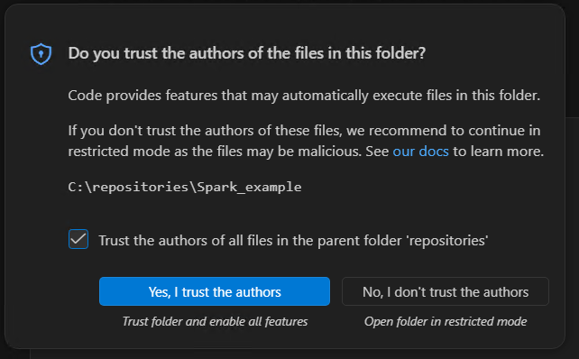
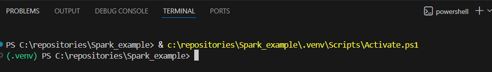
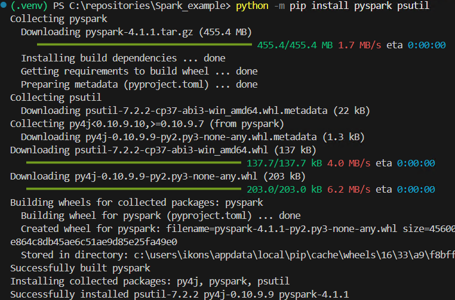
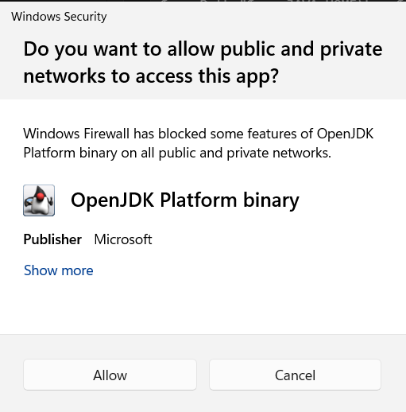

# Local Spark development with VS Code

## Setting up the local environment

You can find the official Apache Spark programming guide here:

https://spark.apache.org/docs/latest/rdd-programming-guide.html

This guide assumes that you already have a recent version of **Visual Studio Code** installed on your computer.

This is the recommended and tested workflow for local development in the course. If you prefer another IDE, there is also the alternative [PyCharm guide](../02_pycharm-local-authoring/README.en.md), but the path that is validated most consistently in the course is VS Code.

https://code.visualstudio.com/

This guide assumes that **Python 3.11** has already been installed through `01_workstation-setup`. In this course we use a simple local environment with `venv`, so Python 3.11 is the recommended baseline.

For Python development in VS Code, you should install at least the following extensions:

- `Python`
- `Pylance`
- optionally `Jupyter`


## Opening the repository

Guide `02` supports two equivalent local paths:

- `Windows / PowerShell`
- `WSL / Ubuntu`

If you already completed `01_workstation-setup`, the repository may now exist:

- either in a Windows folder, such as `C:\Users\<username>\bigdata-uth`
- or inside WSL, such as `~/bigdata-uth`

In VS Code, open the folder that matches the path you chose:

- for the native Windows path, open the normal Windows folder and use a PowerShell terminal
- for the WSL path, open the repo through WSL integration and use a WSL terminal

In this guide, every step that differs is shown for both environments.

When VS Code runs for the first time, if it asks whether you trust the folder, choose `Yes, I trust the authors`.



## Creating a virtual environment in VS Code

A **virtual environment** is an isolated Python space for a specific project.  
Inside that space, you install only the packages needed by that particular assignment, without affecting the rest of your computer or other projects.

In practice, this gives three main benefits:

- it keeps each assignment's dependencies separate
- it avoids conflicts between different package versions
- it makes the run/debug environment in VS Code more predictable

For this course it is recommended to use a **local virtual environment with `venv`** inside each project. This is the cleanest and most practical approach because:

- each assignment has its own packages
- conflicts between different projects are avoided
- VS Code usually detects the project's `.venv` automatically

Open the `bigdata-uth` folder in VS Code.

Open a terminal inside VS Code (`Terminal -> New Terminal`) and create the virtual environment.

From PowerShell:

```powershell
py -3.11 -m venv .venv
```

From WSL:

```bash
python3 -m venv .venv
```

The command above creates a `.venv` directory inside your project.

## Activating the virtual environment

After creating `.venv`, you have two simple options:

### Option 1: Close and reopen the terminal

In many cases it is enough to close the terminal and open a new terminal inside VS Code.  
VS Code will usually detect `.venv` automatically and activate it by itself.

### Option 2: Manual activation

If you want, you can also activate it manually.

From PowerShell:

```powershell
.venv\Scripts\Activate.ps1
```

If PowerShell blocks local scripts from the virtual environment, run this first:

```powershell
Set-ExecutionPolicy -Scope Process Bypass
.venv\Scripts\Activate.ps1
```

From WSL:

```bash
source .venv/bin/activate
```

If everything worked correctly, you will usually see `(.venv)` at the beginning of the terminal prompt.



## Installing packages

After the virtual environment is activated, install the required packages with:

```bash
python -m pip install pyspark==3.5.8 psutil
```

You can view the installed packages with:

```bash
python -m pip list
```

We prefer the `python -m pip` form instead of plain `pip`, because this makes it explicit that the installation targets the Python interpreter used by the project.



## If the terminal does not auto-activate `.venv`

From PowerShell:

```powershell
.venv\Scripts\Activate.ps1
```

From WSL:

```bash
source .venv/bin/activate
```

## If creating `.venv` gets stuck

On some machines, creating `.venv` may be slow or appear to hang at the step where `pip` is installed.

From PowerShell:

```powershell
py -3.11 -m venv --without-pip .venv
.venv\Scripts\python.exe -m ensurepip --upgrade
```

From WSL:

```bash
python3 -m venv --without-pip .venv
.venv/bin/python -m ensurepip --upgrade
```

This way, the virtual environment is created first and `pip` is installed in a second step.

## What to remember

For this course, the recommended workflow is the following:

1. create `.venv`
2. choose `Python: Select Interpreter`
3. install packages with `python -m pip`
4. run or debug from VS Code

Manual activation is optional and is mainly useful when you work directly from a terminal.

## Checking Java

For local PySpark execution, the course Spark 3.5.8 baseline works fine both with `Java 17` on Windows and with `Java 11` in WSL, following the baseline defined in `01_workstation-setup`.
You do not need to install Apache Spark separately on your computer. For this guide, the `pyspark` package inside `.venv` and the Java installation from `01_workstation-setup` are enough.

Check from PowerShell or WSL:

```text
java -version
```

If the command does not work, go back to `01_workstation-setup` first.

## Creating example files

If you are following the repository-based workflow, you do not need to create a new `main.py` and a new `text.txt`. You can use the canonical files that already exist:

- `code/wordcount.py`
- `examples/text.txt`

The small standalone example below remains useful only if you want to see the smallest possible Spark script from zero.

Create two files in your project directory: `main.py` and `text.txt`.

Put the following code into `main.py`:

```python
import os
import sys

from pyspark.sql import SparkSession

os.environ["PYSPARK_PYTHON"] = sys.executable
os.environ["PYSPARK_DRIVER_PYTHON"] = sys.executable


def main() -> None:
    spark = SparkSession.builder.appName("Word Count example").getOrCreate()
    sc = spark.sparkContext

    wordcount = (
        sc.textFile("text.txt")
        .flatMap(lambda line: line.split())
        .map(lambda word: (word, 1))
        .reduceByKey(lambda left, right: left + right)
        .sortBy(lambda item: item[1], ascending=False)
    )

    print(wordcount.collect())
    spark.stop()


if __name__ == "__main__":
    main()
```

The two lines using `sys.executable` explicitly tell Spark to use the same Python interpreter that the project has selected in VS Code. Because of that, this first example does not require a separate `launch.json`.

Put the following sample content into `text.txt`:

```text
spark spark data
big data spark
python spark
```

## Running and debugging in VS Code

After you have already selected the interpreter from `.venv`, open `main.py` and run the program in one of the following ways:

- from the `Run Python File` button
- from the integrated terminal, with `.venv` active, by using `python main.py`

For debugging:

- open `Run and Debug`
- if VS Code asks you for a debug configuration type, choose `Python Debugger: Current File`
- then press `F5`

For this simple example, that is enough. You do not need to write `launch.json` manually. If VS Code automatically creates a simple `launch.json` during the first debug run, you can keep the default configuration.

The first time you run the program, Windows Firewall / Windows Defender may show a prompt for `OpenJDK Platform binary`. If it appears, choose `Allow`, so that Spark can open the local port it needs.



If everything is configured correctly, you should see output such as:

```text
[('spark', 4), ('data', 2), ('big', 1), ('python', 1)]
```

## Experimenting with `pyspark`

If you want to experiment interactively with Spark, you have two practical options:

- `pyspark`, which opens a ready-to-use shell with `sc` and `spark` already available, but on Windows it often does not provide convenient command history with the `Up` / `Down` keys
- the regular Python console that you open with `python`, which usually has more convenient history and editing, but requires you to create the `SparkSession` manually

Note: `pyspark` is for Python, while `spark-shell` is the Scala shell. The command `sparkshell` without a dash is not valid.

### Option 1: `pyspark`

`pyspark` is the quickest option if you want to start immediately with `sc` and `spark` ready to use.

After activating `.venv` and confirming that `java -version` works, run the following in the terminal.

From PowerShell:

```powershell
$env:PYSPARK_PYTHON="$PWD\.venv\Scripts\python.exe"
$env:PYSPARK_DRIVER_PYTHON=$env:PYSPARK_PYTHON
pyspark
```

From WSL:

```bash
export PYSPARK_PYTHON="$PWD/.venv/bin/python"
export PYSPARK_DRIVER_PYTHON="$PYSPARK_PYTHON"
pyspark
```

Once the shell opens, you can try commands such as:

```python
sc.parallelize([1, 2, 3]).count()
spark.range(5).show()
```

To exit the shell:

```python
exit()
```

### Option 2: open the regular Python console from the terminal

If you prefer better command history and a more predictable terminal experience, you can first open the regular Python console:

```bash
python
```

and then create the Spark session manually:

```python
import os
import sys
from pyspark.sql import SparkSession

os.environ["PYSPARK_PYTHON"] = sys.executable
os.environ["PYSPARK_DRIVER_PYTHON"] = sys.executable

spark = SparkSession.builder.appName("playground").getOrCreate()
sc = spark.sparkContext
```

After that, you can experiment with commands such as:

```python
sc.parallelize([1, 2, 3]).count()
spark.range(5).show()
```

When you are done:

```python
spark.stop()
exit()
```

## Checking the Spark UI

Another useful way to monitor what is happening is through the URL where the Spark UI runs. During local execution, it usually appears at:

[http://localhost:4040](http://localhost:4040)

Once you stop the program, the corresponding Spark UI web server also stops.

The exact appearance of the Spark UI may differ slightly depending on the Spark version, but the general idea remains the same.


## Next local guide

After completing this basic guide, the recommended continuation is the unified local Spark practice guide:

- [../03_local-spark-workbook/README.en.md](../03_local-spark-workbook/README.en.md)

That guide now contains together:

- the small local examples with the RDD API
- the local examples with DataFrames and Spark SQL
- the bridge toward remote execution on Kubernetes from WSL

## Useful notes

- If `java -version` does not work, close and reopen VS Code and create a new terminal. If it still does not work, go back to `01_workstation-setup`.
- If VS Code does not detect `.venv` correctly, run `Python: Select Interpreter` again.
- If you see warnings about `winutils.exe` or `NativeCodeLoader`, you can ignore them for this simple local Windows example.
- If `text.txt` is not located in the correct directory, the program will fail because it cannot find it.
- If port `4040` is already in use, Spark may start the UI on another port such as `4041`.
- If you later continue to guide `04`, remote execution does not happen from PowerShell but only from WSL.
