# Τοπική συστοιχία Spark + HDFS με Docker Compose

Σε αυτόν τον οδηγό θα στήσετε από την αρχή, στον προσωπικό σας υπολογιστή, μια μικρή αλλά πλήρη συστοιχία Spark + HDFS με Docker Compose. Στόχος δεν είναι μόνο να εκτελέσετε έτοιμα παραδείγματα, αλλά να καταλάβετε ποια κομμάτια χρειάζονται για να λειτουργήσει μια τέτοια υποδομή και πώς συνεργάζονται μεταξύ τους.

Μέσα από τα βήματα του οδηγού θα δείτε στην πράξη τον ρόλο του Namenode, των Datanodes, του Spark master και των Spark workers, θα αρχικοποιήσετε το HDFS, θα ανεβάσετε κώδικα και δεδομένα και θα εκτελέσετε εργασίες πάνω στη συστοιχία. Οι εντολές τεκμηριώνονται για WSL, ώστε η ροή να παραμείνει ενιαία και απλή για το εργαστήριο.

Ο οδηγός αυτός μπορεί να εκτελεστεί με δύο παραλλαγές Docker μέσα στο WSL:

- **Προτεινόμενη**: `Docker Desktop` με WSL integration
- **Προαιρετική advanced**: native `Docker Engine` απευθείας μέσα στο Ubuntu

Από το σημείο που το `docker version` και το `docker compose version` δουλεύουν κανονικά μέσα στο WSL terminal, οι βασικές εντολές του οδηγού είναι ίδιες και για τις δύο διαδρομές.

## Προέλεγχος Docker στο WSL

Πριν προχωρήσετε, βεβαιωθείτε ότι το ενεργό Docker CLI μέσα στο WSL βλέπει κανονικά έναν Docker daemon:

```bash
docker version
docker compose version
docker info --format '{{.ServerVersion}}'
```

Αν χρησιμοποιείτε `Docker Desktop`, φροντίστε πρώτα να έχει ξεκινήσει κανονικά η εφαρμογή στα Windows.

Αν χρησιμοποιείτε native `Docker Engine` μέσα στο WSL, ελέγξτε και:

```bash
systemctl is-active docker
```

που πρέπει να επιστρέφει `active`.


## Αρχιτεκτονική HDFS και Spark

**HDFS**: Κατανεμημένο σύστημα αρχείων, από το οποίο τα Spark jobs μπορούν να διαβάσουν και να γράψουν.


Ρόλοι κόμβων στη συστοιχία:
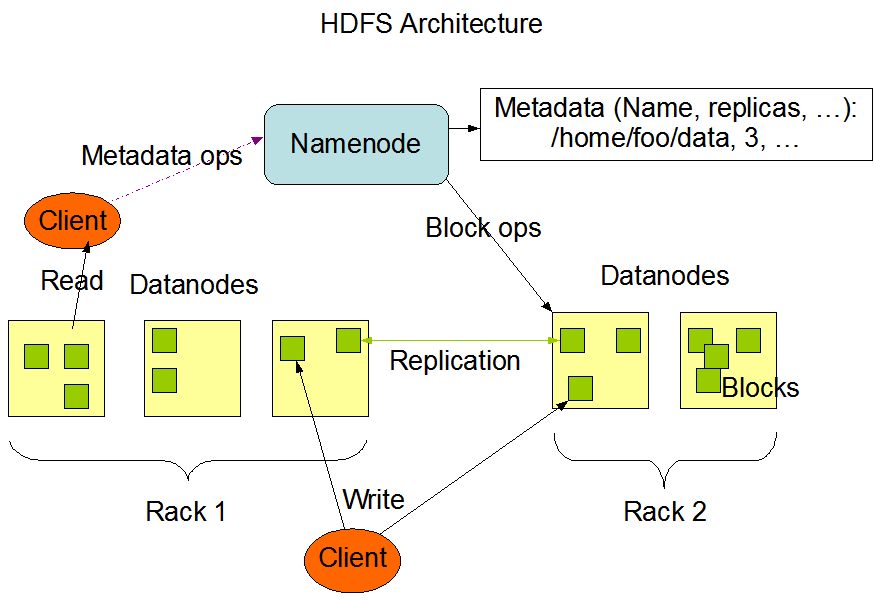


- **HDFS Namenode:**  Ο Namenode είναι ο πιο σημαντικός κόμβος του HDFS. Ο Namenode γνωρίζει ποιος Datanode έχει ποιο μπλοκ ενός αρχείου.
- **HDFS Datanode:** Οι Datanodes αποθηκεύουν μπλοκ από τα αρχεία του HDFS στο τοπικό τους σύστημα αρχείων. Η δουλειά τους είναι να εξυπηρετούν τα μπλοκ που ζητούν οι πελάτες.

**Spark:** Ένα ενιαίο σύστημα  κατανεμημένης επεξεργασίας για επεξεργασία δεδομένων, που περιλαμβάνει την υλοποίηση του προγραμματιστικού μοντέλου Map/reduce και περιέχει βιβλιοθήκες για μηχανική μάθηση, εκτέλεση SQL κ.λπ.


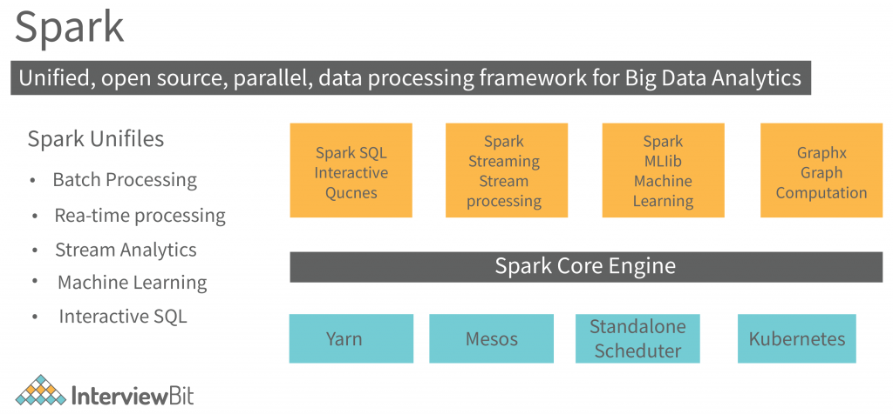


- **Spark Master:** Ο κόμβος Master του Spark ελέγχει τους διαθέσιμους πόρους και, με βάση αυτούς, εκκινεί και διαχειρίζεται τις κατανεμημένες εφαρμογές που εκτελούνται στη συστοιχία.
- **Spark Worker:** Ο Worker είναι μια διεργασία του Spark, η οποία εκτελείται σε κάθε κόμβο της συστοιχίας και διαχειρίζεται τις διεργασίες των κατανεμημένων εφαρμογών που εκτελούνται σε αυτόν τον κόμβο.
- **Spark Driver:** Ο Spark Driver λειτουργεί ως ελεγκτής της εκτέλεσης μιας εφαρμογής Spark. Ο Spark Driver διατηρεί ολόκληρη την κατάσταση της εφαρμογής που εκτελείται στον κλάδο του Spark..


## Βασικές έννοιες Docker

**Βασικές έννοιες:** Για την δημιουργία της παραπάνω υποδομής θα χρησιμοποιήσουμε περιέκτες docker στον προσωπικό μας υπολογιστή. Οι βασικές έννοιες που χρειάζεται να ξέρουμε είναι οι εξής:

- **Docker image:** Είναι ένα στατικό αρχείο που περιέχει όλα τα απαραίτητα για την εκτέλεση μιας εφαρμογής, συμπεριλαμβανομένου του κώδικα, των εξαρτήσεων και του λειτουργικού περιβάλλοντος. Για την δημιουργία περιεκτών χρησιμοποιείται η έννοια της εικόνας (image) και η έννοια του περιέκτη (container). Για να εκτελεστεί ένας περιέκτης χρειάζεται να ανακτηθεί η εικόνα του από ένα αποθετήριο εικόνων (image repository). Για παράδειγμα, με την παρακάτω εντολή κατεβάζουμε την εικόνα και εκτελούμε ένα περιέκτη που βασίζεται στην επίσημη εικόνα `hello-world`:

```bash
docker run hello-world
```

- **Dockerfile:** Είναι ένα αρχείο κειμένου που περιέχει οδηγίες για τη δημιουργία ενός Docker image. Μέσω αυτού καθορίζουμε τη βάση του image, τις εξαρτήσεις και τις ρυθμίσεις εκτέλεσης. Παράδειγμα δημιουργίας ενός Dockerfile που χρησιμοποιεί το Python image και εκτελεί ένα τοπικό αρχείο app.py

Ανοίγουμε το τερματικό Ubuntu και τρέχουμε

```bash
mkdir compose-example
cd compose-example
```

Δημιουργώ το τοπικό αρχείο app.py

```bash
nano app.py
```

Γράφω στον editor

```python
print("Hello from Docker!")
```

Αποθηκεύστε το (`CTRL` + `X`, μετά `Y` και `Enter`).

Τώρα δημιουργώ το τοπικό αρχείο Dockerfile
```bash
nano Dockerfile
```

Γράφω στον editor

```dockerfile
FROM python:3.9
COPY app.py /app.py
CMD ["python", "/app.py"]
```

Αποθηκεύστε το (`CTRL` + `X`, μετά `Y` και `Enter`).

Το χτίζουμε και το τρέχουμε με τις παρακάτω εντολές

```bash
docker build -t my-python-app .
```


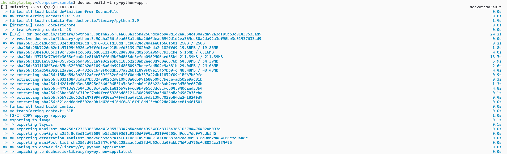


```bash
docker run my-python-app
```


Για να εκτελέσω την χτισμένη εικόνα σαν περιέκτη τρέχω την παρακάτω εντολή

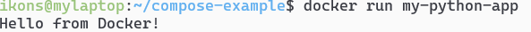


Την πρώτη φορά που το τρέχουμε «κατεβάζει» τις απαραίτητες εξαρτήσεις. Τις επόμενες φορές δεν χρειάζεται


- **Docker Compose:** Είναι ένα εργαλείο που επιτρέπει τη διαχείριση πολλών containers μέσω ενός αρχείου docker-compose.yml, ορίζοντας υπηρεσίες, δίκτυα και αποθηκευτικούς χώρους.
- Οι περιέκτες docker (docker containers) έχουν **εφήμερο (ephemeral)** σύστημα αρχείων, το οποίο με τον τερματισμό των στιγμιοτύπων τους χάνεται. 
- **Volume:** Είναι ένας μηχανισμός αποθήκευσης δεδομένων που επιτρέπει στους containers να διατηρούν δεδομένα ακόμη και μετά την επανεκκίνηση ή διαγραφή τους. Για την μόνιμη αποθήκευση αρχείων το docker χρησιμοποιεί την έννοια των "persistent volumes" (τόμοι). Οι τόμοι μπορούν να δημιουργηθούν, να αποκτήσουν δικό τους όνομα και να προσαρτηθούν σε containers που δημιουργούνται.


## Οδηγός εγκατάστασης Apache Spark και HDFS στον τοπικό υπολογιστή με χρήση docker containers.


Περιηγηθείτε στον κατάλογο του παραδείγματος

```bash
cd ~/bigdata-uth/docker/01-lab1-spark-hdfs/
```


Στον κατάλογο θα δείτε τα παρακάτω αρχεία:

- **docker-compose.yml**: Αρχείο που δημιουργεί μια υποδομή τοπικά στον υπολογιστή σας που αποτελείται από:
   -1 HDFS cluster με έναν namenode (όνομα: namenode) και 3 datanodes (όνομα: datanode1, datanode2 και datanode3).
   -1 Spark cluster με έναν master (όνομα: spark-master) και 4 workers (όνομα: spark-worker1, spark-worker2, spark-worker3 και spark-worker4).

- **Dockerfile.master**: Αρχείο ρυθμίσεων dockerfile με το οποίο δημιουργούμε μια εικόνα για τον περιέκτη spark-master βασισμένη στην επίσημη εικόνα του Apache spark.
- **Dockerfile.worker:** Αρχείο ρυθμίσεων dockerfile με το οποίο δημιουργούμε μια εικόνα για τους περιέκτες spark-worker1-4 βασισμένη στην επίσημη εικόνα του Apache spark.
- **spark-defaults.conf**: Αρχείο με default επιλογές για τους περιέκτες spark-master και workers.
- **startup.sh και worker.sh**: Αρχεία φλοιού Linux τα οποία εκτελούνται κατά την εκκίνηση των περιεκτών spark-master και spark-workers.

## Πώς συνδέονται οι υπηρεσίες μεταξύ τους

Πριν ξεκινήσετε τις εντολές, αξίζει να δείτε καθαρά το μοντέλο επικοινωνίας της τοπικής συστοιχίας:

- Όλοι οι περιέκτες μπαίνουν στο ίδιο Docker network `hadoop-net`.
- Μέσα σε αυτό το network, τα ονόματα υπηρεσιών του `docker-compose.yml` λειτουργούν και ως hostnames.
- Άρα ο Spark master βρίσκει το HDFS ως `hdfs://namenode:9000` και οι Spark workers βρίσκουν τον master ως `spark://spark-master:7077`.
- Τα Spark jobs υποβάλλονται από τον περιέκτη `spark-master`, αλλά τα δεδομένα τους βρίσκονται στο HDFS της ίδιας συστοιχίας.
- Ο History Server διαβάζει Spark event logs από το HDFS, ώστε να μπορεί να εμφανίζει ολοκληρωμένες εργασίες ακόμη και αφού έχουν τελειώσει οι executors.
- Οι named volumes κρατούν μόνιμα τα HDFS metadata, τα HDFS blocks και τους φακέλους προσωρινής μεταφόρτωσης αρχείων, ώστε να μη χάνονται με κάθε restart των containers.

Με άλλα λόγια:

- ο `namenode` και οι `datanodes` συγκροτούν το HDFS
- ο `spark-master` και οι `spark-worker1-4` συγκροτούν τη συστοιχία Spark
- το κοινό Docker network επιτρέπει στα δύο υποσυστήματα να επικοινωνούν με ονόματα όπως `namenode` και `spark-master`
- το HDFS είναι το κοινό στρώμα αποθήκευσης που χρησιμοποιούν τόσο τα Spark jobs όσο και ο History Server

**Εκκίνηση υποδομής:** Εκτελέστε την παρακάτω εντολή για να σηκώσετε την υποδομή. **Προσοχή**: πρέπει να βρίσκεστε μέσα στον κατάλογο 01-lab1-spark-hdfs για να λειτουργήσει σωστά:

```bash
docker compose up --build -d
```

Την πρώτη φορά που θα εκτελέσετε την εντολή μπορεί να χρειαστούν αρκετά λεπτά, ειδικά αν ο Docker daemon μόλις ξεκίνησε ή αν πρέπει να κατεβούν μεγάλες εικόνες. Αν δείτε καθυστέρηση, πρώτα επιβεβαιώστε ότι το `docker version` λειτουργεί κανονικά μέσα από το WSL terminal και αφήστε λίγο χρόνο στον Docker daemon να ολοκληρώσει την εκκίνησή του.

Εάν όλα πάνε καλά, θα δείτε τους περιέκτες να ξεκινούν κανονικά. Αν χρησιμοποιείτε Docker Desktop, θα τους δείτε και στο γραφικό περιβάλλον της εφαρμογής (πράσινη κουκκίδα).


Αντίστοιχα, μπορείτε να εκτελέσετε από το τερματικό την παρακάτω εντολή για δείτε τους περιέκτες

```bash
docker ps
```
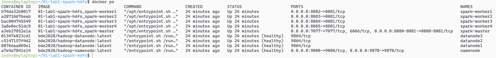

Αν χρησιμοποιείτε Docker Desktop, μπορείτε να κάνετε κλικ στο `01-lab1-spark-hdfs` και να δείτε τους επιμέρους περιέκτες που εκτελούνται:

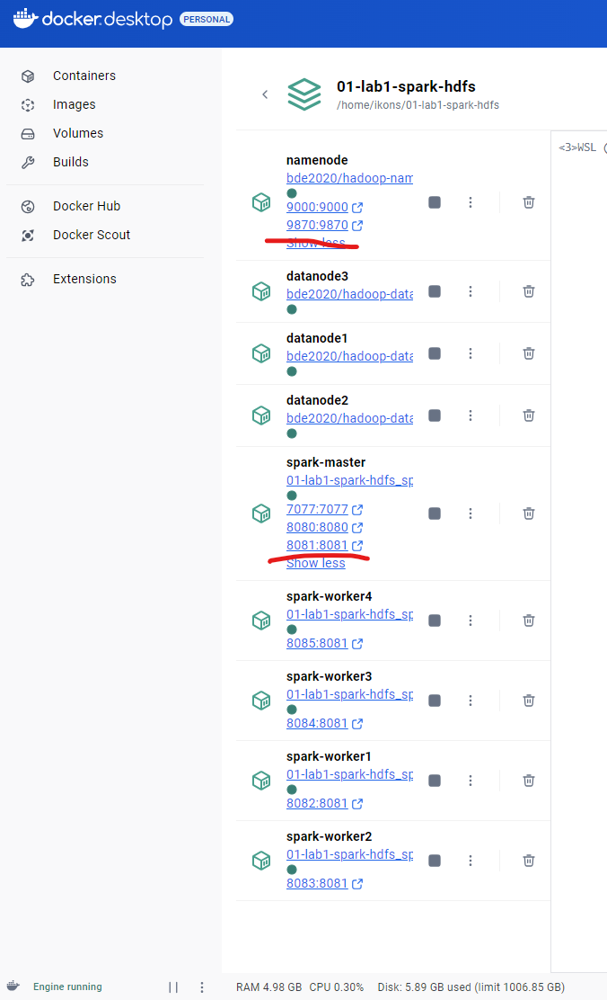

Για κάθε περιέκτη που βλέπετε ζεύγη αριθμών (πχ για τον namenode βλέπετε το  `9870:9870`) σημαίνει ότι εκτελούν μια **υπηρεσία** (συνήθως ένα http site, αλλά όχι απαραίτητα). Η υπηρεσία αυτή είναι**προσβάσιμη από το λειτουργικό σύστημα του υπολογιστή σας** είτε κάνοντας απευθείας κλικ στο link είτε ανοίγοντάς την από τον explorer

Για παράδειγμα, ο `hdfs-namenode` "τρέχει" το site http://localhost:9870 


Και ο `spark-master` τρέχει το site που δείχνει τους workers και τις εργασίες του στην http://localhost:8080 και τον history server στην http://localhost:8081 (όλες τις εργασίες που έχετε τρέξει μέχρι τώρα)

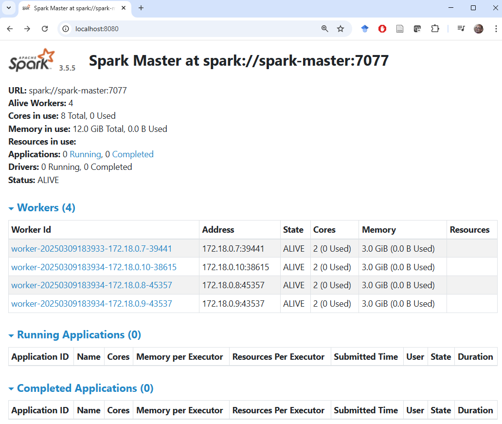

Στην ενότητα **Volumes** βλέπετε όλους τους μόνιμους τόμους (persistent volumes) που χρησιμοποιεί η υποδομή σας. Οι μόνιμοι τόμοι έχουν δηλωθεί στο `docker-compose.yml` και δημιουργήθηκαν με την `docker compose up` εντολή. 


Αντίστοιχα, μπορείτε να εκτελέσετε από το τερματικό την παρακάτω εντολή για δείτε τους τόμους

```bash
docker volume ls
```

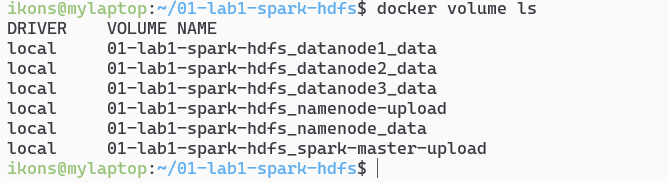

Το πού ακριβώς ζουν οι Docker volumes εξαρτάται από τη διαδρομή Docker που χρησιμοποιείτε.

### Αν χρησιμοποιείτε Docker Desktop

Στην περίπτωση αυτή, ο docker daemon δεν τρέχει μέσα στο Ubuntu του WSL αλλά μέσα στην υποδομή `docker-desktop`.

Για να καταλάβετε τι εννοώ, ανοίξτε ένα κέλυφος των windows (δεξί κλικ στο σύμβολο των windows) και επιλέξτε Terminal 

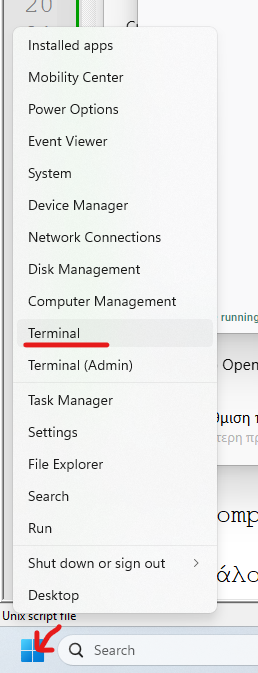


Εκτελέστε την παρακάτω εντολή

```bash
wsl -l -v
```


Αυτό που βλέπουμε είναι ότι ο υπολογιστής μας εκτελεί 2 εικονικές μηχανές: Η μία είναι η Ubuntu (από την οποία εκτελούμε τις εντολές docker) και η άλλη είναι η docker-desktop. Η docker-desktop είναι αυτή που εκτελεί τον docker daemon ο οποίος σηκώνει τους περιέκτες.

Οι μόνιμοι τόμοι (persistent volumes) είναι κατάλογοι στο σύστημα αρχείων της εικονικής μηχανής docker-desktop.

Οι μόνιμοι τόμοι της εικονικής μηχανής docker-desktop μπορούν να γίνουν προσβάσιμοι μέσω του συστήματος αρχείων του windows host μηχανήματος μέσω ενός συγκεκριμένου φακέλου με την ονομασία

```
\\wsl.localhost\docker-desktop\mnt\docker-desktop-disk\data\docker\volumes
```

 Ανοίγουμε έναν windows explorer και κάνουμε paste το παραπάνω στην διεύθυνση. Εκεί βλέπουμε όλους τους φακέλους που χρησιμοποιούνται ως μόνιμοι τόμοι στους περιέκτες docker, και μπορούμε να τους διαχειριστούμε μέσω του συστήματος αρχείων του λειτουργικού συστήματος windows. Ο κάθε κατάλογος έχει έναν υποκατάλογο _data στον οποίο ότι τοποθετούμε είναι ορατό στους περιέκτες που έχουν προσαρτήσει (mount) τον τόμο (volume) αυτό.

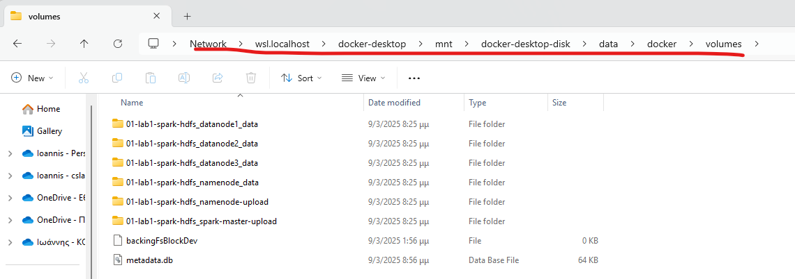

### Αν χρησιμοποιείτε native Docker Engine μέσα στο WSL

Στην περίπτωση αυτή, δεν υπάρχει ξεχωριστή `docker-desktop` εικονική μηχανή. Ο docker daemon τρέχει μέσα στο ίδιο το Ubuntu του WSL και οι volumes ζουν στο filesystem του, συνήθως κάτω από:

```bash
/var/lib/docker/volumes
```

Μπορείτε να δείτε τους φακέλους τους με:

```bash
sudo ls /var/lib/docker/volumes
```

ή να εξετάσετε έναν συγκεκριμένο τόμο με:

```bash
sudo ls /var/lib/docker/volumes/<volume-name>/_data
```

Στο εργαστήριο όμως προτιμούμε να δουλεύουμε με `docker cp` και `docker exec`, ώστε τα βήματα να είναι ίδια και στις δύο διαδρομές.


**Αρχικοποίηση του συστήματος αρχείων HDFS:** Την πρώτη φορά που θα δημιουργήσετε την υποδομή, θα πρέπει να δημιουργήσετε και τους απαραίτητους καταλόγους στο HDFS για να ανεβάζετε αρχεία και για να κρατάτε πληροφορίες εκτέλεσης εργασιών.

Ο πιο ασφαλής τρόπος είναι να χρησιμοποιήσετε το helper script του repository, το οποίο:

- περιμένει να γίνει healthy ο `namenode`
- περιμένει να ανταποκρίνεται το HDFS RPC endpoint
- περιμένει να τελειώσει το HDFS safe mode
- δημιουργεί τους καταλόγους `/user/root`, `/user/root/examples` και `/logs`
- επανεκκινεί τον `spark-master`, ώστε ο History Server να συνδεθεί ξανά σε έτοιμο HDFS

Από το **κέλυφος Ubuntu**, εκτελέστε:

```bash
bash init-hdfs.sh
```

Το script είναι το εξής:

<!-- AUTO-CODE: docker/01-lab1-spark-hdfs/init-hdfs.sh -->
``` bash
#!/usr/bin/env bash

set -euo pipefail

SCRIPT_DIR="$(cd "$(dirname "${BASH_SOURCE[0]}")" && pwd)"
cd "$SCRIPT_DIR"

MAX_ATTEMPTS=60
SLEEP_SECONDS=2

wait_for_namenode_health() {
  local attempt health
  for attempt in $(seq 1 "$MAX_ATTEMPTS"); do
    health="$(docker inspect -f '{{if .State.Health}}{{.State.Health.Status}}{{else}}no-healthcheck{{end}}' namenode 2>/dev/null || true)"
    echo "namenode health attempt ${attempt}/${MAX_ATTEMPTS}: ${health}"
    if [ "$health" = "healthy" ]; then
      return 0
    fi
    sleep "$SLEEP_SECONDS"
  done

  echo "NameNode did not become healthy in time." >&2
  return 1
}

wait_for_hdfs_rpc() {
  local attempt
  for attempt in $(seq 1 "$MAX_ATTEMPTS"); do
    if docker exec namenode hdfs dfsadmin -report >/dev/null 2>&1; then
      echo "HDFS RPC endpoint is responding."
      return 0
    fi
    echo "HDFS RPC attempt ${attempt}/${MAX_ATTEMPTS}: not ready yet"
    sleep "$SLEEP_SECONDS"
  done

  echo "HDFS RPC endpoint did not become ready in time." >&2
  return 1
}

wait_for_safe_mode_to_end() {
  local attempt safe_mode_output
  for attempt in $(seq 1 "$MAX_ATTEMPTS"); do
    safe_mode_output="$(docker exec namenode hdfs dfsadmin -safemode get 2>/dev/null || true)"
    echo "safe mode attempt ${attempt}/${MAX_ATTEMPTS}: ${safe_mode_output:-unknown}"
    if ! printf '%s' "$safe_mode_output" | grep -q 'Safe mode is ON'; then
      return 0
    fi
    sleep "$SLEEP_SECONDS"
  done

  echo "HDFS stayed in safe mode for too long." >&2
  return 1
}

echo "Waiting for the NameNode container to become healthy..."
wait_for_namenode_health

echo "Waiting for the HDFS RPC endpoint to respond..."
wait_for_hdfs_rpc

# Ask HDFS to leave safe mode when it is already ready enough to accept admin commands.
# If it has already left safe mode, this is a harmless no-op.
docker exec namenode hdfs dfsadmin -safemode leave >/dev/null 2>&1 || true

echo "Waiting for HDFS safe mode to end..."
wait_for_safe_mode_to_end

echo "Creating the lab directories in HDFS..."
docker exec namenode hdfs dfs -mkdir -p /user/root /user/root/examples /logs

echo "Restarting spark-master so the History Server reconnects to the ready HDFS..."
docker compose restart spark-master

echo "Local HDFS initialization completed."
```
<!-- END AUTO-CODE -->

Ο λόγος που δημιουργούμε τον `/logs` στο HDFS είναι ότι ο History Server δεν διαβάζει logs από το τοπικό filesystem του host. Διαβάζει Spark event logs από το ίδιο HDFS που χρησιμοποιούν και τα jobs.


## Εκτέλεση προγραμμάτων στη συστοιχία

Εκτελέστε το παρακάτω για τον υπολογισμό του π με την χρήση monte carlo simulation σε Java.

```bash
docker exec spark-master /opt/spark/bin/spark-submit --class org.apache.spark.examples.JavaSparkPi /opt/spark/examples/jars/spark-examples.jar
```

Όπου εάν εκτελεστεί σωστά, θα δείτε στην οθόνη να τυπώνεται (μεταξύ άλλων μηνυμάτων) το εξής:

```
Pi is roughly 3.14638
```

Εκτελέστε το παρακάτω για τον ίδιο υπολογισμό σε python

```bash
docker exec spark-master /opt/spark/bin/spark-submit /opt/spark/examples/src/main/python/pi.py
```

**Εκτέλεση δικού σας προγράμματος στην συστοιχία:** Τώρα που έχουμε ένα αρχικοποιημένο σύστημα αρχείων hdfs και τους περιέκτες να λειτουργούν σωστά, μπορούμε να εκτελέσουμε τα πρώτα μας προγράμματα spark. Για τον σκοπό αυτό, πρέπει να ανεβάσουμε τα εξής στην συστοιχία:

- Αρχεία με **κώδικα** (πχ σε python).
- Αρχεία με **δεδομένα** στα οποία θα γίνει επεξεργασία (πχ τα κείμενα στα οποία θα τρέξει ένα wordcount).

**Ανέβασμα κώδικα**: Για τη ροή που βασίζεται στο αποθετήριο, ο προτεινόμενος τρόπος είναι το `docker cp` από το κλωνοποιημένο repo και όχι χειροκίνητη αντιγραφή σε volume paths. Αυτό κρατά τα βήματα ίδια είτε χρησιμοποιείτε Docker Desktop είτε native Docker Engine μέσα στο WSL.

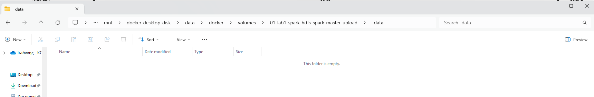

Από WSL terminal τρέξτε:

```bash
docker cp ~/bigdata-uth/code/wordcount.py spark-master:/mnt/upload/wordcount.py
```


Πλέον, ο περιέκτης spark-master έχει στο τοπικό σύστημα αρχείων του το αρχείο wordcount.py στον κατάλογο `/mnt/upload` όπως μπορείτε να δείτε εκτελώντας την παρακάτω εντολή:

```bash
docker exec spark-master ls /mnt/upload 
```

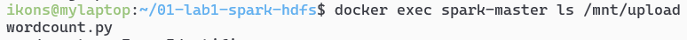

Η παρακάτω εντολή τυπώνει τα περιεχόμενα του απομακρυσμένου αρχείου wordcount.py (που βρίσκεται στο σύστημα αρχείων του περιέκτη spark-master):

```bash
docker exec spark-master cat /mnt/upload/wordcount.py 
```
Και θα δείτε το `wordcount.py` αρχείο να τυπώνεται. Το script που χρησιμοποιούμε είναι πλέον το ίδιο κοινό script του repository που μπορεί να τρέξει είτε τοπικά είτε σε συστοιχία, ανάλογα με το `--base-path` που θα του δώσουμε:

<!-- AUTO-CODE: code/wordcount.py -->
``` python
from __future__ import annotations

import argparse
import os
import sys

from pyspark.sql import SparkSession

# Keep the Python executable the same on the driver and on Spark workers.
# This avoids subtle version mismatches when the same script runs locally or on a cluster.
os.environ["PYSPARK_PYTHON"] = sys.executable
os.environ["PYSPARK_DRIVER_PYTHON"] = sys.executable


def build_path(base_path: str, relative_path: str) -> str:
    return f"{base_path.rstrip('/')}/{relative_path.lstrip('/')}"


def write_local_text_output(output_path: str, lines: list[str]) -> None:
    os.makedirs(output_path, exist_ok=True)
    output_file = os.path.join(output_path, "part-00000")
    with open(output_file, "w", encoding="utf-8") as file_handle:
        for line in lines:
            file_handle.write(f"{line}\n")


def parse_args() -> argparse.Namespace:
    parser = argparse.ArgumentParser(
        description="Count word frequencies from a text file with Spark.",
    )
    parser.add_argument(
        "--base-path",
        help="Base path that contains examples/ and where outputs should be written.",
    )
    parser.add_argument(
        "--input",
        help="Explicit input text path. Defaults to examples/text.txt locally or <base-path>/examples/text.txt remotely.",
    )
    parser.add_argument(
        "--output",
        help="Explicit output path. If omitted, local runs only print results and remote runs write under <base-path>.",
    )
    parser.add_argument(
        "--master",
        help="Optional Spark master. Local runs default to local[*] when no remote path is used.",
    )
    return parser.parse_args()


def main() -> None:
    args = parse_args()
    input_path = args.input or (
        build_path(args.base_path, "examples/text.txt")
        if args.base_path
        else "examples/text.txt"
    )

    builder = SparkSession.builder.appName("wordcount example")
    # Reuse the same script in two contexts:
    # - local files -> start a local Spark session
    # - remote URIs -> let spark-submit use the external cluster configuration
    if args.master:
        builder = builder.master(args.master)
        if args.master.startswith("local"):
            builder = builder.config("spark.submit.deployMode", "client")
    elif "://" not in input_path:
        builder = builder.master("local[*]").config("spark.submit.deployMode", "client")

    spark = builder.getOrCreate()
    sc = spark.sparkContext
    sc.setLogLevel("ERROR")

    output_path = args.output
    if output_path is None and args.base_path:
        output_path = build_path(args.base_path, f"wordcount_output_{sc.applicationId}")

    wordcount = (
        # textFile() gives an RDD where each element is one line from the input file.
        sc.textFile(input_path)
        # flatMap() is the classic "one input record -> many output records" step.
        .flatMap(lambda line: line.split())
        .map(lambda word: (word, 1))
        # reduceByKey() is the standard RDD aggregation pattern for key-value data.
        .reduceByKey(lambda left, right: left + right)
        .sortBy(lambda item: (-item[1], item[0]))
    )

    # collect() is safe here because the lab output is intentionally small.
    results = wordcount.collect()
    for item in results:
        print(item)

    if output_path:
        if "://" in output_path:
            # coalesce(1) makes the lab output easier to inspect.
            # For large real workloads, a single output partition would usually be a bottleneck.
            wordcount.coalesce(1).saveAsTextFile(output_path)
        else:
            write_local_text_output(output_path, [str(item) for item in results])
        print(f"Saved to: {output_path}")

    spark.stop()


if __name__ == "__main__":
    main()
```
<!-- END AUTO-CODE -->

Αν αλλάξετε το `wordcount.py` στο repository, επαναλάβετε το `docker cp` ώστε να περάσει η νεότερη έκδοση μέσα στον περιέκτη.

Ο κώδικας αντιγράφεται στον `spark-master`, γιατί από εκεί εκτελείται το `spark-submit`. Αντίθετα, τα δεδομένα δεν μένουν στο τοπικό filesystem του `spark-master`, αλλά ανεβαίνουν στο HDFS ώστε να είναι διαθέσιμα σε όλη τη συστοιχία.

**Ανέβασμα αρχείων δεδομένων**: Το `wordcount.py` περιμένει από το `--base-path` έναν βασικό κατάλογο που περιέχει υποκατάλογο `examples/` με τα αρχεία εισόδου. Αυτή την στιγμή όμως, το σύστημα αρχείων hdfs είναι κενό (εκτός από τους 2 καταλόγους που δημιουργήσαμε σε προηγούμενο βήμα).

Θα χρειαστεί να ανεβάσουμε ένα αρχείο με δεδομένα στο hdfs για να τρέξουμε το wordcount με είσοδο το αρχείο αυτό.

Το ανέβασμα θα γίνει σε **δυο στάδια**. Αρχικά θα τοποθετήσουμε ένα αρχείο από το τοπικό σύστημα αρχείων μας στο σύστημα αρχείων του περιέκτη namenode.

Κατόπιν θα εκτελέσουμε την εντολή `hdfs dfs -put` από τον περιέκτη namenode με την οποία θα κάνουμε upload το αρχείο από το τοπικό σύστημα αρχείων του περιέκτη (κατάλογος `/mnt/upload`) στο σύστημα αρχείων του hdfs. 

Για τον σκοπό αυτό χρησιμοποιούμε πάλι `docker cp`, αυτή τη φορά για να αντιγράψουμε το βασικό dataset στον `namenode`.

Από WSL terminal τρέξτε:

```bash
docker cp ~/bigdata-uth/examples/text.txt namenode:/mnt/upload/text.txt
```

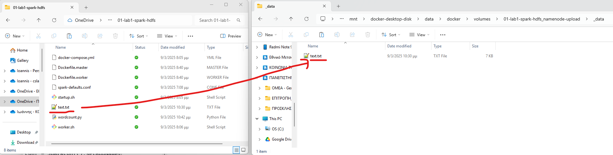


Πλέον, ο περιέκτης namenode έχει στο τοπικό σύστημα αρχείων του το αρχείο `text.txt` στον κατάλογο `/mnt/upload` όπως μπορείτε να δείτε εκτελώντας την παρακάτω εντολή:

```bash
docker exec namenode ls -lah /mnt/upload 
```


Πλέον, με τις παρακάτω εντολές ανεβάζουμε στο hdfs το αρχείο `text.txt` που βρίσκεται στο τοπικό σύστημα αρχείων του namenode στον κατάλογο `/mnt/upload`. Δημιουργούμε πρώτα τον κατάλογο `/user/root/examples`, γιατί εκεί θα ψάξει το script όταν του δώσουμε `--base-path hdfs://namenode:9000/user/root`:

```bash
docker exec namenode hdfs dfs -mkdir -p /user/root/examples
docker exec namenode hdfs dfs -put -f /mnt/upload/text.txt /user/root/examples/text.txt
```

Τώρα έχουμε τοποθετήσει το αρχείο Python προς εκτέλεση στο τοπικό σύστημα αρχείων του `spark-master` και το αρχείο `text.txt` στο HDFS. Είμαστε έτοιμοι να εκτελέσουμε το Spark πρόγραμμα με την παρακάτω εντολή:

```bash
docker exec spark-master /opt/spark/bin/spark-submit /mnt/upload/wordcount.py \
  --base-path hdfs://namenode:9000/user/root
```

Σε αυτό το παράδειγμα:

- το input διαβάζεται από το `hdfs://namenode:9000/user/root/examples/text.txt`
- το output γράφεται αυτόματα σε νέο κατάλογο της μορφής `hdfs://namenode:9000/user/root/wordcount_output_<app-id>`
- έτσι μπορείτε να ξανατρέχετε το παράδειγμα χωρίς να σβήνετε κάθε φορά το προηγούμενο output

Σε αυτό το σημείο η ακολουθία είναι η εξής:

- ο driver ξεκινά μέσα από τον `spark-master`
- ο `spark-master` αναθέτει εργασία στους διαθέσιμους workers
- οι workers διαβάζουν τα δεδομένα από το `hdfs://namenode:9000`
- τα event logs της εκτέλεσης γράφονται επίσης στο HDFS
- ο History Server τα διαβάζει αργότερα από εκεί για να εμφανίσει το ιστορικό

## Προαιρετικά: Τα ίδια βασικά scripts στην τοπική συστοιχία

Αυτή η ενότητα δεν είναι μέρος του βασικού πρώτου περάσματος του μαθήματος. Η βασική μαθησιακή διαδρομή παραμένει:

- `03_local-spark-workbook`
- `04_remote-spark-kubernetes`
- `05_cluster-queries-rdd-df-sql`

Το παρακάτω το χρησιμοποιούμε ως δεύτερο πέρασμα, μόνο για να δείξουμε ότι ο ίδιος βασικός κώδικας μπορεί να τρέξει και πάνω στην τοπική συστοιχία Spark + HDFS.

Η βασική ιδέα είναι:

- ο κώδικας μένει ο ίδιος
- τα δεδομένα μένουν τα ίδια
- αλλάζει μόνο ο στόχος εκτέλεσης και η βασική διαδρομή HDFS

Από τη ρίζα του repository `~/bigdata-uth`, ανεβάστε ολόκληρο το βασικό `code/` στον `spark-master` και τα `examples/` στον `namenode`:

```bash
docker exec spark-master mkdir -p /mnt/upload/code
docker exec namenode mkdir -p /mnt/upload/examples
docker cp ./code/. spark-master:/mnt/upload/code/
docker cp ./examples/. namenode:/mnt/upload/examples/
docker exec namenode bash -c 'hdfs dfs -rm -r -f /user/root/examples || true; hdfs dfs -mkdir -p /user/root/examples; hdfs dfs -put -f /mnt/upload/examples/* /user/root/examples/'
```

Σε αυτή την τοπική στοίβα:

- το βασικό `spark-submit` script βρίσκεται στο `/mnt/upload/code/...` του `spark-master`
- τα input datasets ζουν στο `hdfs://namenode:9000/user/root/examples/...`
- το `--base-path` είναι `hdfs://namenode:9000/user/root`
- δεν χρησιμοποιείς `/user/$USER`, όπως στην απομακρυσμένη ροή Kubernetes

Δοκίμασε πρώτα ένα μικρό portability matrix με 3 scripts:

```bash
docker exec spark-master /opt/spark/bin/spark-submit /mnt/upload/code/wordcount.py \
  --base-path hdfs://namenode:9000/user/root

docker exec spark-master /opt/spark/bin/spark-submit /mnt/upload/code/DFQ1.py \
  --base-path hdfs://namenode:9000/user/root

docker exec spark-master /opt/spark/bin/spark-submit /mnt/upload/code/SQLQ2.py \
  --base-path hdfs://namenode:9000/user/root
```

Μετά την εκτέλεση, ελέγξτε τα outputs στο τοπικό HDFS:

```bash
docker exec namenode hdfs dfs -ls /user/root
```

Αν όλα έχουν πάει σωστά, αυτό σημαίνει ότι το repository πετυχαίνει τον στόχο του:

- ένα κοινό codebase
- τοπική εκτέλεση χωρίς συστοιχία
- απομακρυσμένη εκτέλεση σε έτοιμο Kubernetes cluster
- και προαιρετικά εκτέλεση και σε τοπική συστοιχία Spark + HDFS

Παρακολούθηση της εκτέλεσης της τρέχουσας εργασίας: Μπορείτε να δείτε την εργασία που έχετε στείλει για εκτέλεση στην σελίδα http://localhost:8080 


**History Server**: Το Apache Spark έχει μια χρήσιμη υπηρεσία που αποθηκεύει όλα τα αρχεία καταγραφής (logfiles) από όλους τους διακομιστές (master και workers) από όλες τις εργασίες που έχουν υποβληθεί. Η υπηρεσία αυτή είναι γνωστή ως History Server, και είναι διαθέσιμη μέσω της σελίδας http://localhost:8081 


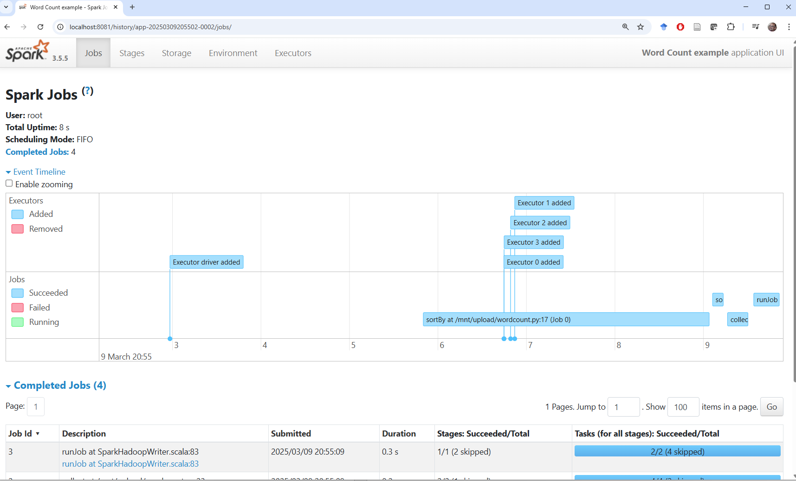

**Χρήσιμες εντολές ****linux**

|ls|περιεχόμενα καταλόγου|
|pwd|εκτύπωση τρέχοντος καταλόγου|
|cd|αλλαγή τρέχοντος καταλόγου|
|cp|αντιγραφή|
|mv|μετακίνηση|
|cat|εκτύπωση περιεχομένων αρχείου|
|echo|εκτύπωση χαρακτήρων στην οθόνn|
|man <command>|οδηγίες χρήσης εντολής με όνομα <command>|

**Χρήσιμες εντολές ****hdfs**

Δημιουργία φακέλου στο hdfs
```bash
docker exec namenode hadoop fs -mkdir -p <path>
```

Σβήσιμο φακέλου στο hdfs
```bash
docker exec namenode hdfs dfs -rm -r -f <path>			

```

Ανέβασμα αρχείου με overwrite

```bash
docker exec namenode hdfs dfs -put -f <local-path> <hdfs-path>
```

## Τερματισμός και καθαρισμός υποδομής

**Τερματισμός υποδομής**: Με την παρακάτω εντολή σταματάτε την υποδομή. Τα αρχεία που έχουν ανέβει στο HDFS ή έχουν αποθηκευτεί στους μόνιμους τόμους του `namenode` και του `spark-master` δεν διαγράφονται και παραμένουν διαθέσιμα. Όπως και για την `docker compose up`, θα χρειαστεί να βρίσκεστε στον κατάλογο που περιέχει το `docker-compose.yml` αρχείο.

```bash
docker compose down
```

**Καθαρισμός υποδομής**: Αν θέλετε να επιστρέψετε σε καθαρή αρχική κατάσταση, εκτελέστε την παρακάτω εντολή:

```bash
docker compose down -v --remove-orphans
```

Με αυτή την εντολή:

- σταματούν και αφαιρούνται οι περιέκτες της άσκησης
- αφαιρείται το τοπικό δίκτυο της άσκησης
- διαγράφονται οι μόνιμοι τόμοι, άρα χάνονται τα δεδομένα του HDFS, τα μεταφορτωμένα αρχεία και τα αρχεία καταγραφής

Την επόμενη φορά που θα εκτελέσετε `docker compose up --build -d`, θα ξεκινήσετε από καθαρή κατάσταση και θα χρειαστεί να επαναλάβετε την αρχικοποίηση του HDFS.

